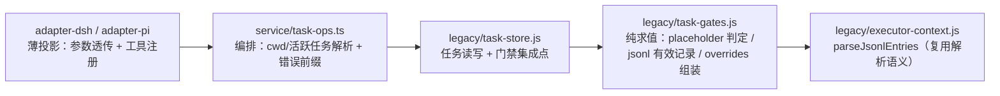

# design: task_start / task_archive 流程硬卡点

## 问题

流程指引仅靠系统提示软约束，模型可跳过 1.1 对齐 / 1.3 配置 / 2.2 check，
直接 start → implement → archive（session-f98c8040 复盘）。需要在工具层
加硬性校验，默认硬阻断 + force 显式豁免（留痕可审计）。

## 模块划分

- 校验求值落 core legacy 纯 JS 模块（task-gates），任务读写仍在 task-store；
  adapter 只做参数透传与工具注册，无业务逻辑。
- `PRD_SECTIONS` 从 task-store 上移至 task-gates：骨架生成与 placeholder
  判定共享同一份小节定义，杜绝两处漂移。
- jsonl 有效记录判定复用 `parseJsonlEntries`（`_example` 行豁免、结构性
  坏行抛错），与 executor 上下文装配同一语义。

## task.json 数据布局（向后兼容）

- 新增 `check`：`{passedAt, summary} | null`，由 `workloom_task_check` 写入；
  重复调用覆盖并刷新 passedAt。
- 新增 `overrides`：`{gate, tool, at, reason?}[]`，每次 force 调用追加一条。
- 不引入 `schemaVersion`：`readTask` 归一化时对旧数据补 `check: null` /
  `overrides: []`，存量任务统一硬阻断（要么补跑 check，要么 force 留痕）。

## 三个卡点

| 卡点 | 校验 | force 豁免 |
| --- | --- | --- |
| start | prd 四小节逐节脱离 placeholder + implement/check.jsonl 各至少一条有效记录 | 记录 `{gate: 'start'}` |
| check | 任务 in_progress + summary 非空 + check.jsonl 至少一条有效记录 | 记录 `{gate: 'check'}` |
| archive | task.json 存在 check 凭据（不区分新旧任务） | 记录 `{gate: 'archive'}` |

## grilling 结论（设计决策）

1. ~~新旧任务判定~~（废弃）：统一硬阻断后无需区分新旧，不引入 `schemaVersion`。
2. prd placeholder 判定：小节正文 trim 后与骨架 placeholder 完全一致才算未填；
   逐小节判定，任一小节未填即失败；小节整体缺失同样视为未填。
3. `workloom_task_check`：`summary` 必填 + `taskPath`/`force` 可选；要求
   `in_progress`；重复调用覆盖 check 字段并刷新 passedAt。
4. `overrides` 元素结构 `{gate, tool, at, reason?}`；start/check/archive
   三个卡点工具均支持 force，统一记录。
5. task_check 防绕过：要求 check.jsonl 存在有效记录才允许写 check 字段
   （force 可豁免）；「必须真跑过 check executor」跨会话无法可靠校验，
   接受残余风险，summary 留痕供审计。
6. start 与 archive 卡点均不区分新旧任务，统一硬阻断。

## 测试接缝（TDD）

- `test/task-gates.test.js`：placeholder 判定 / jsonl 有效记录判定（纯函数，
  骨架文本用字面量防同义反复）。
- `test/task-store.test.js`：start/check/archive 门禁集成（拒绝、force 放行、
  overrides 留痕、旧格式任务归一化）。
- `test/task-ops.test.js`：编排层门禁传播与全链路（create→start→check→archive）。
