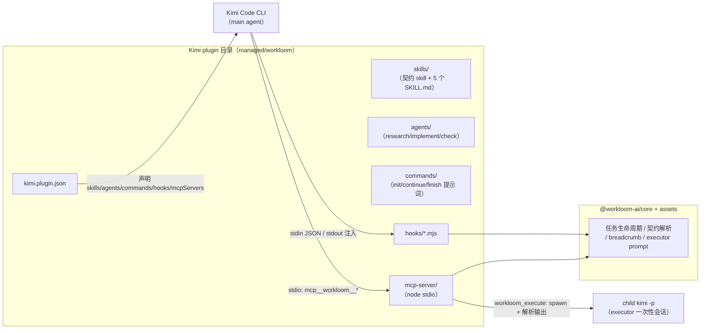

# workloom 支持 Kimi Code CLI 作为第三 runtime 的可行性调研

- 调研日期：2026-08-28
- 调研人：research executor（subagent）
- 结论速览：**需自研 wrapper** —— 资产层可直接映射，任务状态机等编程式能力需经 MCP server + hooks 承载；工作量粗估 **10–17 人天（中，关键路径顺则可收紧至 8–12）**。

## 1. 调研范围与方法

- Kimi Code 官方文档（中文，`https://moonshotai.github.io/kimi-code/zh/customization/` 目录）：plugins / skills / agents / hooks / mcp 五页精读；settings.md 不存在（HTTP 404），themes.md 仅为 TUI 配色主题、与资产分发无关。
- workloom 仓库（本仓库）：`packages/assets`、`packages/core`、`packages/adapter-dsh`、`packages/adapter-pi` 的入口与代表性文件。
- 所有关键断言标注来源：文档给 URL，仓库事实给相对路径。

## 2. Kimi Code 插件机制能力清单

以下来源均为 `https://moonshotai.github.io/kimi-code/zh/customization/` 下对应页面。

### 2.1 Plugin 与 manifest（plugins.html）

- Plugin 是带 manifest 的目录或 zip；manifest 位置 `<plugin_root>/kimi.plugin.json` 优先，`<plugin_root>/.kimi-plugin/plugin.json` 备选。
- manifest 字段：`name`（必填，即 plugin id，正则 `[a-z0-9][a-z0-9_-]{0,63}`）；`version/description/keywords/author/homepage/license`（展示元数据）；`interface`（displayName 等）；`skills`（`./` 路径数组，省略时根目录 SKILL.md 作为单个 Skill root）；`agents`（`./` 路径数组，省略时自动采用根下 `agents/`）；`sessionStart.skill`（会话启动时把指定 plugin Skill 加载进 main agent）；`skillInstructions`；`systemPrompt`（内联，32KB 上限）；`systemPromptPath`（与内联合计 32KB；**所有启用 plugin 合计注入预算 64KB**）；`mcpServers`（stdio 的 command/args/cwd 或 HTTP 的 url，默认启用）；`hooks`（与 config.toml 的 `[[hooks]]` 同构）；`commands`（`./` 路径数组，目录递归收集 .md 或单个 .md）。
- 斜杠命令：Markdown 文件，frontmatter（name/description）+ 正文提示词，`$ARGUMENTS` 占位符；注册名带 plugin id 前缀：`/<plugin-name>:<command-name>`。
- 安装：TUI `/plugins` 管理器；`/plugins install <path-or-url>` 支持本地目录、zip URL、GitHub 仓库 URL（可钉 ref/tag/commit）；自定义 marketplace JSON（version 2）。本地安装拷贝到 `$KIMI_CODE_HOME/plugins/managed/<id>/`；变更需 `/reload` 或新会话生效；**plugin 按用户安装、全局生效，暂无项目级安装范围**。
- 系统提示词注入：内置 Agent 提示词自动包含启用 plugin 的指令；自定义 SYSTEM.md/Agent 模板需显式加入 `${plugin_sections}`。

### 2.2 Skills（skills.md）

- `SKILL.md` = YAML frontmatter + Markdown 正文；目录型（`<name>/SKILL.md`）中 `name`、`description` **必填**，扁平 `.md` 可省略（名称取文件名）。
- frontmatter 字段：`name`、`description`、`type`（`prompt` 默认 / `inline` / `flow` 仅手动调用）、`whenToUse`（含连字符/下划线变体）、`disableModelInvocation`、`arguments`（命名参数，正文用 `$<name>` 读取）。
- 正文占位符：`$ARGUMENTS`、`$ARGUMENTS[0]`/`$0`、`$<name>`、`${KIMI_SKILL_DIR}`；正文无占位符时调用文本以 `\n\nARGUMENTS: <文本>` 追加。
- 扫描作用域优先级：Project（`.kimi-code/skills/`、`.agents/skills/`）> User（`$KIMI_CODE_HOME/skills/`、`~/.agents/skills/`）> Extra（`extra_skill_dirs`）> Built-in。
- 调用：`/skill:<name>` 手动调用；模型可按 description/whenToUse 自动调用；**嵌套最多 3 层**。

### 2.3 Agents（agents.md）

- 内置 subagent：`coder`（通用）、`explore`（只读探索）、`plan`（规划）；内置 subagent 不能再派发，委派链默认必然终止；自定义 Agent 可经 `subagents` 字段声明更深委派链。
- 自定义 Agent 文件 = frontmatter + 正文（正文即系统提示词）。字段：`name`（kebab-case，缺省取文件名）、`description`（必填，供 main agent 委派决策）、`whenToUse`、`override`（覆盖同名内置 Agent，默认 false）、`tools`（允许列表，支持 `mcp__<server>__*` glob；缺省全允许）、`disallowedTools`、`subagents`（可委派列表，缺省继承内置默认）。
- 发现优先级：`--agent-file` > 项目（`.kimi-code/agents/`、`.agents/agents/`）> 额外（`extra_agent_dirs`）> 用户 > **Plugin** > 内置；同名高优先级胜出。
- 正文模板变量：`${base_prompt}`（嵌入有效默认系统提示词）、`${plugin_sections}`（保留 plugin 指令）、`${skills}`、`${agents_md}`、`${cwd}` 等（完整变量表见 agents.md SYSTEM.md 小节）。
- main agent 自动发现并委派自定义 Agent；`kimi --agent <name>` / `--agent-file <path>` 可指定 main agent，print 模式（`kimi -p`）同样支持两个 flag。
- 委派给自定义 Agent 时不携带内置 subagent 的角色框架，用于委派的 Agent 需在正文自证"最后一条消息即完整交付"。

### 2.4 Hooks（hooks.md）

- 配置位置：`~/.kimi-code/config.toml` 的 `[[hooks]]` 数组；plugin manifest 的 `hooks` 字段同构。字段仅四个：`event`（必填）、`matcher`（正则，可选）、`command`（必填）、`timeout`（1–600 秒，默认 30），多写字段导致配置加载失败。
- 事件全集（20 个）：`UserPromptSubmit`（可阻断，stdout 附加进上下文）、`UserPromptQueued`、`PreToolUse`（可阻断，matcher 匹配工具名）、`Stop`（可阻断）、`TurnStarted`、`PostToolUse`、`PostToolUseFailure`、`PermissionRequest`、`PermissionResult`、`SessionStart`（matcher: startup/resume）、`SessionEnd`、`SessionHeartbeat`（每 60 秒）、`SubagentStart`、`SubagentStop`、`TaskStarted`、`StopFailure`、`Interrupt`、`PreCompact`、`PostCompact`、`Notification`。
- 可阻断事件仅 `PreToolUse`、`Stop`、`UserPromptSubmit`；其余为观察型（即发即忘）。
- 协议：事件详情 JSON 经 stdin 传入；退出码 0 放行（stdout 可附加说明到上下文）、2 阻断（stderr 为阻断原因）、其他非零/超时/崩溃 **fail-open**（默认放行）；也可经 stdout 返回 `hookSpecificOutput.permissionDecision: "deny"` 的 JSON 阻断。
- hook 命令的工作目录是当前会话的项目目录；同一事件多条命中规则并行运行。
- 文档明示：因 fail-open，hooks 适合提醒与轻量拦截，**不应作为唯一安全防线**。

### 2.5 MCP（mcp.md）

- 三种接入：stdio（子进程）、HTTP、SSE（旧式，需显式 `transport: "sse"`）。
- 配置：`mcp.json` 分用户级（`$KIMI_CODE_HOME/mcp.json`）与项目级（`.kimi-code/mcp.json`，项目级覆盖同名）；**plugin 亦可在 manifest 声明 `mcpServers`，默认启用**，可在 `/plugins` 禁用/重启用。
- 可选字段：`env`、`cwd`（stdio）；`headers`、`bearerTokenEnvVar`（HTTP/SSE）；`enabled`、`startupTimeoutMs`、`toolTimeoutMs`、`enabledTools`、`disabledTools`（全部）。
- MCP 工具命名 `mcp__<server>__<tool>`，与内置工具行为无差异；权限规则支持 `mcp__github__*` 通配。
- 会话进行中新增的 server 不注册进已打开会话，仅加入之后创建的会话。

### 2.6 扩展面总结与边界

- 在已调研文档范围内，plugin **只有 manifest 声明式扩展**，未发现编程式插件 API（无 registerTool/registerCommand handler 类接口）；进程级扩展点为 `mcpServers`（可跑任意本地命令）与 `hooks`（可跑任意脚本）。
- `settings.md` 不存在（404）；`themes.md` 仅配色，与资产分发无关。

## 3. workloom 中间表示与 adapter 契约现状

以下来源均为本仓库相对路径。

### 3.1 分层规则（`.workloom/spec/repo/architecture/index.md`）

- `core` 持有 runtime 无关逻辑，`assets` 持有内容，adapter 只做薄投影（取 cwd → 读 assets → 调 core → 结果交给宿主通道，无自身业务逻辑）；`core` 不得依赖 `assets`。

### 3.2 assets：资产类型与结构（`packages/assets/`）

中间表示约定（`packages/assets/README.md`）：正文 Markdown + YAML front-matter 元数据，由 adapter 渲染为各 runtime 官方格式。

| 目录 | 内容 | 代表文件事实 |
| --- | --- | --- |
| `workflow/` | 工作流契约 | `workflow/workflow.md`：front-matter `version: 8`、`states: [no_task, planning, in_progress, completed]`；`#### X.X` 步骤节（1.0–3.1）；`[workflow-state:X]` 状态指引块；`[workflow-norms]` always-on 规范块；支持项目级 overlay（`.workloom/workflow.override.md`，见 `packages/core/src/legacy/breadcrumb.js` 的 `mergeOverlay`） |
| `skills/` | 自有 skills 中间表示 | `skills/workloom-brainstorm/SKILL.md`、`skills/workloom-update-spec/SKILL.md`：front-matter 仅 `name` + `description`，正文英文 Markdown |
| `commands/` | 命令中间表示 | `commands/workloom-init.md`、`workloom-continue.md`、`workloom-finish.md`：front-matter 为 `name`（下划线风格，如 `workloom_init`）/ `title` / `description` / `argument-hint`，正文为命令指引 |
| `templates/` | spec 模板 | `templates/spec-index.md`、`spec-detail.md`（init 后补落进项目，见 `packages/adapter-pi/src/commands.ts`） |
| `third-party/` | 三方 vendored skills | `third-party/mattpocock-skills/`：tdd、grilling、writing-for-agents（MIT，含 LICENSE） |

`packages/assets/index.js`：薄访问器（`readAssetText` / `loadWorkflowContractText`），纯 ESM 无构建，ENOENT 返回 null。

### 3.3 core：runtime 无关逻辑形态（`packages/core/`）

- 包形态：纯 ESM Node 包（`package.json` engines `node>=22`），`src/legacy/` 为纯 JS + JSDoc 移植模块，`src/service/`、`src/surface.ts` 为 TS 新增抽象；`src/index.ts` 注释明示"不得 import 任何 runtime 包"。
- 核心导出（`packages/core/src/index.ts`）：`parseContract`（契约解析）、`mergeOverlay`/`buildBreadcrumb`/`shouldSkipBreadcrumb`（breadcrumb）、`assembleSessionContext`（会话上下文快照）、task-store 生命周期（`createTask/startTask/checkTask/finishTask/archiveTask/listTasks/readTask`）、`runTaskHooks`、`buildExecutorPrompt` + `EXECUTOR_KINDS`（research/implement/check）、`loadConfig`/`resolveSubagentDefaults`（读项目 `.workloom/config.yaml`）、journal、git、init/migrate 等。
- 注册面共享常量（`packages/core/src/surface.ts`）：3 个命令名（`workloom-init/continue/finish`）、**9 个模型可见工具**（`workloom_task_create/start/check/finish/archive/list`、`workloom_execute`、`workloom_step`、`workloom_journal`）及其描述文案、`TOOL_SNIPPETS`（仅 Pi 消费）、错误转述/回执拼装函数。

### 3.4 adapter-dsh：DSH profile bundle（`packages/adapter-dsh/`）

- 形态：Cordis 插件包；`package.json` 的 `dsh.bundle.patch` 指向 `cordis.patch.yml`（声明插件行 `@workloom-ai/adapter-dsh`）；入口默认导出 `{ name, apply, inject }`（`src/index.ts`）。
- 注入（`src/plugin.ts` 头注释）：经 DSH systemPrompt 服务注册 section（order 90，breadcrumb 工作流状态指引）与 context（order 85，取代式 session-context 快照）；自激活——cwd 不在 `.workloom` 项目内时静默不注入；注入失败只告警不阻塞。
- 注册面：3 命令（`src/commands.ts`）、9 工具（`src/tasks.ts`、`src/executor.ts`、`src/skills.ts`、`src/journal-tool.ts`）、5 个 skills 注册进 `ctx.skills`（front-matter 极简解析，只认 name/description/whenToUse，`src/skills.ts`）。
- executor（`src/executor.ts` 头注释）：`workloom_execute` 工具经 `ctx.subagents.start` 前台派发 one-shot 子代理，`buildExecutorPrompt` 内联任务上下文，model 支持 `provider/model` 前缀，冲突需 `force + reason` 留痕。
- executor.gate（`src/gate.ts` 头注释）：订阅 DSH 工具管线 `tools/pre-execute`，任务 in_progress 期间拦截主会话（delegationDepth 0）的 write/edit，`.workloom/` 内放行；已知边界：bash 内写文件不可拦截。

### 3.5 adapter-pi：Pi Package（`packages/adapter-pi/`）

- 形态：Pi Package（`package.json` 的 `pi.extensions` 指向 `./src/index.ts`，jiti 直载 TS 无需构建）；入口依次注册命令、任务工具、executor、步骤工具、journal 工具、会话注入（`src/index.ts`）。
- 注入（`src/inject.ts` 头注释）：`session_start`（reason ∈ startup/new）以 CustomMessage 注入 session-context；`before_agent_start` 每轮把 breadcrumb 追加进 systemPrompt。
- executor（`src/executor.ts` 头注释，ADR-0006）：不依赖 pi-subagents，**自研 spawn child pi**——按 kind 用 `buildExecutorPrompt` 组装首条 prompt，spawn `pi --mode json --no-session --no-extensions`，stdout 逐行 JSONL 解析（`src/pi-events.ts`），`agent_end` 判定完成；`--no-extensions` 使 child 无 `workloom_execute`，天然禁止再派发；角色说明（`src/agent-definitions.ts` 的 `EXECUTOR_AGENT_DEFINITIONS`）经 `--append-system-prompt` 注入。
- skills 分发：`scripts/sync-skills.mjs` 构建时从 `../assets` 递归拷贝 5 个 skill 目录（含 vendored LICENSE）到包内 `skills/`（构建产物，git 忽略）。

## 4. 能力映射表：workloom 资产/能力 → Kimi plugin 元素

评级口径：直接映射 = 格式兼容、拷贝或微改即可；需转换 = 语义等价但形态不同，需渲染/改写；不支持-需新机制 = Kimi 无对应概念，需借 mcpServers/hooks 等进程级扩展点实现；gap = 当前无法等价表达。

| workloom 资产/能力（来源） | Kimi plugin 元素 | 评级 | 说明 |
| --- | --- | --- | --- |
| skills/*.md（name+description+正文，`packages/assets/skills/`） | manifest `skills` 指向的 SKILL.md 目录 | 直接映射 | Kimi 目录型 SKILL.md 必填 name/description（skills.md §文件格式），workloom 恰好都有；`whenToUse` 两边同名同义 |
| third-party vendored skills（`packages/assets/third-party/`） | 同上 | 直接映射 | 同 adapter-pi 的 sync-skills 拷贝模式；注意 Kimi 目录型必填 name/description，vendored 文件若缺需补齐 |
| executor agent 定义（research/implement/check，当前在 `packages/adapter-pi/src/agent-definitions.ts`，`assets/agents/` 为规划目录见 `packages/assets/README.md`） | plugin 根下 `agents/`（manifest `agents` 省略时自动采用） | 直接映射 | Kimi Agent 文件 = frontmatter（name/description/whenToUse）+ 正文系统提示词（agents.md §Agent 文件格式）；description/systemPrompt 可直接落盘 |
| commands/*.md（`packages/assets/commands/`） | manifest `commands` 指向的 .md | 需转换 | frontmatter 需从 `name/title/description/argument-hint` 收敛为 Kimi 的 name/description；注册名变为 `/<plugin>:<command>`（plugins.html）；**且 Kimi 命令正文是纯提示词、无编程 handler**——init/continue/finish 中调用 core 的逻辑需改写为"指示模型调用 MCP 工具"的正文 |
| workflow 契约 `workflow/workflow.md`（states/步骤/指引块） | `sessionStart.skill` + `systemPrompt`/`systemPromptPath` | 需转换 | 契约全文约 116 行，远小于 32KB 内联上限（plugins.html）；可整体作为一个 sessionStart Skill 加载，或精简版进 systemPrompt |
| 每轮 breadcrumb 注入（DSH section / Pi before_agent_start） | `hooks`：`UserPromptSubmit`（stdout 附加上下文） | 需转换 | hook 脚本调 core 组装 breadcrumb 经 stdout 注入（hooks.md §返回值）；注意触发粒度是"用户提交消息"而非"每个模型回合" |
| session-context 快照（`packages/core/src/service/session-context.ts`） | `hooks`：`SessionStart` + `UserPromptSubmit` | 需转换 | SessionStart hook 输出一次性快照；每轮刷新可与 breadcrumb 合并进同一 hook |
| 6 个任务工具 + step + journal（`surface.ts` TOOL_NAMES） | 不支持-需新机制：manifest `mcpServers` 声明 stdio MCP server | 需新机制 | plugin 无编程式工具注册 API；MCP server 以 node 加载 `@workloom-ai/core` 直接暴露 8 个工具，模型侧显示为 `mcp__workloom__*`（mcp.md §工具命名） |
| `workloom_execute` executor 派发 | 不支持-需新机制：MCP 工具内 spawn child kimi | 需新机制 | 复刻 adapter-pi 模式：MCP 工具 spawn `kimi -p --agent-file <agent> "<prompt>"`，解析输出返回（agents.md §选择 main agent）；kimi -p 输出格式未调研，见开放问题 1 |
| 工作流门控（start 需 prd/jsonl、archive 需 check，`packages/core/src/legacy/task-gates.js`） | MCP 工具内部强制 | 直接映射 | 门控逻辑在 core 的 task 工具实现内，与 runtime 无关，经 MCP 暴露后天然生效 |
| executor.gate 写门禁（`packages/adapter-dsh/src/gate.ts`） | `hooks`：`PreToolUse`（matcher 写工具名，exit 2 阻断） | 需转换 | hooks.md §示例即为 PreToolUse 阻断 Bash；写工具确切名称待确认（开放问题 2）；fail-open 语义与 DSH gate 的 bash 绕行同级 |
| 项目级 overlay `.workloom/workflow.override.md` | core 内部能力 | 直接映射 | `mergeOverlay` 在 core，breadcrumb hook 脚本调用即生效 |
| 命令 handler 编程编排（`packages/core/src/service/command-ops.ts`） | Kimi commands 无 handler | gap | Kimi 命令只是提示词模板；编排逻辑需移入 MCP 工具/CLI，命令正文改为引导模型调用——可靠性依赖模型遵从度，非硬保证 |
| plugin 安装作用域 | 仅用户级全局（plugins.html） | gap | workloom 按项目激活（自激活判定 cwd 是否在 .workloom 内）可缓解，但 plugin 版本全局唯一 |

## 5. 可行性结论

**判定：需自研 wrapper**（不是"装个插件即可"，也非"不可行"）。

理由：

1. 资产层（skills、agents、命令提示词、契约文本）与 Kimi plugin 的 skills/agents/commands/systemPrompt 高度同构，可直接映射或轻量转换（§4 前 5 行）。
2. workloom 的核心价值——任务状态机、9 个模型可见工具、executor 派发、写门禁、每轮注入——是编程式能力；Kimi plugin 无编程式扩展 API（§2.6），**无法仅靠 plugin manifest 表达**。
3. 但 Kimi 提供了两个一等进程级扩展点：manifest `mcpServers`（stdio 可跑 node 进程加载 `@workloom-ai/core`）与 `hooks`（可跑任意脚本，cwd 即项目目录）。core 是纯 ESM Node 包、不依赖任何 runtime（`packages/core/src/index.ts` 头注释），可被 MCP server/hook 脚本直接复用；adapter-pi 已验证 "spawn child CLI" 的 executor 模式可移植（`packages/adapter-pi/src/executor.ts`）。
4. 因此正确形态是：**adapter-kimi = Kimi plugin（资产分发）+ companion 运行时（MCP server + hook 脚本，承载 core 逻辑）**，二者打包在同一 plugin 目录内经 manifest 同时声明。

## 6. adapter-kimi 初步方案

### 6.1 包结构

```txt
packages/adapter-kimi/
├── package.json              # @workloom-ai/adapter-kimi，deps: core + assets
├── src/
│   ├── manifest.ts           # 生成 kimi.plugin.json（name: workloom，声明全部字段）
│   ├── render/
│   │   ├── skills.ts         # assets/skills + third-party → plugin skills/（校验补齐 name/description）
│   │   ├── commands.ts       # assets/commands → Kimi 命令 .md（frontmatter 收敛 + 正文改写为 MCP 调用指引）
│   │   ├── agents.ts         # executor agent 定义 → plugin agents/（research/implement/check）
│   │   └── contract.ts       # workflow/workflow.md → sessionStart skill + systemPrompt 精简文本
│   ├── mcp-server/           # stdio MCP server：加载 core，暴露 8 个任务/步骤/journal 工具 + workloom_execute
│   ├── hooks/                # breadcrumb.mjs（UserPromptSubmit）、gate.mjs（PreToolUse）、session-context.mjs（SessionStart）
│   └── executor/             # spawn child kimi：pi-args/pi-events 的 Kimi 对应物
├── scripts/sync-plugin.mjs   # 构建：渲染全部资产到 plugin/（对齐 adapter-pi sync-skills.mjs 模式）
├── plugin/                   # 构建产物（git 忽略）：kimi.plugin.json + skills/ + agents/ + commands/ + hooks + mcp-server 入口
└── test/
```

### 6.2 运行时拓扑



### 6.3 转换器设计要点

1. **skills**：直接拷贝 + 构建期校验（目录型必填 name/description，与 `packages/adapter-dsh/src/skills.ts` 的极简解析器同一组键）；`type` 省略走默认 `prompt`；vendored skills 缺 description 时在渲染层补齐。
2. **commands**：frontmatter 收敛为 `name`/`description`；正文改写——DSH/Pi 中命令 handler 调 core 的 `command-ops` 编排（`packages/adapter-pi/src/commands.ts`），Kimi 侧改为"调用 `mcp__workloom__*` 工具并按指引推进"的提示词；`$ARGUMENTS` 占位符两边语义一致（plugins.html / skills.md），`argument-hint` 无对应字段，拼进 description。
3. **agents**：把 `EXECUTOR_AGENT_DEFINITIONS`（拟按 `packages/assets/README.md` 规划下沉 `assets/agents/`）渲染为 Kimi Agent 文件；正文沿用"最后一条消息即完整交付"的自证写法（agents.md 明确要求）；`subagents: []` 收紧委派（Kimi 自定义 Agent 缺省会继承 coder/explore/plan）。
4. **workflow 契约**：整份 `workflow.md` 作为一个目录型 skill（如 `workloom-contract/SKILL.md`），经 manifest `sessionStart.skill` 在会话启动时加载进 main agent（plugins.html）；`systemPromptPath` 注入 ≤32KB 的精简状态指引（注意 64KB 全插件共享预算）。
5. **breadcrumb / session-context**：一个 `UserPromptSubmit` hook 脚本调 core（`assembleBreadcrumbSync` + `assembleSessionContext`）把文本经 stdout 附加进上下文（hooks.md §返回值）；`SessionStart` hook 注入一次性快照。自激活判定（cwd 是否在 .workloom 内）复用 core 的 `findWorkloomRoot`。
6. **9 个工具**：stdio MCP server 加载 core，把 `surface.ts` 的 9 个工具暴露为 `mcp__workloom__task_create` 等；schema 描述文案直接复用 `TOOL_DESCRIPTIONS`/`PARAM_DESCRIPTIONS` 常量；门控（task-gates）在 core 内天然生效。
7. **executor**：`workloom_execute` 在 MCP server 内 spawn `kimi -p --agent-file <渲染出的 agent 文件> "<buildExecutorPrompt 输出>"`，前台等待、解析输出文本返回；与 adapter-pi 的 pi-args/pi-events 一一对应；child 无 workloom 工具即天然禁止再派发（需确认 `--agent-file` 会话是否加载 plugin MCP，见开放问题 1/6）。

### 6.4 任务流转表达度评估（Kimi 无原生工作流概念）

| 流转机制 | Kimi 承载方式 | 表达度 |
| --- | --- | --- |
| 状态机与门控（planning/in_progress/completed；start/archive 硬门） | MCP 工具内 core 强制 | 完整（比 DSH 更硬：工具实现即门禁，不依赖模型自觉） |
| 每轮状态指引（breadcrumb） | UserPromptSubmit hook stdout | 基本完整；粒度为"每条用户消息"而非"每个模型回合"，subagent 上下文内不注入 |
| always-on norms | sessionStart skill 正文 + hook 每次注入 | 完整（与 DSH 的 context 快照同级） |
| 步骤详情查询（workloom_step） | MCP 工具 | 完整 |
| executor 三角色派发 | MCP 工具 spawn child kimi | 取决于开放问题 1（kimi -p 输出解析） |
| 写门禁（executor.gate） | PreToolUse hook exit 2 | 基本完整；fail-open 与 bash 绕行是两个 runtime 共有的已知边界 |
| 命令（init/continue/finish） | 提示词命令 + MCP 工具 | 弱化：编程 handler → 模型遵从提示词，可靠性下降 |

### 6.5 复用 core 的方式

core 是纯 ESM Node 包（`packages/core/package.json`，engines `node>=22`），不 import 任何 runtime 包（`packages/core/src/index.ts`）；MCP server 与 hook 脚本均为 node 进程，直接 `import { ... } from '@workloom-ai/core'` 与 `@workloom-ai/assets`，与两个现有 adapter 的消费方式完全一致。core 与 assets 预期零改动；唯一建议是 executor agent 定义按既有规划下沉 `assets/agents/`（`packages/assets/README.md`），让三个 adapter 共享同一份中间表示。

## 7. 风险点

1. **hook fail-open**：脚本异常即放行（hooks.md 明示），gate 与注入都不能作为唯一保障——与 DSH 的 bash 绕行同级，需在文档中声明边界。
2. **kimi -p 输出格式未调研**：executor 解析器的实现成本完全取决于 print 模式是否有机器可读输出（开放问题 1），是最大的不确定项。
3. **命令可靠性下降**：Kimi 命令是纯提示词，init/continue/finish 的编排从"编程 handler"退化为"模型遵从提示词调用 MCP 工具"，存在模型不照做的概率。
4. **plugin 仅用户级全局安装**（plugins.html）：无项目级范围；多项目并行时 plugin 版本唯一，升级影响所有项目；好在 workloom 有 cwd 自激活判定可兜底"非 workloom 项目不注入"。
5. **注入预算**：systemPrompt 32KB / 全插件合计 64KB（plugins.html）；workflow 契约约 5KB 无碍，但与用户其他 plugin 共享预算需留意。
6. **skill 嵌套 3 层上限**（skills.md）：workloom 命令提示词 → skill → 子 skill 的链长需控制在限额内。
7. **plugin agents 优先级仅高于内置**（agents.md）：用户级/项目级同名 Agent 可静默覆盖 executor agent，渲染层应使用带 `workloom-` 前缀的 name 规避撞名。
8. **MCP 注册时机**：会话进行中安装的 plugin 其 MCP server 只加入之后创建的会话（mcp.md）；安装后需提示用户新开会话（与 `/reload` 语义一致）。

## 8. 工作量粗估：中（10–17 人天，关键路径 8–12）

| 粒度 | 工作项 | 估时（人天） | 依据 |
| --- | --- | --- | --- |
| 小 | manifest 生成 + sync-plugin 构建脚本 + 安装验证 | 1 | 对齐 adapter-pi `scripts/sync-skills.mjs` 的既有模式 |
| 小 | skills/agents 渲染器 | 1–2 | 格式近同构，主要是校验与字段补齐 |
| 中 | commands 渲染器（含正文改写为 MCP 调用指引） | 1–2 | 3 个命令，需真机验证模型遵从度 |
| 中 | stdio MCP server 封装 9 工具 | 2–3 | core 已是 runtime 无关 service 层，工作集中在 MCP SDK 接线与 schema 定义 |
| 中 | hooks 三件套（breadcrumb / session-context / gate）+ 真机验证 | 2–3 | 协议简单（stdin JSON / exit code），但需逐事件验证 payload 字段 |
| 中 | executor spawn child kimi | 2–3 | 有 adapter-pi 完整先例；含 kimi -p 输出格式 spike（开放问题 1 若结论不利则上浮） |
| 小 | 测试与文档 | 1 | 对齐仓库既有 node --test 惯例 |

总计 10–17 人天上界偏保守；若开放问题 1 结论顺利（kimi -p 有 JSON 输出），收紧至 **8–12 人天**。关键正面依据：core/assets 零改动、两个 adapter 提供了全部参照实现。

## 9. 开放问题清单

1. `kimi -p` print 模式的输出格式：是否有 `--mode json` / JSONL 类机器可读输出？退出码语义？（本次调研的 customization 目录未覆盖，需查 reference/cli 文档或真机验证）——直接决定 executor 解析器成本。
2. `PreToolUse` payload 中 `tool_input` 的字段结构，以及写工具的确切名称（Write/Edit？hooks.md 仅示例 Bash）——gate 的 matcher 依赖此。
3. `UserPromptSubmit` hook stdout 附加文本的长度上限；subagent 的回合是否也触发该事件（影响 executor 会话内是否有 breadcrumb）。
4. plugin commands 的 frontmatter 对未知字段（title/argument-hint）是否容错（agents.md 对 Agent 文件明示忽略未知字段，plugins.html 未对命令明示）。
5. plugin 更新/多版本共存策略：`plugins/managed/<id>/` 是否单版本覆盖安装。
6. plugin manifest 声明的 stdio MCP server 的默认 cwd（core 需 cwd 定位 `.workloom`；hooks 已明示为项目目录，mcp.md 未说明 plugin server 的 cwd 默认值）。
7. `sessionStart.skill` 的加载形态：契约全文是否作为 skill 内容整体进入 main agent 上下文，还是仅登记为可调用。
8. Kimi 是否有项目级 plugin 启用/禁用或项目级安装范围的路线图（当前全局生效）。

## 附：来源清单

文档（`https://moonshotai.github.io/kimi-code/zh/customization/`）：

- `plugins.html`（本地快照 `/tmp/kimi-plugins.html`）：manifest 字段、安装、注入预算、命令前缀、sessionStart.skill
- `skills.md`：SKILL.md 格式、frontmatter 字段、占位符、作用域、嵌套上限
- `agents.md`：Agent 文件格式、委派模型、优先级、模板变量表、--agent/--agent-file
- `hooks.md`：事件全集、可阻断事件、stdin/exit-code 协议、fail-open
- `mcp.md`：stdio/HTTP/SSE、mcp.json 层级、plugin mcpServers、工具命名与权限
- `settings.md`：不存在（HTTP 404）；`themes.md`：仅配色主题，与资产分发无关

仓库（相对路径）：`packages/assets/README.md`、`packages/assets/index.js`、`packages/assets/workflow/workflow.md`、`packages/assets/skills/workloom-brainstorm/SKILL.md`、`packages/assets/commands/workloom-init.md`、`packages/core/src/index.ts`、`packages/core/src/surface.ts`、`packages/core/src/legacy/workflow-contract.js`、`packages/core/src/legacy/breadcrumb.js`、`packages/core/src/service/session-context.ts`、`packages/adapter-dsh/package.json`、`packages/adapter-dsh/cordis.patch.yml`、`packages/adapter-dsh/src/plugin.ts`、`packages/adapter-dsh/src/executor.ts`、`packages/adapter-dsh/src/gate.ts`、`packages/adapter-dsh/src/skills.ts`、`packages/adapter-pi/package.json`、`packages/adapter-pi/src/index.ts`、`packages/adapter-pi/src/inject.ts`、`packages/adapter-pi/src/executor.ts`、`packages/adapter-pi/src/agent-definitions.ts`、`packages/adapter-pi/scripts/sync-skills.mjs`、`.workloom/spec/repo/architecture/index.md`
