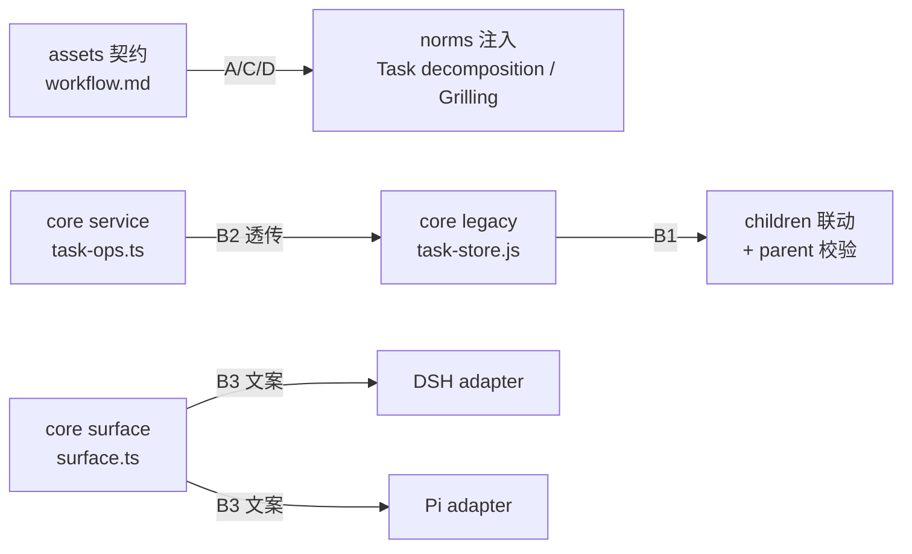

# 设计文档：workloom 子任务机制（契约/工具/提示三面落地）

## 1. 改动总览

按分层映射（每层职责见 spec/repo/architecture/layering.md）：



## 2. B1 core legacy：parent 校验与 children 联动（task-store.js）

1. `CreateTaskParams.parent` 已存在，只需在 `createTaskInternal` 消费：
   - **normalize**：`parent` 接受 `tasks/08-29-xxx`（原样）或 `08-29-xxx`（补 `tasks/` 前缀）；归一后称 `parentRelPath`。
   - **校验（顺序固定，任一失败抛错，均不产生任何写入）**：
     - ① 存在性：`readTask(root, parentRelPath)` 可读且非空；
     - ② 自引用：`parentRelPath !== 新任务的 taskRelPath`（新 taskRelPath = `tasks/<MM-DD>-<slug>`，创建前即可比较）；
     - ③ 状态：parent.status ∈ {planning, in_progress}，archived/completed 拒绝；
     - ④ 逃逸防护：复用 `insideWorkloom`（path escapes .workloom directory 自动抛错）。
   - **联动（创建成功之后）**：读父 task.json → `children` 追加子任务 `taskRelPath`（去重）→ `writeTaskJson` 写回。父写回失败则抛错（子任务已创建，错误消息指明需人工修复，不做回滚）。
2. `TaskSummary` 增加 `parent` 字段：`listTasksInternal` 摘要构建处补 `parent: task.parent ?? null`；d.ts 同步。

## 3. B2 core service（task-ops.ts）

`ExecuteCreateTaskParams` 增加 `parent?: string`；`executeCreateInternal` 透传给 `createTask`（空串视同未传，与现有参数处理一致）。校验/联动全部在 legacy 层，service 不重复。

## 4. B3 core surface（surface.ts）

1. `TOOL_SNIPPETS.taskCreate` 签名加 `parent?`：
   `workloom_task_create(title, slug?, priority?, description?, parent?) — create a task`
2. `PARAM_DESCRIPTIONS` 增加：
   `parent: 'Optional parent task relative path (tasks/<id> or <id>); the task is recorded as its child'`
3. `TOOL_DESCRIPTIONS.taskCreate` 不动（保持现状逐字）。

## 5. B4/B5 双 adapter（tasks.ts）

1. **adapter-dsh**：注册参数 schema 加 `parent: { type: 'string', description: PARAM_DESCRIPTIONS.parent }`；`createTaskTool` 加 `parent: stringOf(typed, 'parent')` 透传（复用现有 `stringOf`）。
2. **adapter-pi**：`TASK_CREATE_PARAMS` 加 `parent: Type.Optional(Type.String({ description: PARAM_DESCRIPTIONS.parent }))`；`executeCreate` 透传 `params.parent`。
3. 两个 adapter 均不重复校验（core 统一）。

## 6. A 契约（assets/workflow/workflow.md）

1. **Principles** 追加一条：任务拆分原则——模型只推荐，用户确认后才创建子任务；容器任务与"one active task"的关系（容器保持 planning，子任务完成后容器做总验收归档）。
2. **1.0** 追加"复杂度预判"：推荐建任务时粗判交付物数，≥3 个可独立交付/验收时在推荐中预告"建议拆 N 个子任务"，创建前用户确认。
3. **1.1** 强化顺序：brainstorm → grilling（设计决策类）→ prd 定稿；grilling 多轮护栏写进正文。
4. **1.4** 追加"开工前规模自检"：以 prd/design/implement 实际阶段数精判；推荐拆分（候选子任务清单：title/scope/理由）→ 用户确认 → 逐个 `workloom_task_create`（parent 挂主任务）；子任务完整走生命周期；主任务最后 start→check→archive（总验收前确认全部子任务已归档）。
5. **3.1** 追加归档约束：主任务归档前确认全部声明子任务已归档；缺则说明理由并留痕。
6. 契约解析器测试（workflow-contract/contract-asset/step-lookup）必须保持全绿；新增 S6 存在性测试守护关键规则不被误删。

## 7. C/D norms（workflow.md [workflow-norms] 块追加，英文）

```txt
Task decomposition (always-on):

- When a task contains 3+ independently deliverable pieces, recommend splitting it; never create subtask tasks before the user confirms the candidate list and the split itself. A container task stays in planning; subtasks run their own full lifecycle; the container does the final acceptance and archives last.

Grilling (always-on):

- After every user answer, recompute the design-tree frontier; new branches mean another round. Never declare "frontier empty" just because the user answered the current batch — claim convergence only when no open question remains.
```

## 8. 关键约束与风险

1. legacy 改动仅为 task-store.js（纯 JS + JSDoc），保持数据布局兼容（spec/repo/legacy-module）。
2. surface 文案 `as const` 英文；Pi promptSnippet 与 DSH schema 必须同步（`TOOL_SNIPPETS` 是唯一签名来源）。
3. children 联动为文件读写，单机场景无并发竞态；失败时错误消息指明"子任务已创建，父 children 未更新"。
4. 契约改动不触碰 front-matter/states 声明，避免解析器报错；norms 块保持单一不嵌套。
