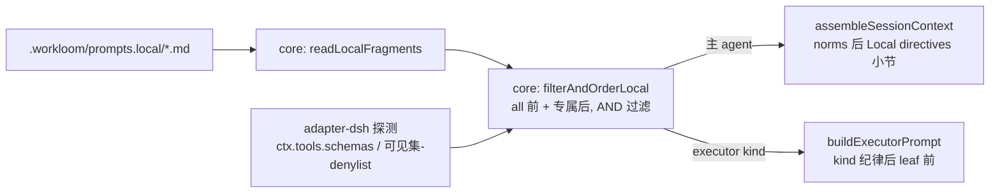

# 提示词本机扩展点机制（DSH 落地）— 设计

## 1. 架构与分层

本机片段机制的读取/解析/过滤/合成全部在 core（runtime 无关，新 TS 抽象），adapter-dsh 只做两件事：确认可用工具集、把合成文本传入已有入口。adapter-pi 零改动（不传参数 = 不注入，向后兼容）。

## 2. core 新抽象：`packages/core/src/service/local-prompts.ts`

纯函数与 IO 分离，测试接缝落在纯函数：

1. `LocalFragmentTarget`：`'main' | 'research' | 'implement' | 'check' | 'frontend' | 'all'`；文件名→目标映射 `main.md → main` 等，`all.md → all`。
2. `LocalFragment`：`{ target, requiresTools: string[], text }`（requiresTools 缺省为空数组）。
3. `parseLocalFragment(body: string): LocalFragment`（纯）：YAML front-matter 解析（复用 `yaml` 依赖，与 config.js 同库）；无 front-matter 视为无条件片段；`requiresTools` 须为字符串数组，否则抛错；未知字段抛错。
4. `filterAndOrderLocal(fragments, target, availableTools): LocalFragment[]`（纯）：合成顺序 `all.md` 在前、`<target>.md` 在后（target 为 `all` 时只有 all）；AND 过滤——requiresTools 非空时，声明工具须全部 ∈ availableTools。
5. `readLocalFragments(root): [Error|null, LocalFragment[]]`（IO）：目录不存在返回空；遍历目录，未知 `.md` 文件名 fail loud（文案列出合法清单）；非 `.md` 忽略；单项解析错误 fail loud（路径入错误信息）。
6. `composeLocalDirectivesText(root, target, availableTools): [Error|null, string]`（组合）：`readLocalFragments` + `filterAndOrderLocal`，输出以 `\n\n` 拼接的最终文本（空串 = 无注入）。

错误类型：`WorkloomLocalPromptError extends Error`，携带 `file`（相对路径）与字段路径，措辞风格对齐 `WorkloomConfigError`（fail loud 口径：本机片段是用户有意之增强，静默失效不可接受）。

## 3. 注入点改造

### 3.1 主 agent：`session-context.ts`

- `SessionContextParams` 新增 `localDirectives?: string | null`。
- `assembleInternal`：深度 0 且文本非空时，在 norms 段（或 guidelines 之后）追加 `Local directives:` 小节；深度 > 0 忽略（executor 的片段由首条 prompt 注入一次，避免重复）。

### 3.2 executor：`executor-context.js`（legacy 纯 JS，只接字符串）

- `BuildExecutorPromptParams` 新增 `localDirectives?: string`（d.ts 同步）。
- 插入位置：kind 纪律段之后、leaf 契约段之前，`## Local directives` 标题包裹；`userPrompt` 已含 `## Local directives` 时不再追加（与 leaf 段同去重规则）；空串/未传不插入。
- 该参数由 adapter 传入，core 不做 IO（分层：legacy 免构建、无新依赖）。

### 3.3 adapter-dsh 探测与传参

- `plugin.ts` `renderSessionContext`：`availableTools = ctx.tools.schemas().map(s => s.name)`；调 `composeLocalDirectivesText(root, 'main', availableTools)`；结果文本经 `assembleSessionContextText` 传给 core。错误 fail loud 前先按现有口径处理（`renderSessionContext` 现有错误只告警返回空串——需确认并保持：localDirectives 组装失败走同样的告警降级，不阻塞会话快照）。
- `executor.ts`：把 `buildExecutorPrompt` 调用挪到 denyList 计算之后；`availableTools = visibleNames − denyList`（子代理真实可见集）；`composeLocalDirectivesText(root, kind, availableTools)` 结果传入 `buildExecutorPrompt`。
- 注意 `executor.ts` 现在 `buildExecutorPrompt` 在 `buildDenyList` 之前调用，需要调整语句顺序（无行为变化，仅顺序）。

## 4. 内置 LSP 软基线（含在 EXECUTOR_CONTRACT_BY_KIND 与 workflow 契约中，无独立片段概念）

统一软句子（英文，与契约语言一致）：

> When LSP tooling is available, use it to assist coding and error diagnosis, and include an LSP diagnostics check in the verification pass.

- `EXECUTOR_CONTRACT_BY_KIND`：implement / check / frontend 三个文本追加此句；research 不动；`EXECUTOR_NORMS` 不动。
- `workflow.md`：`version: 13` → `14`；2.1 完成标准、2.2 完成标准各加一句（软基线）；`[workflow-state:in_progress]` 块加一句（每轮自动注入主 agent）；`[workflow-norms]` 加一句（always-on）。
- 措辞软（"When available"）确保无 LSP 插件环境不产生指向虚无的硬指令；本机偏好文件负责升级为硬指令。

## 5. doctor 可观测性

- `doctor-check-rules.ts` 新规则 `checkLocalPrompts(root)`：遍历 `.workloom/prompts.local/`，逐片段输出状态——loaded（含 target、条件、来源文件）/ skipped（列出缺失的工具名）/ 未知文件名（warn）/ front-matter 错误（error，带 path）；目录不存在不产出 issue。
- 注册进 `doctor-checks.ts` 的规则列表（与 `checkTaskLifecycle` 同级）。
- 主链路 fail loud 与 doctor 报 issue 并存：主链路报错阻止注入，doctor 给出可修复提示（fixable 视错误类别）。

## 6. 文档与本机落地

- `.workloom/config.example.yaml`：新增 `## prompt local extensions` 一节——目录约定、文件清单、front-matter 格式、requiresTools AND 语义、示例（LSP 硬约束片段）。
- `.workloom/.gitignore` 追加 `prompts.local/`。
- 本机落地（gitignored，不入库）：`.workloom/prompts.local/{main,implement,check,frontend}.md` 四个文件，内容为英文硬约束——必须使用 LSP 工具辅助编码与排错；implement/check 收尾报告必须包含 LSP 诊断验证结果；`implement.md`/`check.md`/`frontend.md` 可声明 `requiresTools: [lsp_diagnostics]`（本机已装插件，条件恒真；仍声明以示示例完整）。main.md 一律保留。

## 7. 测试策略（接缝已对齐）

| 接缝 | 测试文件 | 覆盖 |
| --- | --- | --- |
| 片段解析 / 过滤合成 | `core/test/local-prompts.test.js`（import `../dist/service/local-prompts.js`） | TC1–TC3：合法解析、非法 front-matter fail loud、AND 过滤、all 前专属后、未知文件名 fail loud、目录缺失空 |
| executor 注入 | `core/test/executor-context.test.js` 增补 | TC4：文本插入位置（kind 后 leaf 前）、缺省行为不变、标题去重 |
| 主 agent 注入 | `core/test/session-context.test.js` 增补 | TC5：depth0 小节（norms 后）、depth>0 不注入 |
| adapter 传参 | `adapter-dsh/test/executor.test.js` 增补 | TC6：探测集为可见集−deny、无条件满足时无 Local directives 段 |
| 内置基线 | `executor-context.test.js` + workflow 契约测试 | TC7：三个 kind 含句、research 不含、EXECUTOR_NORMS 不含、version=14 |

本机四文件存在性与 gitignore 行为为手工验收（TC9）。
