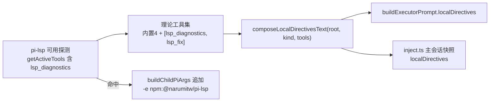

# 提示词本机扩展点机制（Pi 落地）— 设计

## 1. 总体架构

core 零行为变化（`assembleSessionContext` / `buildExecutorPrompt` / `composeLocalDirectivesText` 参数已就位），本次只做 adapter-pi 接线 + 本机 pi-lsp server 配置：

## 2. 探测与理论工具集（公共函数）

新文件 `packages/adapter-pi/src/pi-tools.ts`（纯函数 + 探测封装，供 executor 与 inject 共用）：

1. `BUILTIN_CHILD_TOOLS`：`['read', 'bash', 'edit', 'write']`（research 实证的内置 4 工具常量）。
2. `PI_LSP_TOOLS`：`['lsp_diagnostics', 'lsp_fix']`（pi-lsp 源码 registerTool 实证；与 DSH 侧 `lsp_diagnostics` 同名）。
3. `PI_LSP_SOURCE = 'npm:@narumitw/pi-lsp'`（`-e` 加载源）。
4. `buildTheoreticalTools(hasLsp: boolean): string[]`：纯函数，命中 → 内置 4 ∪ PI_LSP_TOOLS；未命中 → 内置 4。
5. `hasLspCapability(pi: ExtensionAPI): boolean`：事件处理器内调用 `pi.getActiveTools()` 判 `lsp_diagnostics`（不在加载期 stub 上下文调用）。

## 3. child 注入链（executor.ts + pi-args.ts）

### 3.1 pi-args.ts

- `BuildChildPiArgsParams` 新增 `loadExtensions?: string[]`（扩展源列表，缺省不加载）。
- 固定序列在 `--no-extensions` 之后追加 `-e <src>`（每源一对参数；与 `--no-extensions` 并存合法，官方 CLI 语义）。
- 不改变既有参数顺序与缺省行为（现有调用方不传 = 行为一致）。

### 3.2 executor.ts

- 工具执行路径：`pi` 句柄（registerExecutorTool 入参）→ `hasLspCapability(pi)` → `buildTheoreticalTools`。
- `localText = composeLocalDirectivesText(root, kind, theoreticalTools)`（core 导出，错误处理沿现有 fail loud 口径：组装失败抛错转工具失败）。
- `buildExecutorPrompt({ ..., localDirectives: localText })`（参数已在 core 就位）。
- `dispatchChildPi` → `buildChildPiArgs({ prompt: built.text, kind, model, effort, loadExtensions: hasLsp ? [PI_LSP_SOURCE] : undefined })`。

## 4. 主会话注入链（inject.ts）

- `assembleSessionContextText(root, contextKey, contractText, localDirectives?)`：透传 `assembleSessionContext`。
- `injectSessionContext`（session_start，reason ∈ {startup, new}）：探测 `hasLspCapability(pi)` → `composeLocalDirectivesText(root, 'main', getActiveTools())` → 传入。
- Pi 主会话工具面即 `getActiveTools()` 全量（主会话无 deny，与 DSH 主 agent 视图同义）；`main.md` 无条件注入、其余片段按 `requiresTools` 过滤。
- 注入形态为一次性消息（文本入上下文历史后持续存在；与 DSH 每轮快照覆盖效力等价，不拉齐 —— prd Notes）。

## 5. pi-lsp server 配置（机器层）

- 写 `~/.pi/agent/pi-lsp.json`（pi-lsp canonical 名；child 与主会话共享同一用户级配置）。
- 配置对齐 DSH 覆盖面：gopls（`.go`）、bash-language-server（`.sh`/`.bash`）、TS 双路（tsgo `tsc --lsp --stdio` 优先 + typescript-language-server 兜底，tsserver fallbackPath 指向 `~/.dsh/lsp-typescript/node_modules/typescript`）。
- 具体 JSON 结构以 pi-lsp 的 README「Custom config」schema 为准（实现时对照 `~/.pi/agent/npm/node_modules/@narumitw/pi-lsp/README.md` 的 servers 字段定义写，语义与 DSH 等价）。
- 该文件不入仓库、无测试（TC6 手工验收：Pi 会话实测 `lsp_diagnostics`）。

## 6. 测试策略（接缝已对齐，TC1–TC5）

| 接缝 | 测试文件 | 覆盖 |
| --- | --- | --- |
| `buildChildPiArgs` `-e` 追加 | `pi-args.test.ts` 增补 | TC1：命中含 `-e` 且保留 `--no-extensions`；未命中无 `-e`；缺省行为与旧版一致 |
| 理论工具集 | `executor.test.ts` 增补 | TC2：命中/未命中两态；TC3：注入产物含/不含片段 |
| 主会话注入 | `inject.test.ts` 增补 | TC4：快照含 `Local directives:` 小节与 main.md 内容 |
| 回归 | 全量 | TC5：adapter-pi 全部现有测试 + core 测试全绿；`agent-definitions.ts` 无 LSP 句（grep 断言） |

`pi-lsp.json` 内容为机器层文件，手工验收（TC6），不入测试。

## 7. 分层与不变量

- adapter-pi 保持 thin：只有探测函数、工具集计算与传参；无业务逻辑。
- `agent-definitions.ts` 零改动（executor-voice：LSP 句只在 core）。
- 本任务不引入新 config 字段（能力探测为默认路径）。
- 所有 Pi 侧改动均不破坏 `--no-extensions` 的零派发保证（pi-lsp 无 workloom 工具，research 实证）。
