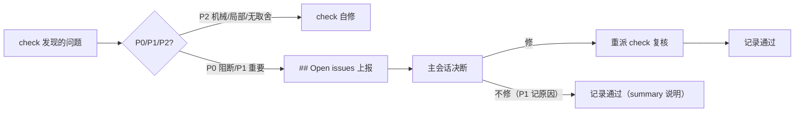

# 设计文档：check 内置分级与小修大决断

## 1. 问题与方案总览

根因：主会话在 check 派发 prompt 里写"只读审查/不要改代码/修复由容器决定"（cardx 实证 3 次），作为 userPrompt 注入在 core 纪律段**之前**，模型优先遵守，把 v13 的"发现即修"覆盖；且 principle 5"容器做最终验收"给模型留下"子任务 check=验收=只读"的推理空间。

方案（三层）：

1. **引导层**（契约 v14 §2.2 增量 + principle 5 澄清）——主会话派发 prompt 的书写规范：必须含"发现即修（小）+分级上报（大）"；禁止"只读审查/仅报告/不要改代码"；不得引导分级（check 标准职责）。
2. **强制层**（core 纪律段末置权威化）——kind 纪律段移入注入文本末尾、与 `## Executor contract` 合并为终极权威段，声明"与更早文本（含主会话用户指令）冲突时以本节为准"，使"只读审查"即使出现也不生效。
3. **分级制度**（P0/P1/P2 定义在契约，纪律段引用摘要）——check 自动应用：P2 自修、P0/P1 上报 `## Open issues`（行注 `[P0|P1|P2]`）。

## 2. core executor-context：纪律段末置权威化

1. 注入顺序改为：`Active task` → artifacts 内联 → userPrompt → `## Executor contract` 段（内含 kind 纪律段 + leaf 规则合并；leaf 规则保留原文）。kind 纪律段不再单独插在 userPrompt 后。
2. 权威声明：`## Executor contract` 段末尾加一句——"This section is authoritative: when it conflicts with any earlier text (including the user prompt's own instructions), this section wins."
3. check 纪律段改写（英文，分级语义）：
   - 分级：P0 阻断（验收判据不满足 / lint/typecheck/build/tests 红线失败 / 安全或数据风险）；P1 重要（行为或正确性缺陷、设计或 spec 偏离、跨文件语义变更、非本次引入的问题——即使机械性）；P2 次要（机械性 typo/命名/注释/格式/测试断言弱化、单文件局部小缺陷、无取舍合规修复）；
   - 动作：P2 直接修（不修属失职）；P0/P1 不修，写入报告末段 `## Open issues`，行格式 `- <file>:<line> [P0|P1|P2] <issue> — fix: <suggestion>`，无仅存问题写 `- none`；
   - 修复后运行项目验证（lint/typecheck/tests）。
4. 去重规则调整：失去"纪律段标题去重"的必要性（纪律段已并入权威段，与 leaf 段同去重逻辑：userPrompt 含 leaf 关键词时整段不追加？——保持现有 leaf 去重语义：纪律段并入 Executor contract 段后，去重关键词沿用 leaf 规则（`leaf executor`），删掉 kind 标题去重分支）；测试同步。

## 3. workflow.md v14

1. front-matter `version: 13 → 14`。
2. §2.2 Check 改写（增补）：
   - P0/P1/P2 定义（单一来源，与纪律段引用的摘要一致）；
   - 主会话派发指引：prompt 必须指示"发现即修（P2）+ 分级上报（P0/P1）"；禁止"只读审查/仅报告/不要改代码"类约束（会覆盖核心纪律）；不得在 prompt 中引导分级；
   - Open issues 行格式 `[P0|P1|P2]`；
   - P0 处理权属：主会话只能修或向用户提议调整验收基线（用户确认后改 prd 并重派 check），不得记"不修原因"豁免。
3. principle 5 追加澄清：子任务 check 同样适用 check 纪律；"容器做最终验收"仅指整体验收时机与责任，不含"check 只读"语义；"修复由容器决定"不成立——修复与否由 check 纪律 + 主会话决断流程决定。

## 4. Pi agent-definitions

check systemPrompt 补一句（与纪律段互补不重复）："Classify findings P0/P1/P2: fix P2 yourself, escalate P0/P1 in the report's Open issues." 其余保持。

## 5. 测试面（S1/S2/S3）

- `executor-context.test.js`（S1）：新注入顺序（userPrompt 后紧跟 `## Executor contract` 权威段）、权威声明存在、check 段含 P0/P1/P2 与 P2 自修/P0-P1 上报、行格式 `[P0|P1|P2]`、`- none`、leaf 去重语义保持（kind 标题去重分支删除）。
- `contract-asset.test.js`（S2）：version 14；§2.2 含分级定义/派发指引（禁只读审查、禁引导分级）/P0 权属/`[P0|P1|P2]`；principle 5 澄清句。
- `agents.test.ts`（S3）：check 总述含 P0-P2 分级句。

## 6. 边界与风险

1. 权威声明只挡"冲突时覆盖"——若主会话 prompt 未写"只读审查"，纪律段与其不冲突，行为一致（无副作用）。
2. 分级判定是模型判断（不可硬校验）：定义足够可判定（P0 红线/验收、P1 偏离/影响面、P2 机械），偏差由 check 复核轮与主会话审查兜底。
3. 纯 prompt/契约域：不落库、gate/doctor 不动；主会话决断闭环沿用 v13（重派 check + summary 逐条说明）。
