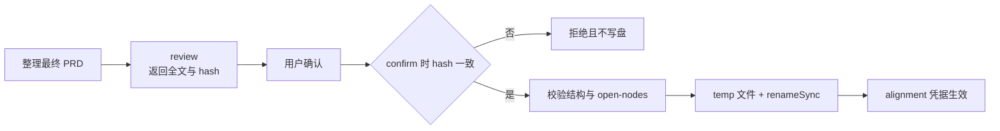

# design: 统一 alignment skill 与可失效凭据

## 1. 设计原则

1. Alignment 是 Phase 1.1 的单一连续 design tree，不再跨 skill 交接。
2. 内容规则归 assets，纯状态判断归 core legacy，编排归 core service，runtime 只做投影与能力硬化。
3. 新任务只产生 `alignment`；旧 `grilling` 作为未知历史字段透传，不映射语义。
4. 门禁只根据可客观验证的 PRD、hash、status 和凭据判断，frontier 质量由 skill + 用户确认负责。

## 2. Alignment 资产结构

```text
packages/assets/skills/workloom-alignment/
├── SKILL.md
├── references/ui-design.md
├── references/test-first.md
└── evals/evals.json
```

`SKILL.md` 内联固定根节点、frontier 轮次、推荐答案、事实调查、技术节点边界和收敛步骤；仅在适用节点命中时读取 UI/TDD reference。Workflow Phase 1.1 只加载该 skill。Generic `grilling`/`tdd` 仅改 workloom 注记和触发边界，不改上游方法正文。

## 3. 状态与哈希

```ts
interface TaskAlignmentRecord {
  passedAt: string
  summary: string
  prdHash: string
}
```

`computePrdHash` 对完整 UTF-8 PRD 将 CRLF/CR 归一为 LF 后计算 SHA-256。开放节点只扫描语言无关标记 `<!-- workloom:open-nodes=pending|none -->`，避免新增 H2 解析器。



Confirm 全程同步；相同 hash 直接返回旧凭据，不刷新 `passedAt`。Task-store 只新增窄写口，通用原子写函数负责同目录临时文件、清理失败残留和 rename。

## 4. Service 与工具边界

新 `alignment-service.ts` 负责 cwd/root/task 解析、review/confirm 编排和错误归一化；legacy 模块提供 hash、marker、stale 纯函数与凭据写口。`workloom_task_align` 暴露 `action=review|confirm`、`expectedPrdHash`、`summary`、`taskPath`。

DSH 工具执行时以 delegation depth 拒绝子代理；Pi executor 不加载 extensions，保持天然隔离。工具不进入 executor 默认 allow 清单。

## 5. 门禁矩阵

| 状态 | alignment | PRD | 行为 |
| --- | --- | --- | --- |
| planning | null | 任意 | 允许 research，start 拒绝 |
| planning | 有效 | hash 一致 | start 继续检查既有 PRD/jsonl 门禁 |
| planning | 有效 | hash 不同 | 允许 research，start 拒绝 |
| in_progress | null | 任意 | 旧任务不追溯阻断 |
| in_progress | 有效 | hash 一致 | 正常执行 |
| in_progress | 有效 | hash 不同 | 阻止新派发、continuation、check、archive |

新增 `stale_alignment` gate。Force 统一要求非空 reason；先求值实际缺失 gate，再为每个被绕过项分别写 override，同时存在配置冲突和 stale 时写两条。

## 6. 迁移与 doctor

Normalize 继续 `...parsed` 后补 `alignment ?? null`，因此旧字段不会丢失。新任务不再写 `grilling`。旧 planning 必须 alignment；旧 in_progress 空凭据放行；归档任务不主动迁移，但 doctor 确实修复并写回时允许补 `alignment: null`。

Doctor 新增不可自动修复的 workflow overlay 检查，报告旧 skill 名及 1.1a/1.1b/1.1c 引用。Legacy-module spec 增加显式迁移、旧字段透传和 doctor 写回边界。

## 7. Protocol 与发布

Workflow frontmatter version 同时作为 protocol version；core 导出期望值。DSH apply 和 Pi 工厂在任何注册副作用前解析契约并 fail loud。构建测试独立断言四个 package semver 一致。

## 8. 验证策略

自动化覆盖 core 纯函数、原子写、service、门禁、迁移、doctor、surface、双 adapter schema/skill 清单和 protocol。Skill 行为与 trigger eval 生成静态 viewer；runtime smoke 使用独立 DSH headless 与 Pi 沙箱，不改 Web GUI 绑定。
