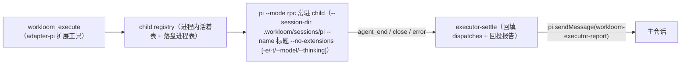

# Design：Pi 侧 executor 对齐 DSH（架构 R：RPC 常驻 child）

依据：prd.md（R1–R8）、`docs/research/pi-dsh-executor-parity.md` §4（事实与架构决策）、pi 0.84.2 `docs/rpc.md`（协议全文已核）。

## 1. 架构总览

transport 从「`--mode json` spawn 用后即弃」演进为「`--mode rpc` 常驻 child + 会话落盘」：

- 分层归属（repo/architecture）：RPC 客户端、child registry、settle 都是 Pi host 投影，全部落 adapter-pi；core 只新增共享文案常量（§5）；assets 只改契约措辞（§5）。
- 派发纪律不变：child 启动参数保留 `--no-extensions` + 按需 `-e`（pi-lsp / research scope），RPC child 同样看不到 `workloom_execute`，零再派发的结构性保证保持（R8）。

## 2. 模块设计（adapter-pi）

### 2.1 pi-rpc.ts（新增）：RPC 客户端

- 严格 `\n` 分帧：`StringDecoder` + buffer 手写 reader（官方 rpc.md 明示 Node `readline` 不合规——U+2028/U+2029 会错切 JSON 字符串；官方 Node 示例即此模式）。现有 `createInterface` 读法（executor.ts/pi-events.ts 链路）随 M1 退役。
- 形状：`createRpcConnection(child)` 返回 `{ sendCommand(cmd): Promise<RpcResponse>, onEvent(cb), close() }`；`sendCommand` 自动生成递增 `id` 并按 response.id 关联，`success: false` 抛错（fail loud）；事件回调逐行 parse，坏行静默跳过（沿用 pi-events 的容错口径）。
- 消费的命令面（最小集）：`prompt`（含 `streamingBehavior`）、`steer`、`abort`、`get_state`（取 sessionId/sessionFile/isStreaming）；响应超时不设（与派发无 timeout 的既有口径一致），进程退出即连接终结。

### 2.2 pi-child-registry.ts（新增）：child 活着表 + 落盘进程表

- 进程内表：`sessionId → { connection, child, kind, root, taskRelPath, parentSessionId, status, startedAt }`，派发时登记、settle 后保留至 child 退出。
- 落盘进程表：`.workloom/sessions/pi/registry.json`（pid + sessionId + startedAt 列表），原子写（复用 core file-atomic）；child 退出即移除条目。
- 孤儿回收（R6）：扩展加载时读 registry.json——残留条目对应的 pid 若存活则 SIGTERM（不收养），随后清空文件；主会话结束（扩展卸载/pi 退出 hook）联动 SIGTERM 全部存活 child，未完成派发由 settle 回填 failed（摘要 `host session ended`）。
- 目录初始化：`.workloom/sessions/pi/` 按需创建；gitignore 写入由 init/文档层负责（本任务在 adapter-pi README 级说明 + workloom init 的 gitignore 模板若存在则同步——实现时核实 init 模板，若无模板则仅在 registry 目录放 `.gitignore` 自守护）。

### 2.3 executor-settle.ts（新增，与 DSH 同名同职责）

- 每个 child 注册终态监听：`agent_end` 事件（成功，提取最后非空 assistant text——复用 pi-events 的 `extractExecutorText` 语义）与 `close`/`error`（异常，stderr 尾部摘要沿用 4KB 上限）。
- 回填：调 core `settleExecutorDispatch`（DSH 已在用，直接复用）把 dispatches 的 running 改 completed/failed + 一行错误摘要（200 字符截断口径与 DSH 一致）。
- 回投（R1）：settle 成功路径把「终文 + receipt 尾行」经 `pi.sendMessage({ customType: 'workloom-executor-report', content, display: true })` 投递给登记的 parentSessionId 主会话；回投失败仅 WARNING（前缀沿用 `ERR_PREFIX.executor`）。前台派发不回投（工具返回值即报告，避免双份）。

### 2.4 executor.ts / pi-args.ts / pi-events.ts（改造）

- pi-args：`buildChildPiArgs` 改为 RPC 形态——固定序列 `--mode rpc --session-dir <root>/.workloom/sessions/pi --no-extensions --name "[<KindLabel>] <title>"`（R5，KindLabel 口径与 DSH 相同），`-e`/`-t`/`--model`/`--thinking` 追加逻辑不变；`-p <prompt>` 从 args 移除（prompt 改经 RPC `prompt` 命令下发）。
- executor.ts 派发时序（后台，默认）：组装 prompt（buildExecutorPrompt 不变）→ spawn RPC child → `get_state` 取 sessionId（=childId）→ **派发时刻** `recordExecutorDispatch`（running、childId、生效 model/effort 绑定 + modelSource，R4）→ 发 `prompt` 命令 → 接受即返回 `{ childId, receipt }`（receipt 含注入统计，buildExecutorReceipt 复用）。spawn/get_state/prompt 任一失败：留痕 failed（无 sessionId 时 childId 缺省）+ fail loud 抛错（R4）。
- foreground: true：同链路但等待 settle 的终文直接作为工具返回（不回投）；ctx.signal abort → 发 `abort` 命令 + SIGTERM，settle 回填 failed。
- pi-events.ts：JSONL 行解析纯函数保留（`agent_end`/`message_end` 语义在 RPC 事件流不变），`createInterface` 绑定移除，改由 pi-rpc 的 reader 喂入。

## 3. 续用与 steering（M2，executor-continuation.ts 新增，与 DSH 同名）

- `continue_executor` 定位：`latest` = task.json dispatches 同 kind 最近一条的 childId；显式 childId 按记录校验；跨 kind 拒绝（文案与 DSH 逐字一致，共享常量见 §5）；无记录 fail loud。
- rebind 拒绝：`continue_executor` 与 model/effort 同传 → 返回拒绝文案（共享常量），不派发。
- 投递路径三分支：child 存活且 idle → RPC `prompt`（增量指令；`reinject: true` 时重发 buildExecutorPrompt 全量）；child 存活且 streaming → RPC `steer`（R3，当前回合工具执行完、下次 LLM 调用前送达）；child 不存活 → `pi --session <id> --mode rpc …` 重启续接（参数面同新派，`--name` 保持原标题）后发 `prompt`。
- 续用轮留痕：dispatches 追加一条（kind/title/childId 同前，绑定字段按 DSH spawnBinding 语义标注首派值）；settle/回投链路复用。

## 4. 数据与存储口径

- child 会话 transcript：`.workloom/sessions/pi/<sessionId>.jsonl`（pi 自管，`--session-dir` 决定）；任务归档时清理该任务关联 child 的 transcript（按 dispatches 的 childId 对账，清理失败仅 WARNING 不阻塞归档——归档钩子挂 core 归档流程还是 Pi 侧命令层，实现时按 architecture「adapter 薄投影」原则定：core 归档流程不感知 runtime 文件，清理由 adapter-pi 在归档命令路径补充）。
- dispatches 字段：childId = pi sessionId；status 生命周期 running → completed/failed；modelSource/binding 字段复用 core buildNewDispatchBinding，与 DSH 完全同口径（R4）。

## 5. core / assets / adapter-dsh 改动面（M3）

- core surface.ts：`PARAM_DESCRIPTIONS.titleExecutor` 删除 "only effective on the DSH adapter" 尾注；续用/rebind 拒绝文案上移为 core 共享常量（DSH executor.ts 现有本地常量迁走，两 adapter 同 import——服务 R7「逐字相同」且消除双份维护）。TOOL_DESCRIPTIONS/TOOL_SNIPPETS 已描述 continuable 语义，Pi 补齐参数面后自然成立，不改文案。
- core PARAM_DESCRIPTIONS 已有 continueExecutor/foregroundExecutor/reinjectExecutor 描述，Pi EXECUTOR_PARAMS 直接补齐三参数引用。
- assets workflow.md norms Dispatch 段：措辞 runtime 中性化核查——"subagent notice" 改为不绑定 DSH 机制的表述（如 "the completion report arrives asynchronously in the main session"），其余（background by default/continue_executor/reinject）两 runtime 均已成立。
- adapter-dsh：拒绝文案常量改 import core（行为零变化）；dist 按 repo/deployment 重建 + rsync 同步。

## 6. ADR-0006 修订（R8）

仓库无独立 ADR 文件（ADR-0006 以 adapter-pi 源码头注释形态存在），修订方式：executor.ts / agent-definitions.ts 头注释更新为 RPC 常驻形态的决策记录（动因 = P1–P8 对齐；保持 = fresh prompt 与零再派发两条初衷；否决 = 架构 S 与 pi-web 原生 transport，指向两份 research 文档），并在 parity 文档 §4 追加修订记录行。

## 7. 里程碑边界

- M1：pi-rpc + registry + settle + executor/pi-args 改造 + 后台/foreground + 留痕时机 + title + 孤儿回收（R1/R4/R5/R6）。
- M2：executor-continuation + steering + reinject + `--session` 重启续接（R2/R3）。
- M3：Pi 参数面补齐三参数 + core 文案统一/共享常量迁移 + assets norms 核查 + adapter-dsh 同步 + ADR 修订（R7/R8）+ transcript 归档清理挂接。
- 每里程碑独立可验收（prd Acceptance），提交按 repo/commits 拆分。
