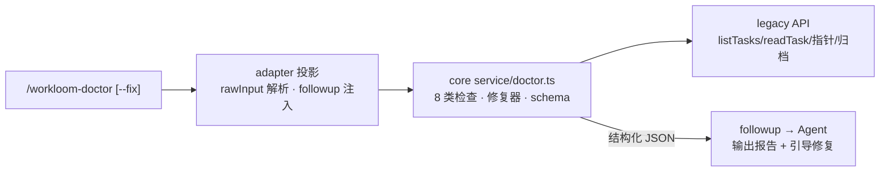

# 设计文档：workloom-doctor 工作流健康检查命令

## 1. 架构总览



- 命令名/描述进 surface 常量（双 adapter 逐字一致）；命令资产 `assets/commands/workloom-doctor.md`；不登记 workflow 步骤。

## 2. core 检查引擎（service/doctor.ts，TS 新抽象）

```ts
export interface DoctorIssue {
  code: string        // 检查项 code，如 'task-lifecycle' / 'parent-child' / 'archive' / 'dispatch-audit' / 'active-pointer' / 'doc-completeness' / 'spec-ref' / 'config'
  title: string
  severity: 'error' | 'warn'
  task: string | null          // taskRelPath 或 null（项目级 issue）
  message: string
  path: string | null
  fixable: boolean
  hint: string | null
}
export interface DoctorReport {
  checks: { code: string; title: string; severity: string; issues: DoctorIssue[] }[]
  summary: { total: number; fixable: number; manual: number }
  fixed: DoctorIssue[]          // --fix 时：已修复项（修复前 issue 快照）
  manual: DoctorIssue[]         // --fix 后仍存留项
}
export function runDoctor(root: string, opts: { fix: boolean }): [Error | null, DoctorReport | null]
```

8 类检查实现要点（全部只读，除修复器）：
1. task-lifecycle：遍历 tasks/（含 archive/）task.json——planning 且 createdAt 超 24h；in_progress 且 check 为空；completed 但仍在 tasks/（未归档）。
2. parent-child：子任务 parent 指向 P，但 P.children 缺该项；P.children 含子任务但子任务 parent 为空。
3. archive：存在 children 的主任务在 archive/ 但某子任务不在 archive/（反之报告）。
4. dispatch-audit：in_progress/archived 任务 dispatches 为空（提示可能绕行 executor，与 gate 语义呼应）。
5. active-pointer：active-task 指针指向不存在/已归档任务。
6. doc-completeness：prd.md 缺 H1/含占位符（复用 task-gates 判定）；implement/check.jsonl 无有效记录。
7. spec-ref：jsonl 引用的文件不存在（spec 或 research 路径失效）。
8. config：findWorkloomRoot 失败（无 .workloom）；config.yaml 缺失/非法；executor.gate 状态仅提示（warn）。

## 3. 修复器（仅确定性机械问题，fix 幂等）

- parent-child 双向补全：子 parent 有而父 children 缺 → 追加；父 children 含而子 parent 空且子任务存在 → 补 parent；写回 task.json（保持 2 空格缩进/尾换行）。
- active-pointer 清理：指针指向不存在/已归档任务 → 删除指针文件。
- 归档迁移：tasks/ 下 completed 任务移入 archive/（复用归档路径约定 tasks/archive/<YYYY-MM>/<name>/；**无 check 记录拒绝**并 report 为 manual）。
- 修复流程：先 runDoctor（快照 issues）→ 逐项执行 → 再 runDoctor 复核 → 报告 fixed（快照）/manual（复核残留）。

## 4. 命令接线

- dsh `handleDoctor`：cwd 解析 → rawInput 含 `--fix` → `runDoctor(root, {fix})` → followup 注入 `buildDoctorRelayText`（JSON + 引导："基于下列 JSON 输出报告；fixable 项已处理/或建议执行 --fix；manual 项给出修复步骤"）→ 回执。失败走既有 relayFailure。
- pi 命令注册：同语义（pi 的 commands 面，无 followup 时以文本返回 JSON）。
- surface：`COMMAND_NAMES.doctor = 'workloom-doctor'`、`COMMAND_DESCRIPTIONS.doctor`（英文）、`input: { hint: '--fix' }`。

## 5. 边界与约束

- doctor 只写 `.workloom/` 内文件（修复对象），不受 executor.gate 影响（gate 只拦 .workloom 外）。
- 不修改 task.json 字段布局；修复保持 legacy 数据兼容。
- 运行时文案/issue message 英文；注释中文。
