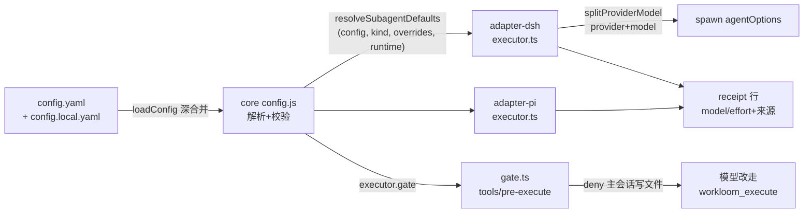

# 设计：强化 executor 派发约束与模型配置可观测性

## 总览

六个修复点按层归属：core 承担配置解析与值合并（runtime 无关），adapter-dsh 承担 provider 透传、receipt 行与硬门禁（DSH 专属能力），adapter-pi 只改传参与 receipt，assets 只改契约文案。

## 1. core：config.js 扩展（legacy 纯 JS 模块）

- **`subagents.<kind>.model` 双形式**：string（所有 runtime 同值）或 map（`{dsh: xxx, pi: yyy}`）。map 的 value 逐个 `requireString`，key 不白名单。类型变为 `string | Record<string, string>`。
- **runtime 解析在 resolve 端**：`resolveSubagentDefaults(config, kind, overrides, runtime)` 新增第 4 参 `runtime`（adapter 传入 `'dsh'`/`'pi'`）。entry.model 为 map 时取 `model[runtime]`，缺 key 抛 `WorkloomConfigError('subagents.<kind>.model', 'missing entry for runtime "<runtime>"')`。loadConfig 保持 runtime 无关（纯解析），runtime 语义只在消费端出现。
- **来源追踪**：返回值扩展为 `{ model, effort, sources: { model?, effort? } }`，source ∈ `'param' | 'config'`；字段缺失时 source 为 undefined（调用方标 default）。纯函数、无副作用的既有约束不变。
- **`config.local.yaml` 深合并**：loadConfig 在 config.yaml 之后尝试读 `.workloom/config.local.yaml`（ENOENT 跳过），用纯函数 `deepMerge(base, overlay)` 合并两份文档后再走 `mergeWithDefaults`：两边都是 plain object 递归合并，其余（数组/标量/ null）overlay 覆盖。packages/subagents 因此天然按 key 合并。
- **`executor.gate`**：`DEFAULT_CONFIG` 新增 `executor: { gate: true }`；解析 `executor` map 的可选 `gate` 布尔（复用 requireBoolean）。
- **`splitProviderModel(model)`**：按首个 `/` 拆为 `{ provider?, model }`；裸 id 返回 `{ model }`（provider undefined，语义=父 provider 兜底）。导出供两个 adapter 消费。
- config.d.ts 同步更新类型。

## 2. core：surface.ts 文案与 receipt

- `PARAM_DESCRIPTIONS.model` 更新为说明 `provider/model` 前缀形式与回退链（英文）。
- 新增 `buildExecutorReceipt({ model, modelSource, effort, effortSource })`：拼一行英文摘要，如 `[workloom executor] model: deepseek-official/deepseek-v4-flash-vision-exp (config), effort: max (config)`；字段缺失时显示 `(default)`。两 adapter 共用。
- `TOOL_SNIPPETS.executor` 不动（参数面不变）。

## 3. core：init.js 模板

- `GITIGNORE_TEMPLATE` 追加 `# Local config overrides (per-machine).` + `config.local.yaml`；本仓库 `.workloom/.gitignore` 手工同步同一行。

## 4. adapter-dsh：executor.ts

- `resolveSubagentDefaults` 调用加第 4 参 `'dsh'`。
- effective.model 经 `splitProviderModel` 拆分：`agentOptions` 变为 `{ provider?, model }`（provider 仅在拆分得出时携带）。
- **writeEffortHeader 修复**：provider/model 兜底链改为「子代理既有 header → 本次派发生效值（agentOptions）→ 父会话 options」，跨 provider 派发时不再错写父 provider/model。
- 返回文本尾部追加 `buildExecutorReceipt` 产物一行（拼进 output 首块文本）。

## 5. adapter-dsh：硬门禁（新增 gate.ts）

- `registerGate(ctx)`：`ctx.on('tools/pre-execute', handler)` 全局订阅；plugin.ts 的 apply 里接线。不新增 inject 依赖（事件走 cordis，`delegationDepthOf` 来自已依赖的 `@deepseek-ai/dsh-subagent`）。
- handler 判定链（任一不满足即 `return next()` 放行）：
  1. `exec.name` ∈ `{write, edit}`（常量集合，注释说明 dsh-tool-fs 注册面）；
  2. `exec.agent` 存在且 `delegationDepthOf(exec.agent) === 0`（主会话；子代理放行）；
  3. agent cwd 可解析出 workloom root；
  4. `loadConfig(root).executor.gate === true`；
  5. `resolveActiveTask(root, contextKey)` 有活动任务，且 `readTask` 状态为 `in_progress`；
  6. 目标路径（`exec.arguments.file_path`，相对路径按 agent cwd 归一化）不在 `<root>/.workloom/` 下。
- 全命中返回 `{ kind: 'deny', reason }`；reason 英文引导文案：任务处于 in_progress、主会话直接写文件已被 executor.gate 拦截、请改用 workloom_execute 派发 implement 子代理、或在 config.yaml 设 `executor.gate: false`。
- **判定基础设施故障（文件读失败等）只 console.warn 并放行**：门禁不锁死会话。
- 可测性：判定逻辑抽成纯函数 `decideWriteGate({...})` 导出，ctx.on 回调只做取数与转调，单测覆盖纯函数。

## 6. adapter-pi：executor.ts

- `resolveSubagentDefaults` 调用加第 4 参 `'pi'`；model map 由 core 按 `'pi'` 取值，Pi 侧把结果字符串原样透传 `--model`（pi 自身的 provider/model 形式由 pi 解释）。
- 返回文本尾部追加 receipt 行（同 adapter-dsh）。

## 7. assets：workflow.md 契约强化（英文）

- step 2.1 增加硬约束表述：主会话不得直接写实现代码（含 test-first 的测试种子），一切文件改动来自 workloom_execute 派发的子代理。
- `[workflow-state:in_progress]` 段补充：DSH 下主会话直接 write/edit 会被 executor.gate 硬拒绝（可配置关闭），与其被拦不如直接派发。
- 1.2/2.2 核对口径：派发表述与 2.1 对齐，不改语义。

## 8. 本仓库配置同步

- `.workloom/config.yaml`：裸模型 id 改为带 provider 前缀；subagents 注释块补充 map 形式与 config.local.yaml 说明（英文，与现有风格一致）；追加 `executor.gate` 注释示例。
- `.workloom/config.example.yaml`（新增）：map 形式示范（dsh: `deepseek-official/deepseek-v4-flash`，pi: `deepseek/deepseek-v4-flash`），仅演示用，不被 loadConfig 消费。
- `.workloom/.gitignore`：追加 `config.local.yaml`（example 文件入树，不忽略）。

## 关键取舍

- runtime 解析放 resolve 端而非 loadConfig：core 的 loadConfig 保持 runtime 无关，符合分层规范。
- 门禁只拦 write/edit 工具：bash 内写文件（cat > 等）无法拦截，作为已知边界写进契约说明，不追求完备。
- 裸 id 不 WARNING：与父同 provider 的裸 id 是合法用法，文档说明即可。
- config.local.yaml 与 config.yaml 同目录同后缀风格，深合并语义与「字段独立合并」的既有约定一致。
- map 示范放 config.example.yaml 而非生效配置：避免 pi runtime 下解析报错，生效配置保持 string 形式。
