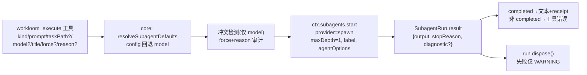

# design: workloom executor 子代理切换为一次性(one-shot)模式

## 数据流(改动后)

## 派发契约(DSH one-shot,`@deepseek-ai/dsh-subagent@0.1.1-rc.2`)

- `ctx.subagents.start(name, request)` → `SubagentRun { id, result, localAgent, dispose }`:
  `request` 为 `SubagentStartRequest`,支持 `label/prompt/parent/signal/
  agentOptions(provider|model|maxTokens)/maxDepth/outputSchema/toolFilter/persona`;
  descriptor mode 固定 `one-shot`。
- `run.result`(`SubagentResult`)含 `output`(final assistant output,语义同
  `finalAssistantOutput`)、`stopReason`(completed/aborted/error/max-tokens/
  refusal)、`diagnostic?`;`run.id` 即 child session id。
- spawn provider(`dsh-subagent-spawn-in-process`)capability 含 `depthLimit`,
  `maxDepth: 1` 语义不变(子代理深度 1 放行、再派发被拒)。
- **用户不可发送消息的依据**:客户端 `selectReadOnlySubagent` 对
  `mode === "one-shot"` 渲染只读 composer;服务端 `subagent.prompt` 端点经
  `catalogChild` 只接受 continuable,one-shot 返回 `subagent-not-found`。

## 派发切换(executor.ts)

- `SubagentsService` 收窄为 `start(name, request)`(返回 run 形状);
  `AgentsService` 从工具服务面删除(不再需要 child 引用);
  `MinimalAgent` 保留为 parent 形状(parent 只有 header.cwd/options 被读取)。
- `executeTool` 流程:`resolveSubagentDefaults(config, kind, {model})`
  → `detectExecutorConflicts(config, kind, {model}, 'dsh')`(force 审计不变)
  → `ctx.subagents.start(SPAWN_PROVIDER, { label, prompt, parent, signal,
  agentOptions, maxDepth: 1 })`(SubagentStartRequest 扁平形状,与
  `SubagentRuntime.start(name, request)` 契约一致)→ `await run.result`:
  - `stopReason === 'completed'`:`output` 文本 + receipt(model 行),空输出
    用 `EMPTY_OUTPUT_TEXT`;
  - 其余:`throw` 工具错误,文本 = `${ERR_PREFIX.executor}: ` + `diagnostic`
    (缺失用 `the executor subagent ended with <stopReason>` 兜底),不附输出。
  - 收尾 `run.dispose()`,失败 WARNING 不阻塞(对齐 drain 语义)。
- 删除:effort 参数/schema、`writeEffortHeader`、`EFFORT_WARN_PREFIX`、
  `assertEffort`/`finalAssistantOutput` import、events 边界切片逻辑。
- `runId` 沿用 `run.id`(现存返回形状不变)。

## effort 移除(DSH 侧断层,core/Pi 不动)

- **工具面**:schema 删除 `effort`;`ExecutorArgs` 同步删除。
- **配置面**:DSH 不再消费 `subagents.<kind>.effort`(仅不再传 overrides 的
  effort 即可,core 合并函数不改)。
- **冲突门**:`detectExecutorConflicts` 只传 `{ model }`,effort 冲突不再
  触发;`assertEffort` 调用点删除(Pi 侧保留)。
- **审计 gate**:`recordExecutorOverride` 与 `GATES.EXECUTOR_MODEL_EFFORT`
  是 core 共享审计面(adapter-pi 仍用同一 gate 记录 effort 覆盖),**不改名
  不改语义**,仅 DSH 侧的触发面收窄为 model 冲突;注释补充说明。
- **receipt(共享函数,最小通用化)**:`buildExecutorReceipt` 的 effort 段改为
  条件渲染——`effort/effortSource` 均 undefined 时不输出
  `, effort: ...` 段;Pi 传参行为不变(输出不变),DSH 调用只传
  model/modelSource。
- **文档**:`.workloom/config.example.yaml` 的 `subagents.<kind>.effort`
  说明补充「仅 Pi 生效,DSH 忽略该字段」。

## 边界与不变式

- 仅影响 DSH `workloom_execute` 派发;Pi 侧行为、core 的共享解析/冲突
  逻辑、任务工具与 gate 流程均不变。
- 子代理历史仍可在 GUI 子代理目录查看(one-shot 记录),只是不能再发送
  消息;本次不删除 or 迁移任何会话数据。
- 工具错误(异常终止)与冲突中断提示的既有消费方式一致(错由 DSH 工具
  管线转失败结果)。
