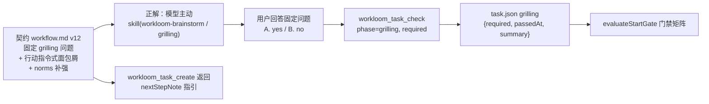

# design: planning 阶段 grilling 可靠主动触发

## 数据流

- 提示层（软）：面包屑行动指令 + create 返回指引 + norms 补强 + skill description 强化。
- 凭据层（记录）：`workloom_task_check` 复用扩展 `phase`，判定与收敛两次调用。
- 门禁层（硬）：start 前按门禁矩阵拦截；仅 UI Design 小节存在且无判定时额外硬拦。

## 契约结构（v12）

`workflow.md` 变更：

1. `version: 11` → `12`。
2. 1.1 固定问题按流程时序编排（test-first → UI → grilling），grilling 问题段落：
   - 问题文本：does this task involve design-tree grilling?
   - 选项：A. yes: grilling joins the alignment scope (Phase 1.1c) / B. no。
   - For A：记录 required=true，收敛后记录 passedAt+summary，结论入 prd 验收标准。
   - UI 答 yes 的任务不再问本问题（契约明文：直接进 1.1c）。
3. `[workflow-state:planning]` 面包屑改行动指令式：明确「load workloom-brainstorm → ask the fixed grilling question → grilling 收敛前不得 finalize prd.md」。
4. `[workflow-norms]` Grilling 条目追加：「planning 阶段在 brainstorm 之后运行 grilling；收敛前不得 finalize prd.md」。

## 凭据工具（复用 workloom_task_check）

- `phase` 参数：缺省 `check`；grilling/check 枚举；描述引用 surface 常量。
- phase=grilling：允许 planning/in_progress；跳过 check.jsonl 门禁。
- 参数校验：required 与 summary 至少一个；只有 required → 落判定（布尔显式）；只有 summary → 收敛调用（须已有判定）；都有 → 一起落。
- task-store 的 `checkTask` 按 phase 分支写 `task.grilling` 或 `task.check`；两处重用同一 gate/override 机制（grilling 无 jsonl gate，force 不入口）。

## 门禁矩阵（evaluateStartGate 增量）

| task.grilling | prd 含 UI Design 小节 | start 结果 |
| --- | --- | --- |
| null（未判定，含存量） | 否 | 放行 + grillingPending=true |
| null | 是 | 拦截（指引记录 required=true） |
| required=false | 任意 | 放行 + grillingPending=false |
| required=true, 无 passedAt | 任意 | 拦截（文案含下一步动作 + force 提示） |
| required=true, 有 passedAt | 任意 | 放行 + grillingPending=false |

- 门禁读 task.json `grilling` 字段；prd 的 `## Grilling` 小节不参与门禁（复核材料）。
- 拦截文案英文，含下一步动作与 force 豁免提示。
- start 返回附 `grillingPending` 布尔字段。

## 注入与提示

- surface.ts 新增 `TASK_CREATE_NOTE` 常量（同 TASK_ARCHIVE_NOTE 先例），create 结果带 `nextStepNote`。
- session-context 不变（norms 随契约文本透传）。

## skill 强化

- workloom-brainstorm（自有）：description 追加触发词（grilling、design-tree、压力测试需求）；「Division of labor with grilling」补固定问题的前置说明。
- grilling vendored：仅更新已有 workloom 注记行，upstream body 不动。

## 兼容性

- 存量任务（无 grilling 字段）start 放行 + 软提醒，零阻塞。
- 旧契约（v11）部署共存期：新代码读 v12 契约，无向下兼容问题（契约文本随 assets 同步发布）。
