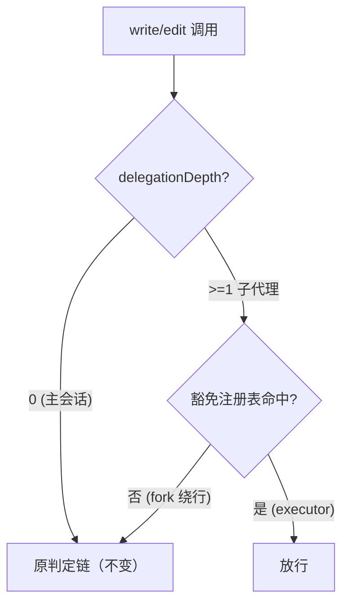

# 设计文档：executor gate 堵住 fork 子代理绕行

## 1. 问题与方案总览

现状：`decideWriteGate` 判定链第 2 条 `delegationDepthOf(agent) !== 0 → ALLOW`，所有子代理（含 subagent_fork 派发的绕行者）写文件一律放行；主会话 gate 被 fork 子代理轻易绕过。

方案：进程内豁免注册表 + 判定链改造——executor 子代理被显式登记为豁免（放行），其余子代理与主会话同链判定。



## 2. gate.ts 改动

1. 新增模块级注册表（Set<string>，键 = 子代理 session id）：
   ```ts
   const EXEMPTIONS = new Set<string>()
   export function registerWriteGateExemption(childSessionId: string): void
   export function unregisterWriteGateExemption(childSessionId: string): void
   ```
2. `decideWriteGate` 判定链改造：
   - 第 2 条"depth !== 0 → ALLOW"改为：depth >= 1 时先查豁免（命中 → ALLOW；未命中 → 继续）；
   - 非豁免子代理走变体判定：cwd 解析项目根 → `executor.gate === true` → **存在 in_progress 任务**（`listTasks(root, { status: 'in_progress' })` 非空；one-active-task 原则下至多一个）→ 目标不在 `.workloom/` 下 → DENY；
   - 其余判定（写工具名、路径合法性、逃逸）与主会话共用；判定故障仍 warn 放行。

## 3. executor.ts 改动

```ts
const run = await ctx.subagents.start(SPAWN_PROVIDER, {...})
registerWriteGateExemption(run.id)        // start resolve 即注册；run.id === 子代理 session id
try {
  const result = await run.result
  ...
} finally {
  unregisterWriteGateExemption(run.id)    // 先注销，再 dispose
  try { await run.dispose() } catch ...
}
```

## 4. 测试面

- gate.test.js 新分支（见 prd 验收）；executor.test.js 注册/注销断言。
- 既有判定链测试全部保持绿（depth=0 路径不动）。

## 5. 边界与风险

- bash 内写命令仍不可拦（工具面之外），契约兜底（已知边界，不扩大范围）。
- 多执行器并发：Set 无锁，单线程事件循环安全；同 id 重复注册幂等。
- 不引入 core 依赖（豁免表是 adapter 进程级机制）。
