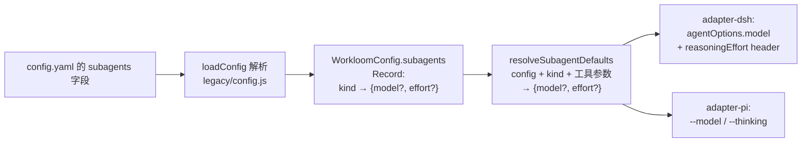

# design: config.yaml 支持 subagents 配置字段

## 数据流



## 字段模型

`subagents` 顶层字段默认 `{}`;每个 entry 结构:

```ts
{ model?: string; effort?: string }
```

- key 不限集合(不对 kind 白名单校验),与 `parsePackages` 同风格;entry 统一结构校验,非法 fail loud。
- `model`/`effort` 均可选,可只配其一;空字符串按现有 `requireString` 语义允许(与 `prompt_injection.skip_keyword` 一致),不作为特殊值处理。
- 解析不校验 effort 档位:档位由消费端对合并后的 effective effort 执行 `assertEffort`——避免 `config.js` import `executor-context.js` 形成循环依赖(`executor-context.js` 已依赖 `config.js` 的 `loadConfig`)。

## 合并语义

```js
resolveSubagentDefaults(config, kind, overrides)
// overrides.model  ?? config.subagents[kind]?.model
// overrides.effort ?? config.subagents[kind]?.effort
```

- model 与 effort 独立合并:工具参数只覆盖自己出现的字段,未出现回退配置,均无则 undefined(保持现状:model 继承父会话、effort 不写)。
- 纯同步、无副作用(不修改入参),放 `legacy/config.js`(配置数据消费逻辑与解析同模块);`config.d.ts` 补类型,`index.ts` 导出。

## adapter-dsh 消费路径

`executeTool` 中 `findWorkloomRoot` 之后新增:

1. `loadConfig(root)` → `resolveSubagentDefaults(config, params.kind, { model: params.model, effort: params.effort })`。
2. 原 `assertEffort(params.effort)` 改为对合并后的 `effective.effort` 断言(配置缺失或工具参数未传时 undefined 通过)。
3. `agentOptions` 由 `params.model` 改为 `effective.model`。
4. `writeEffortHeader` 入参由 `ExecutorArgs` 收窄为 `{ effort?: string }`(函数只消费 effort;删除未被消费的入参),调用改传 `{ effort: effective.effort }`;失败仍 WARNING 不阻塞。

## adapter-pi 消费路径

`executeTool` 中 `findWorkloomRoot` 之后同样 `loadConfig` + `resolveSubagentDefaults`;`assertEffort` 改为对合并值;`dispatchChildPi` 的 `model`/`effort` 改用合并值。`pi-args.ts` 不变(只负责透传)。

## 文案

`surface.ts` 的 `PARAM_DESCRIPTIONS` 更新:

- `model`:默认回退顺序改为 `subagents.<kind>.model` → 父会话模型。
- `effort`:注明默认为 `subagents.<kind>.effort`。

`surface.test.js` 只断言非空,不受影响。

## 文档

仓库根 `.workloom/config.yaml` 追加注释示例(注释掉,不启用,避免影响本地开发),文案英文与既有注释风格一致。

## 边界

- 仅作用于 `workloom_execute` 派发的三种 executor;不涉及其他子代理通道。
- 配置非法(非 map/字段类型错)在 `loadConfig` 时 fail loud;effort 档位非法在派发时 fail loud(错误消息沿用 `assertEffort` 现有文案,指明合法档位)。
