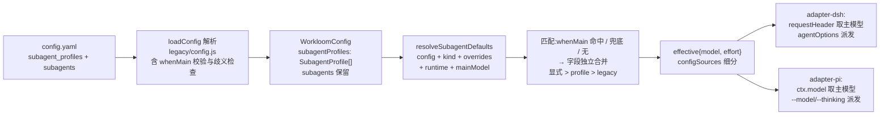

# design: subagents 按主 Agent 模型分档（subagent_profiles）

## 数据流



## 字段模型

```yaml
subagent_profiles:            # 数组,顺序即匹配顺序(新)
  - whenMain: kimi-coding/k3  # 或 { dsh: ..., pi: ... }
    subagents:
      <kind>:
        model: string | { <runtime>: string }
        effort: string
subagents: <kind>: {model?, effort?}   # 旧字段,解析路径不变
```

```ts
interface SubagentProfile {
  whenMain?: string | Record<string, string>
  subagents: Record<string, SubagentConfigEntry>
}
// WorkloomConfig 新增 subagentProfiles: SubagentProfile[]（默认 []）
```

## whenMain 校验与歧义检查（loadConfig 时 fail loud，静态可判）

- string 必须完整 `provider/model`：按 splitProviderModel 语义首个 `/` 前后均非空，否则 WorkloomConfigError。
- map 每个 value 同规则；key 不白名单（与现有 runtime 约定一致）。
- 歧义 fail loud：
  - 多个无 `whenMain` 的条目 → 报错。
  - 重叠判定：string 视为「对所有 runtime 都有该值」。两条目存在任意 runtime 上匹配值相同即重叠——string vs string 同值；string vs map 任一 value 同值；map vs map 存在共同 key 且同值。报错信息写明冲突 runtime 与值。

## 匹配与合并（resolveSubagentDefaults 扩展）

```ts
resolveSubagentDefaults(config, kind, overrides, runtime, mainModel?)
// mainModel: "provider/model" 字符串（adapter 拼好）或 undefined（取不到）
```

- 遍历 profile：无 `whenMain` → 命中（match=fallback，无条件）；有 `whenMain` → mainModel 非 undefined 且两段归一化相等才命中（string 形式：mainModel 与值整体两段比较；map 形式：取 map[runtime]，缺 key 跳过）。
- mainModel undefined → 所有 whenMain 条目一律跳过（不 fail loud）。
- 命中条目 profileLayer = entry.subagents[kind] ?? {}；未命中 profileLayer = {}（等效缺失）。
- 字段独立合并（model/effort 分别）：overrides.x ?? profileLayer.x ?? legacyLayer.x；全部无 → undefined（继承父会话）。
- profileLayer/legacyLayer 内 `model` 的 per-runtime map 仍按现有 resolveEntryModel 解析，缺当前 runtime key fail loud（沿用现状口径）。
- 返回值扩展：

```ts
interface ResolveSubagentDefaultsResult {
  model?: string
  effort?: string
  sources: { model?: 'param' | 'config'; effort?: 'param' | 'config' }   // 不变
  configSources: {                                                        // 新增，字段级
    model?: 'whenMain' | 'fallback' | 'legacy'
    effort?: 'whenMain' | 'fallback' | 'legacy'
  }
  whenMainValue?: string   // configSources 为 whenMain 时的匹配值（receipt 展示用）
}
```

## adapter-dsh 消费路径

- `MinimalAgent.session` 扩展 `requestHeader?(): { config?: { provider?: string; model?: string } } | undefined`。
- executeTool：mainModel = `requestHeader()?.config` 的 provider/model 拼 `${provider}/${model}`，任一缺失 → undefined；`resolveSubagentDefaults`/`detectExecutorConflicts` 均传 mainModel。
- receipt：buildExecutorReceipt 传 configSources/whenMainValue。

## adapter-pi 消费路径

- `ExecutorContextLike` 扩展 `model?: { provider?: string; id?: string }`（ctx.model 窄化）。
- mainModel 同规则拼 `ctx.model.provider/ctx.model.id`；`resolveConflictGate` 增加 mainModel 参数并透传 detectExecutorConflicts；receipt 同 DSH。

## 文案

- `PARAM_DESCRIPTIONS.model/effort`：回退链更新为「显式参数 > subagent_profiles 命中条目 > subagents.<kind> > 父会话」。
- `buildExecutorReceipt` 渲染（sources=config 时按 configSources 细分）：`(config: whenMain=<值>)` / `(config: fallback)` / `(config: legacy)`；`(param)`/`(default)` 不变。
- `buildConflictNotice`：冲突条目配置值追加来源标注（同一细分）。

## 文档

- `.workloom/config.example.yaml`：双字段并存示例 + whenMain 校验说明 + 优先级说明（英文注释，与既有风格一致）。
- `config.d.ts` JSDoc 同步；`surface.test.js` 只断言非空，不受影响。
- 仓库根 `.workloom/config.yaml` 不强制迁移（旧字段即默认层），可选追加注释示例。

## 边界

- 仅作用于 workloom_execute 派发通道；不涉及其他子代理通道。
- `subagent_profiles` 缺失/空数组 → 与现状完全一致（旧 subagents 生效）。
- deepMerge 对 subagent_profiles 数组整体替换（config.local.yaml 覆盖，现状语义）。
- 配置格式错误一律 loadConfig fail loud（含歧义）；mainModel 取不到不报错（运行时信息缺失，非配置错误）。
