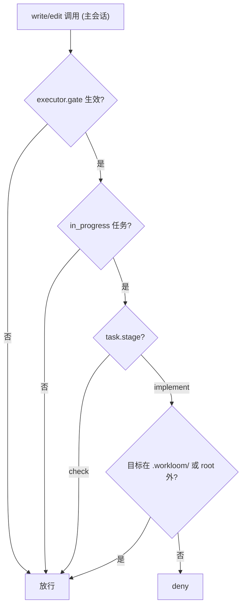

# 设计文档：task stage 字段与 check 阶段主会话修复窗口

## 1. 问题与方案总览

现状：`executor.gate` 在任务 `in_progress` 期间拦截主会话（depth 0）对项目根内、`.workloom/` 外的 write/edit，修复只能派子代理；check executor 契约要求"fixes what it finds itself"，实际两 runtime 都只报告（evidence 见 research/current-state.md），且"带病通过"无约束。

方案：`task.json` 新增显式 `stage`（`implement | check`），`workloom_execute` 派发成功时与 `dispatches` 同点写入；gate 在 `in_progress` 且 `stage === 'check'` 时放行主会话写业务文件（修复窗口）；check 修复纪律上提 core 按 kind 注入（两 runtime 共享）；doctor 加 stage 一致性审计；"带病通过"以纯契约约束（check 报告结构化"仅存问题"段 + summary 逐条说明）。

## 2. core：stage 字段（task-store）

1. `task-store.d.ts` 新增 `TaskStage` 枚举（`'implement' | 'check'`）与 `Task.stage?: TaskStageValue`；`task-store.js` 导出常量 `TaskStage`（禁 magic string）。
2. 归一化（`readTask`）：stage 缺失补 `'implement'`（旧任务语义 = 未进入 check 阶段，门禁维持拦截）。
3. 新增纯函数 `computeTaskStage(current, kind)`：`research` → 保持 current；`implement`/`frontend` → `'implement'`；`check` → `'check'`。独立可单测。
4. `recordExecutorDispatch`（与 dispatches 同点）：追加 `{kind, at, title}` 时同时以 `computeTaskStage` 更新 `task.stage` 并落盘——两 adapter 均走此函数（DSH executor.ts 与 Pi executor.ts 的派发成功后调用点），一处改动覆盖两 runtime。

## 3. adapter-dsh gate：check 阶段放行

1. `decideMainSessionGate` 判定链：`task.status === IN_PROGRESS` 检查之后、`decideTarget` 之前插入——`task.stage === TaskStage.CHECK` → `ALLOW`。
2. `decideSubagentGate` 不变（fork 绕行者按项目内 in_progress 判定，与 stage 无关）；`DENY_REASON` 文案不变（仍适用 implement 阶段）。

## 4. core executor-context：按 kind 纪律段

1. 新增 `EXECUTOR_CONTRACT_BY_KIND`（英文，每 kind 3–6 行硬指令，单一来源）：
   - research：调查后产出可执行报告，结论引用于源码；
   - implement：按 plan 实施、改动最小、运行项目验证后报告；
   - frontend：以 UI 小节为基线、七轴落地、前端验证、后端缺接口 mock 标注；
   - check：发现即修（不当"仅报告者"）；修复后运行验证（lint/typecheck/tests）；报告末段输出结构化"## Open issues"段，行格式 `- <file>:<line> [<severity>] <issue> — fix: <suggestion>`，无仅存问题时输出 `- none`。
2. 注入位置：`buildExecutorPrompt` 在 userPrompt 之后、`## Executor contract`（leaf 规则）段之前追加 `${EXECUTOR_CONTRACT_HEADING}` 注释的 kind 纪律段（userPrompt 已含关键词时去重，与既有 leaf 段规则一致）。
3. Pi 的 `EXECUTOR_AGENT_DEFINITIONS` 保留角色总述（description/systemPrompt），删除与纪律段重复/冲突句（check 的"report issues with locations and fixes"、"You are done when your review report is complete" 改为评审+修复导向），保持两来源互补不冲突。

## 5. doctor：stage 一致性审计

`doctor-checks.ts` 新增第 9 类检查（WARN 级，id 如 `stage-consistency`）：

1. `in_progress` 任务 `stage === 'check'` 但 `dispatches` 为空或最近一条 `kind !== 'check'` → warn；
2. `stage` 值不在枚举内（手改/损坏）→ warn。
同步更新 `packages/assets/commands/workloom-doctor.md` 的检查清单（8→9 类）。

## 6. 契约与文案（assets + config.example.yaml）

1. `workflow.md` front-matter `version: 12 → 13`。
2. §2.2 Check 改写：check executor 纪律（发现即修、报告末段 `## Open issues` 结构化、修复后运行验证）；主会话在 `stage === 'check'` 可直接修复（gate 例外），修复后必须重新派 check executor 全量复核；记录通过前仅存问题必须逐条处理（修复或记录不修原因），summary 须说明处理结果；记录通过后如需改动须重派 check。
3. `[workflow-state:in_progress]`：gate 指引更新——implement 阶段拦截、check 阶段主会话修复窗口放行；不再建议"绕过/关闭 gate"作为修复出路。
4. `[workflow-norms]` Dispatch：追加例外句——"check stage 的主会话直接修复为例外"。
5. `config.example.yaml` executor.gate 注释：说明 stage=check 时放行（修复窗口），gate 主要在 implement 阶段生效。

## 7. 测试面（接缝 S1/S2/S3 + 配套）

- `task-store.test.js`（S1）：stage 归一化默认；四 kind 派发后 stage 正确（research 保持）；`computeTaskStage` 边界。
- `gate.test.js`（S2）：stage=check 主会话业务文件写放行；stage=implement 拦截；无 stage 旧任务（归一化 implement）拦截；既有分支不回归（子代理豁免/`.workloom/`/root 外/gate:false/非 in_progress）。
- `executor-context.test.js`：四 kind 纪律段注入（check 含"发现即修"与 `## Open issues` 段）；userPrompt 含关键词去重。
- `workflow-contract.test.js`（S3）：契约措辞断言（2.2 修复指令、`## Open issues`、in_progress 指引、norms 例外、version 13）。
- `doctor.test.js`：stage 一致性两分支。
- `adapter-pi/test/agents.test.ts`：check systemPrompt 改写后文案断言更新。

## 8. 边界与风险

1. stage=check 期间主会话可写任意业务文件（不限于"修复"）：由"修复后必须重派 check 复核"兜底（prd 已定）。
2. 主会话手改 `task.json` 的 stage 可绕过门禁：`.workloom/` 内本就放行，属信任主会话范畴，doctor 审计可发现痕迹。
3. bash 内写文件仍不可拦截（已知边界，不扩大范围）。
4. 存量 `in_progress` 任务升级后 stage 归一化为 implement：处于 check 中的任务需重新派发 check（stage→check）解锁，符合流程。

