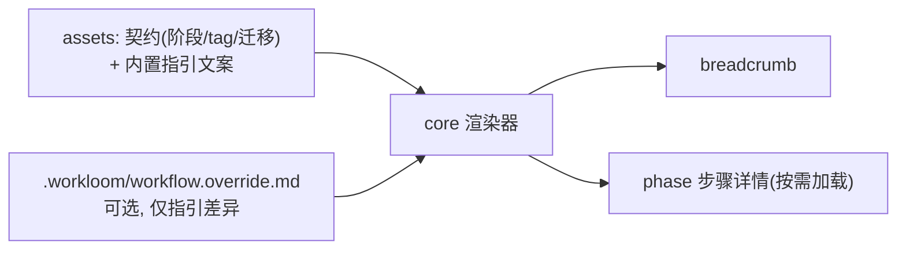
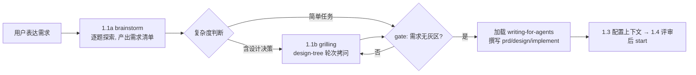

# workloom 工作流适配矩阵

12 个核心工作流（行为规格见 docs/trellis-core-workflows.md）在两个 runtime 的落地机制。DSH 列、Pi 列均为已验证的官方机制（验证依据见 docs/architecture-delivery.md §验证清单）。

| 工作流 | DSH adapter 落地 | Pi adapter 落地 |
| --- | --- | --- |
| W1 初始化 | `/workloom:init` 原生命令（commands 注册，handler 直执行），含 `.trellis` 迁移 | `/workloom:init` registerCommand，handler 检测并生成 `.workloom/` |
| W2 会话启动 | host 插件按 session 注入 `<session-context>`（systemPrompt section，会话级一次） | `session_start` 事件注入 `<session-context>` |
| W3 每轮 breadcrumb | `systemPrompt.section` 每轮渲染 `<workflow-state>`（契约解析 + overlay 合并） | `before_agent_start` 每轮注入 `<workflow-state>` |
| W4 任务生命周期 | core 的任务管理工具（create/start/finish/archive），模型可调 | Extension 注册同名工具（registerTool） |
| W5 规划 | Phase 1.1a `workloom-brainstorm` 需求探索 → 1.1b `grilling` 设计树拷问（无灰区 gate）→ 写文档前加载 `writing-for-agents` | 同源 skills 渲染进 Pi 包内 skills/ |
| W6 研究 | Executor(subagent, agent=research, model/effort 可配) | 自研 spawn child pi（ADR-0006） |
| W7 实现 | Executor(subagent, agent=implement) | 同上，agent=implement |
| W8 检查 | Executor(subagent, agent=check) | 同上，agent=check |
| W9 子代理上下文 | executor 工具 execute 内组装（jsonl 物化 + prd/design/implement 内联 + 预算截断） | 同左；agent 定义经 subagentOnlyExtensions 只带必要扩展 |
| W10 收尾 | `/workloom:finish` 命令：handler 检查脏文件→archive→journal，其余指引经 `agent.followup` 唤醒模型执行 | `/workloom:finish` registerCommand + followUp 路径 |
| W11 继续 | `/workloom:continue` 命令：handler 组装状态路由指引 → `agent.followup` 注入并触发模型回合 | 同左（registerCommand） |
| W12 会话记录 | W10 流程内调 core 的 addSession（journal 滚动 + 自动提交） | 同左 |

## Executor 契约（core 定义，adapter 实现）

```js
// core 的派发请求（与 runtime 无关）
{
  kind: 'research' | 'implement' | 'check',
  taskPath,                      // .workloom/tasks/<slug> 相对路径
  model: 'deepseek-v4-flash',    // 可选
  effort: 'low'|'medium'|'high'|'xhigh'|'max',  // 可选
  prompt,                        // 主会话给出的任务正文
  background: boolean
}
```

- DSH：adapter 自定义工具（如 `workloom_execute`）接收该结构 → `ctx.subagents.start('spawn', {agentOptions:{model}, ...})` → 若 effort 存在，经 `request/header` logged channel 写入子代理 session（PoC 验证点 P1）。
- Pi：adapter 自研 spawn child pi（`--mode json --no-session --no-extensions --thinking <effort>`，角色说明经 `--append-system-prompt` 注入，ADR-0006）；research/implement/check 三角色的定义保留在 adapter 内存。

## effort 映射表

| core 档位 | Pi thinking | DSH reasoningEffort |
| --- | --- | --- |
| low | low | 透传 provider 支持值；不支持时省略（默认档） |
| medium | medium | 同上 |
| high | high | 同上 |
| xhigh | xhigh | 同上 |
| max | max | 同上 |

DSH 侧 effort 首期经 request/header 原生写入；若 PoC P1 失败，fallback 为 maxTokens 档位映射并在文档标注。

## workflow 契约与 overlay 渲染模型



- 契约（状态枚举、tag 块约定、迁移关系）随插件版本，项目不可改；overlay 只允许覆盖指引文字，渲染时按“段落键”合并。
- 契约加载器与 overlay 合并器是 core 的可替换接口，为二期 workflow profile 预留。

### 预留接口评审结论（Phase 3，2026-08-26）

对照二期 workflow profile 需求（按项目/用户切换整套工作流定义）逐点评审，结论：**接口满足，无债，二期只需补一处挂载点**。

1. 解析/合并层已可替换：`parseContract(text)`、`mergeOverlay(contract, text)`、`buildBreadcrumb(contract, status)` 均为纯函数（文本进、结果出），对契约文本来源零假设——切换整套工作流定义时 core 零改动。
2. 缺失的挂载点唯一：契约文本来源。当前 adapter 经 assets 的 `loadWorkflowContractText()` 读取内置契约（无参、固定）；二期在 adapter 注入处增加「config 声明 profile → 读该 profile 契约文件，缺省回退内置」的分支即可，core 与 assets 均不动。
3. 边界明确：profile 若需改状态枚举（契约级变化），必须走「profile 指向完整契约文件」（挂载点方案）而非 overlay——overlay 的状态集被内置契约锁定，仅覆盖指引文字，二者语义边界已由 mergeOverlay 校验（overlay 引入未声明状态即报错）。
4. 逃生舱（shouldSkipBreadcrumb）与 profile 无关，保持现状。

## Phase 1 需求对齐流程（W5 细化）



1. **1.1a brainstorm**：一次一个问题探索需求，澄清“要什么、约束是什么、验收怎么判”，边问边维护需求清单。
2. **1.1b grilling**：对含设计决策的需求，用 design-tree 方法轮次拷问（frontier 制，每问给推荐答案）；事实查证由 agent 自行完成，不占用用户。含实现工作的任务须问固定问题“实现策略：是否 test-first（TDD red-green）交付”（A 是 / B 否 / C 仅关键路径，措辞见 docs/vendoring-plan.md）。
3. **无灰区 gate（硬性）**：进入文档编写前，最终对齐的需求必须满足——每条需求可判定（done 与 not-done 可区分）、无歧义表述、无未决假设（frontier 为空）。不满足则回到 1.1b 继续拷问。
4. **写文档前**：加载 writing-for-agents（context pointer / 信息层级 / 完成判据 / leading words / pruning），按该方法论撰写 prd.md、design.md、implement.md 与后续 spec/journal。
5. **test-first 承接**：固定问题选 A/C 时，seams 确认结果写入 prd.md 验收标准；W7 实现阶段按 tdd skill 的 red-green 循环执行（指引只放 pointer，规则正文唯一存在于 tdd skill）。
