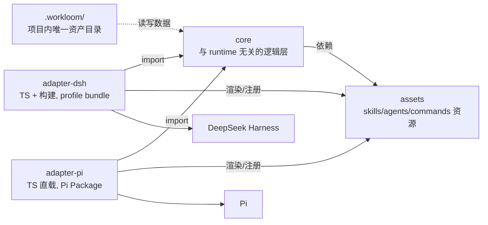

# workloom 架构总览

workloom 把 Trellis 式 AI 编码工作流抽象为与 runtime 无关的核心逻辑层与资源层，通过面向各 runtime 的官方格式插件（adapter）分发；用户项目内只保留一个资产目录 `.workloom/`。许可证 MIT，clean-room 重实现（不复制原 Trellis 文本，行为与数据布局兼容）。

## 设计树摘要

| # | 决策 | 结论 |
| --- | --- | --- |
| 1 | 许可证边界 | clean-room + MIT |
| 2 | 数据格式兼容 | 与原 Trellis 任务数据布局兼容 |
| 3 | 工作流范围 | 12 个全做、分阶段落地 |
| 4 | 语言 | Python 移植逻辑纯 JS（免构建）；其余一律 TS |
| 5 | 资源中间表示 | Markdown + YAML front-matter |
| 6 | 资产目录边界 | `.workloom/` 只留声明+数据，无脚本 |
| 7 | init | 纯插件内置 |
| 8 | 包结构 | monorepo：core / assets / adapter-dsh / adapter-pi |
| 9 | 术语 | runtime / adapter |
| 10 | Pi 分发 | 全局 Pi Package + 按 `.workloom` 自激活 |
| 11 | Pi 注入 | 官方事件 push（session_start / before_agent_start） |
| 12 | Executor | DSH 自定义 subagent（model+effort）；Pi 自研 spawn child pi（ADR-0006，不依赖 pi-subagents） |
| 13 | skills | bundled，禁止项目定制 |
| 14 | 根 AGENTS.md | 不生成，注入全走插件 |
| 15 | 命令资源 | DSH 原生斜杠命令；Pi registerCommand/Prompt Templates |
| 16 | 命名 | 项目 workloom，目录 `.workloom` |
| 18 | 许可证 | MIT |
| 19 | effort | low/medium/high/xhigh/max；DSH 原生改写（request/header） |
| 20 | 工作流定义 | 契约 bundled + 指引项目 overlay，预留 profile |
| 21 | DSH adapter | 全局 profile bundle + 自激活 |
| 22 | git 与 hooks | 自动提交与 after_* hooks 保留、可配置、默认开 |
| 23 | DSH init | `/workloom:init` 原生命令 |
| 24 | Pi 版本 | 开源官方版 |
| 25 | Phase 1 需求对齐 | brainstorm 探索需求 → grilling 设计树拷问，硬性 gate：最终需求无灰区 |
| 26 | writing-for-agents 范围 | 所有面向 agent 的文档（prd/design/implement/spec 等） |
| 27 | 第三方 skill | vendoring 纳入 assets/third-party，保留 MIT 声明 |
| 28 | grill-me | 不纳入，契约驱动的 grilling 已够 |

## 总体架构



## 分层职责与依赖规则

1. **core**：任务生命周期、工作流状态机（契约解析 + overlay 合并）、breadcrumb 组装、上下文注入组装、模板渲染、journal、git 操作。只依赖 Node 内建与自身；不 import 任何 runtime 包。
2. **assets**：workflow 契约与指引文案、skills、agents、commands 的中间表示（MD + front-matter）。纯内容，无代码。
3. **adapter-***：把 core 的能力注册为 runtime 原生机制（DSH 的 tools/commands/systemPrompt/skills/subagents；Pi 的 Extension 事件/工具/pi-subagents），把 assets 渲染为 runtime 原生资源。依赖 core 与 assets。
4. **.workloom/**：用户项目数据，只有 core 读写；adapter 只负责检测其存在性。

## 包结构（monorepo）

```txt
packages/
├── core/            # 纯 JS 移植模块 + TS 新增模块，tsc 构建发布
├── assets/          # workflow 契约、指引、skills/agents/commands 中间表示
├── adapter-dsh/     # TS + 构建，DSH profile bundle（cordis.patch.yml）
└── adapter-pi/      # TS 直载，Pi Package（pi manifest + Extension）
```

## .workloom 布局（声明 + 数据，无脚本）

```txt
.workloom/
├── config.yaml               # 注入预算、git 自动提交、hooks、packages 声明等配置
├── workflow.override.md      # 可选：指引文案覆盖（团队差异）
├── tasks/                    # {MM-DD-slug}/：task.json、prd/design/implement、
│                             # research/、implement.jsonl、check.jsonl（兼容原布局）
├── spec/                     # 编码规范：spec/<package>/<layer>/index.md 两级布局，
│                             # 会话启动注入索引清单（guidelines 段，按 packages 过滤）
├── workspace/                # 会话日志 journal + index
└── .runtime/sessions/        # 会话级活跃任务指针（gitignored）
```
