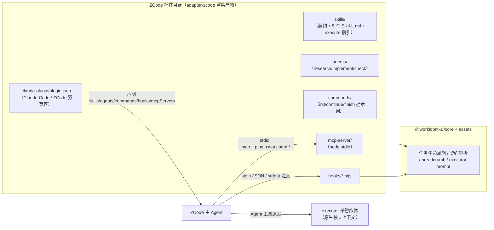

# workloom 支持 ZCode（Z.ai）作为第三 runtime 的可行性调研

## 1. 调研范围与方法

- 目标：评估把 workloom（core + assets）适配到 ZCode（https://zcode.z.ai/ ，智谱 Z.ai 的 Agentic Development Environment）的可行性，产出 adapter-zcode 初步方案。
- 方法：阅读 ZCode 官方文档（plugin / skill / command / subagents / hooks / mcp-services 六篇，cn 版）；抓取官方插件市场仓库 `zai-org/zai-coding-plugins` 的实例文件核对格式；对照 `docs/research/kimi-code-plugin-support.md` 与 `kimi-code-spike-report.md` 的既有结论。
- 基线事实：ZCode 插件体系是 Claude Code 插件格式的兼容实现（manifest 查找优先级 `.zcode-plugin/plugin.json` → `.claude-plugin/plugin.json`，hook 协议与 Claude Code 同构），因此 Kimi 调研中「plugin 无编程式扩展 API、需 companion 运行时」的总判断可直接继承，差异点集中在分发机制、子智能体与 executor 派发上（见 §6.4）。

## 2. ZCode 插件机制能力清单

### 2.1 Plugin 与 marketplace（plugin 文档）

- 插件 = 文件夹：`.zcode-plugin/plugin.json`（唯一必需）+ 可选 `commands/`、`skills/`、`agents/`、`hooks/hooks.json`、`.mcp.json`。
- `plugin.json` 字段：`name`（必填，`^[a-z0-9][a-z0-9._-]{0,127}$`）、`version`、`description`、`author`（字符串或对象）、`homepage`/`repository`/`license`/`keywords`、组件声明（`commands`/`skills`/`agents`/`hooks`/`mcpServers`，可写目录字符串、路径数组或内联对象）、`dependencies`（`name@market`）、`userConfig`（界面可填配置，`type: string/number/boolean/directory/file`，`sensitive` 项暂不支持界面填写）。
- `channels`/`lspServers`/`outputStyles`/`settings` 四个字段当前「仅登记、不执行」，给诊断提示。
- 官方市场 `marketplace.json`：`name` + `plugins[]`（`name`/`source`/`description`/`version`/`category`/`tags`/`dependencies`/`strict`）。`source` 支持 7 种写法：相对路径、本地绝对目录、GitHub 仓库（repo/path/ref）、任意 Git URL、本地清单文件、HTTP URL、npm 包。
- 分发闭环完整：设置 → 插件 → 创建 → 添加插件市场（GitHub 仓库 / Git URL / 本地目录均可）；预置 Claude Code 市场；版本比对口径是 market `version` vs plugin `version`（发版需同步改 marketplace.json）。
- 官方内置插件：document-skills、skill-creator（默认启用），android-emulator、ios-simulator、restore-legacy-sessions（默认关闭）。

### 2.2 Skills（skill 文档）

- `skills/<名>/SKILL.md`，frontmatter 必填 `name`/`description`；`when_to_use` 补充触发时机；`description` 上限 1024 字符（超出整体丢弃）；正文超 100KB 截断。
- 插件内技能必须**单层目录**，嵌套分组目录不被识别。
- 每轮注入全部已启用技能的元数据（name + description 摘要 ≤250 字符），共享固定预算，超出降级为只留技能名（自动触发率骤降）。
- 支持从 Claude Code / Codex CLI / OpenClaw 等外部 Agent 导入技能（软链或复制）。
- 调用方式：输入框 `$skill-name` 或 `/` 面板「技能」分组。

### 2.3 Commands（command + plugin 文档）

- `commands/*.md`，frontmatter：`description`（必填或正文非空）、`argument-hint`、`allowed-tools`、`model`、`skills`、`disable-noninteractive`。正文 `$ARGUMENTS` / `$1` / `$2` 接收参数；命令名取文件名（`^[a-z0-9][a-z0-9_:-]{0,63}$`）。
- 插件命令注册名带命名空间：`/<插件名>:<命令名>`（官方实例 `/glm-plan-usage:usage-query` 证实）。
- 命令是**纯提示词模板**（发送给 Agent 的 prompt），无编程 handler——与 Kimi 相同，command-ops 编排逻辑需移入 MCP 工具。

### 2.4 Subagents（subagents + plugin 文档）

- 内置 `general-purpose`（全工具权限）与 `Explore`（只读调研）。
- 插件 `agents/*.md` 注册子智能体：frontmatter 必填 `name`/`description`，正文即 system prompt；支持 `model`（`inherit` 或具体模型）、`thoughtLevel`、`color`、`tools`/`disallowedTools`、`maxTurns`、`injectAgentsMd`（默认注入 AGENTS.md）、`mcpServers`（声明依赖的 MCP 服务名，未连接则调用失败）。
- 工具边界：`tools: *` 继承主会话全部工具（含 MCP）；自定义列表只含内置工具，MCP 工具需写全名 `mcp__<服务名>__<工具名>`（通配无效）。
- **技能工具在子智能体内的可用性**（skill 文档排查清单）：子智能体声明了自定义 `tools` 白名单时，技能工具不在列表内则无法调用任何技能；官方实例 agents frontmatter 写 `tools: Bash, Read, Skill, Glob, Grep`，证实技能工具名为 `Skill`、插件子智能体支持 tools 白名单。
- **子智能体内不能再派发子智能体**——与 workloom「禁止嵌套派发」约束天然一致。
- 主 Agent 通过 Agent 工具派发，独立上下文，完成汇总回主对话；支持前台并行与后台执行。
- 边界（subagents 文档）：子智能体只能看到主会话**启动时**已连接的 MCP 服务（会话中途新连接不可见）；`mcpServers` 字段声明依赖（精确匹配服务名，未连接则调用直接失败）。
- 限制：Beta 仅用户级管理界面（`~/.zcode/agents/`）；插件子智能体在设置页「插件子智能体」分组只读展示；定义修改需新建会话生效。

### 2.5 Hooks（hooks 文档）

- 事件全集：`SessionStart`、`UserPromptSubmit`、`PreToolUse`、`PermissionRequest`、`PostToolUse`、`PostToolUseFailure`、`Stop`（与 Claude Code / Kimi 同构）。
- 协议：stdin 一行 JSON（camelCase + snake_case alias 并存，含 `session_id`/`cwd`/`hook_event_name`/`tool_name`/`tool_input`）；stdout 以 `{` 开头的 JSON 按协议解析（`hookSpecificOutput.additionalContext` 注入上下文；PreToolUse 可 `permissionDecision: deny` + 原因或 `updatedInput` 整体替换；Stop 可 `decision: block` 续跑，最多连续 3 次）；退出码 0 成功 / 2 阻断 / 其他 fail-open。
- 配置来源：用户级 `~/.zcode/cli/config.json`（需 `hooks.enabled: true`）与插件 `hooks/hooks.json`（标准位置自动发现，随插件启停）；**项目级 hook 当前被安全策略整体忽略**（`config_project_hooks_ignored`）——团队共享 hook 只能走插件分发，恰好与 adapter 形态一致。
- 模板变量：`${ZCODE_PLUGIN_ROOT}`（兼容 `${CLAUDE_PLUGIN_ROOT}`）、`${ZCODE_PLUGIN_DATA}`、`${CLAUDE_PROJECT_DIR}`。
- 安全提示官方明示：hook 可执行本地进程并读取 Agent 环境变量，启用插件即授予代码执行信任。

### 2.6 MCP（mcp-services + plugin 文档）

- 插件在根目录 `.mcp.json` 或 manifest `mcpServers` 声明；`type` 省略时按 `command`（stdio）/`url`（http）推断；支持 `cwd`/`env`/`enabled`/`timeoutMs`。
- 服务键名自动加命名空间 `plugin:<插件名>:<服务名>`，避免冲突。
- 可用模板变量 `${user_config.键}`（引用 userConfig，含 sensitive 项）与上节路径变量。
- 设置 → MCP 分「Plugin MCP 服务器」分组展示，随插件启停自动加载。

### 2.7 Claude Code 市场兼容性（对分发方案的关键事实）

- ZCode 预置了 **Claude Code 插件市场**（设置 → 插件 → 个人分段，无需手动添加即可浏览安装）。
- 官方市场仓库 `zai-org/zai-coding-plugins` 自身就是 Claude Code 格式：marketplace.json 位于 `.claude-plugin/`，`$schema` 指向 `https://anthropic.com/claude-code/marketplace.schema.json`，使用 `owner` 字段——ZCode 官方以 Claude Code 格式自举。
- manifest 查找优先级 `.zcode-plugin/plugin.json` → `.claude-plugin/plugin.json`；hook 协议（事件集、stdin/stdout JSON、exit code 0/2）、模板变量（`${CLAUDE_PLUGIN_ROOT}` 等）、SKILL.md、commands、`.mcp.json` 均与 Claude Code 插件格式同构。
- **已知差异（非「完全兼容」）**：
  1. `channels`/`lspServers`/`outputStyles`/`settings` 四个 manifest 字段「仅登记、不执行」（Claude Code 插件带这些能力时在 ZCode 中不生效）；
  2. 子智能体思考强度字段名为 `thoughtLevel`，不是 Claude Code 的 `reasoningEffort`（不认识的字段被静默忽略，不报错）；
  3. 插件内 skills 必须单层目录（Claude Code 侧目录约定的差异需按 ZCode 约束渲染）；
  4. 项目级 hooks 被 ZCode 安全策略整体忽略（Claude Code 支持项目级 hooks）；
  5. 版本比对口径 market `version` vs plugin `version`。
- 结论：**一份 Claude Code 格式插件（`.claude-plugin/plugin.json` + marketplace.json）可同时分发到 Claude Code 与 ZCode**，代价是渲染层按 ZCode 的差异约束写（单层 skills、thoughtLevel、不带 channels/lspServers 等字段），见 §6.5。
- **实证案例 `vercel/vercel-plugin`**（用户实测可在 ZCode 插件市场搜到）：
  1. 仓库同时携带多端薄 manifest：`.claude-plugin/plugin.json`（Claude Code）、`.kimi-plugin/plugin.json`（Kimi Code）、`.cursor-plugin/plugin.json`（Cursor）、`.plugin/plugin.json`（通用），而 `skills/`、`commands/`、`agents/`、`hooks/`、`.mcp.json` 组件全部共享——「共享组件 + 每端薄 manifest」是多端分发的行业标准形态；
  2. `.claude-plugin/marketplace.json` 即市场清单（`source: "./"` 自指），Claude Code 官方市场收录后 ZCode 经预置市场源即可搜到——workloom 走同一通道可实现 ZCode 用户零配置安装；
  3. 各端 manifest 格式细节不同（Claude Code 的 commands 用文件路径数组、skills 自动发现；Kimi 用目录字符串声明 + 自有 `interface` 字段 + 自有 mcpServers 写法）——**Kimi 有独立 `.kimi-plugin/` 目录，不读 `.claude-plugin/plugin.json`**（§6.5 待验证项获强信号）。

## 3. workloom 现状（与 kimi 调研 §3 同源）

- 分层规则：core 纯 ESM Node 包（engines `node>=22`）、runtime 无关；assets 中间表示（正文 Markdown + YAML front-matter）；adapter 只做宿主投影。详见 `.workloom/spec/repo/architecture/index.md`。
- assets：`workflow/workflow.md`（契约，约 116 行）、`skills/`（2 个自有 SKILL.md）、`third-party/mattpocock-skills/`（3 个 vendored）、`commands/`（init/continue/finish 三个 .md）、`templates/`（spec 模板）。
- core：`legacy/`（纯 JS 移植：task-store、task-gates、breadcrumb、executor-context、git、init、migrate 等）+ `service/`（TS：task-ops、command-ops、route-service、session-context、spec-templates、step-lookup、workflow-service）+ `surface.ts`（9 个工具名/描述/参数文案共享常量）。
- adapter-dsh：Cordis 插件（systemPrompt 注入 breadcrumb/session-context、3 命令、9 工具、5 skills、写门禁 gate）。
- adapter-pi：Pi Package（Extension 事件注入、命令、executor 自研 spawn child pi、sync-skills 构建脚本）。
- executor agent 定义当前在 `packages/adapter-pi/src/agent-definitions.ts`（research/implement/check 的 description + systemPrompt），`assets/agents/` 为规划目录（`packages/assets/README.md`）。

## 4. 能力映射表：workloom 资产/能力 → ZCode plugin 元素

评级口径沿用 kimi 报告：直接映射 = 格式兼容、拷贝或微改即可；需转换 = 语义等价但形态不同，需渲染/改写；不支持-需新机制 = ZCode 无对应概念，需借 mcpServers/hooks 等进程级扩展点实现；gap = 当前无法等价表达。

| workloom 资产/能力（来源） | ZCode plugin 元素 | 评级 | 说明 |
| --- | --- | --- | --- |
| skills/*.md（`packages/assets/skills/`） | `skills/<名>/SKILL.md` | 直接映射 | 两边 frontmatter 同为 name/description 必填，`when_to_use` 同名同义；注意插件内技能必须单层目录 |
| third-party vendored skills | 同上 | 直接映射 | 同 adapter-pi sync-skills 拷贝模式；缺 description 需在渲染层补齐（description 超 1024 字符会被整体丢弃，渲染层须校验） |
| executor agent 定义（research/implement/check，`packages/adapter-pi/src/agent-definitions.ts`） | 插件根 `agents/*.md` | 直接映射 | frontmatter name/description + 正文 system prompt 与 ZCode Agent 文件格式同构；`injectAgentsMd` 默认注入 AGENTS.md；建议按规划先下沉 `assets/agents/` 共享中间表示 |
| commands/*.md（`packages/assets/commands/`） | `commands/*.md` | 需转换 | frontmatter 收敛为 description/argument-hint（name 取文件名，title 拼进正文）；注册名变 `/<插件名>:<命令名>`（官方实例证实）；正文从「编排逻辑调用点」改写为「引导模型调用 MCP 工具」 |
| workflow 契约（`workflow/workflow.md`） | SessionStart hook 注入 + 契约 skill | 需转换 | 契约全文可作为 `skills/workloom-contract/SKILL.md` 供 `$` 手动引用；首轮注入走 SessionStart hook 的 additionalContext（stdout 上限 32KB，契约约 5KB 无碍） |
| 每轮 breadcrumb 注入（DSH section / Pi before_agent_start） | `hooks`：`UserPromptSubmit` | 需转换 | hook 脚本调 core 的 `assembleBreadcrumbSync` 经 stdout 注入；触发粒度为「用户提交消息」而非「每个模型回合」，与 kimi 同边界 |
| session-context 快照（`core/src/service/session-context.ts`） | `hooks`：`SessionStart` + `UserPromptSubmit` | 需转换 | 与 breadcrumb 合并进同一 hook 脚本；取代式语义退化为追加式 |
| 6 个任务工具 + step + journal（`surface.ts` TOOL_NAMES） | 不支持-需新机制：`.mcp.json` 声明 stdio MCP server | 需新机制 | ZCode 无编程式工具注册 API；MCP server 加载 core 暴露 8 个工具，模型侧显示为 `mcp__<命名空间>__*` |
| `workloom_execute` executor 派发 | 不支持-需新机制：ZCode 原生 Agent 工具派发插件子智能体 | 需新机制（方案差异，见 §6.4） | ZCode 无 headless CLI（§6.4），spawn child 模式不可移植；改为三个 executor 子智能体 + skill 指导主 Agent 组装派发 prompt |
| 工作流门控（start 需 prd/jsonl、archive 需 check） | MCP 工具内部强制 | 直接映射 | 门控在 core 的 task 工具实现内，runtime 无关，经 MCP 暴露后天然生效 |
| 写门禁 gate（`adapter-dsh/src/gate.ts`） | `hooks`：`PreToolUse`（matcher 写工具名，permissionDecision: deny） | 需转换 | 协议与 Claude Code/Kimi 同构（kimi spike 已验证 exit 2 阻断生效）；ZCode 写工具名、deny 返回值形状待真机验证（开放问题 3） |
| 项目级 overlay `workflow.override.md` | core 内部能力 | 直接映射 | hook 脚本调 core 即生效 |
| 命令 handler 编程编排（`core/src/service/command-ops.ts`） | ZCode commands 无 handler | gap | 命令只是提示词模板；编排移入 MCP 工具/CLI，命令正文引导模型调用——可靠性依赖模型遵从度，非硬保证 |
| 插件安装作用域 | 用户级全局（+ 远程同步到 SSH/WSL 工作区） | gap | 无项目级安装；靠 core 的 cwd 自激活判定（`findWorkloomRoot`）兜底非 workloom 项目不注入 |

## 5. 可行性结论

**判定：需自研 wrapper**（与 kimi 同结论，但依赖面更宽：ZCode 原生子智能体替代了 spawn child CLI）。

理由：

1. 资产层（skills、agents、命令提示词、契约文本）与 ZCode plugin 的 skills/agents/commands 高度同构，可直接映射或轻量转换（§4 前 5 行）。
2. workloom 的编程式能力（9 工具、门控、注入、写门禁）在 ZCode 同样只能借两个进程级扩展点表达：插件 `.mcp.json`（stdio 跑 node 进程加载 `@workloom-ai/core`）与 `hooks/`（协议与 Claude Code 同构，kimi spike 已真机验证过同构协议）。
3. ZCode 比 Kimi 多给了一等公民：插件 `agents/*.md` 子智能体（独立上下文、可声明 `mcpServers`、禁止嵌套派发）。workloom executor 的三角色可以**原生承载**，不再需要 adapter-pi/kimi 的 spawn child CLI 机制（ZCode 无公开 headless CLI，该机制本也不可移植）。
4. ZCode 有官方 marketplace 分发闭环（GitHub 仓库 / Git URL / 本地目录 / npm 源 + 版本比对），团队分发路径比 Kimi（需手工安装 managed 目录）更正规。
5. 因此正确形态是：**adapter-zcode = ZCode plugin（资产分发）+ companion 运行时（stdio MCP server + hook 脚本，承载 core 逻辑）+ executor 子智能体**，全部打包在同一插件目录，经 marketplace.json 分发。

## 6. adapter-zcode 初步方案

### 6.1 包结构

```txt
packages/adapter-zcode/
├── package.json              # @workloom-ai/adapter-zcode，deps: core + assets
├── src/
│   ├── render/
│   │   ├── plugin-json.ts    # 生成 .claude-plugin/plugin.json（Claude Code/ZCode 双兼容路径，name: workloom）
│   │   ├── skills.ts         # assets/skills + third-party → plugin skills/（单层目录 + 校验补齐）
│   │   ├── commands.ts       # assets/commands → ZCode 命令 .md（frontmatter 收敛 + 正文改写为 MCP 调用指引）
│   │   ├── agents.ts         # executor agent 定义 → plugin agents/（research/implement/check）
│   │   └── contract.ts       # workflow/workflow.md → 契约 skill（workloom-contract）
│   ├── mcp-server/           # stdio MCP server：加载 core，暴露 8 个任务/步骤/journal 工具
│   ├── hooks/                # breadcrumb.mjs（UserPromptSubmit）、session-start.mjs（SessionStart）、gate.mjs（PreToolUse）
│   └── workloom-execute/     # executor 派发指引 skill（教主 Agent 组装 prompt 并调用 Agent 工具）
├── scripts/sync-plugin.mjs   # 构建：渲染全部资产到 plugin/（对齐 adapter-pi sync-skills.mjs 模式）
├── plugin/                   # 构建产物（git 忽略）：.claude-plugin/plugin.json + marketplace.json + skills/ + agents/ + commands/ + hooks/ + mcp-server 入口
└── test/
```

### 6.2 运行时拓扑



### 6.3 转换器设计要点

1. **skills**：直接拷贝 + 构建期校验（必填 name/description，description ≤1024 字符超限报错不静默丢弃）；vendored skills 缺字段时补齐；ZCode 插件内技能必须单层目录，嵌套结构渲染层拍平。
2. **commands**：frontmatter 收敛为 `description`/`argument-hint`（name 取文件名 `workloom-init` 等，注册名为 `/workloom:workloom-init`）；正文改写——DSH/Pi 中 handler 调 core 的 `command-ops` 编排，ZCode 侧改为「按步骤调用 `mcp__plugin:workloom:workloom_*` 工具并汇报」的提示词；`$ARGUMENTS` 占位符两边语义一致。
3. **agents**：把 `EXECUTOR_AGENT_DEFINITIONS`（建议先按 `packages/assets/README.md` 规划下沉 `assets/agents/`）渲染为 `agents/research.md`、`agents/implement.md`、`agents/check.md`；frontmatter 写 `name`/`description`（供主 Agent 判断何时派发），`injectAgentsMd` 保持默认注入；`tools` 是否收紧与 `mcpServers` 声明见开放问题 1。
4. **workflow 契约**：整份 `workflow.md` 作为 `skills/workloom-contract/SKILL.md`（$ 手动引用）；SessionStart hook 注入精简状态指引（首轮可见）。
5. **breadcrumb / session-context**：一个 `UserPromptSubmit` hook 脚本调 core（`assembleBreadcrumbSync` + `assembleSessionContext`）把文本经 stdout 附加进上下文；`SessionStart` hook 注入一次性快照；自激活判定复用 core 的 `findWorkloomRoot`（cwd 取自 hook 输入的 `cwd` 字段）。
6. **8 个工具**（task_create/start/check/finish/archive/list + step + journal）：stdio MCP server 加载 core，schema 描述复用 `TOOL_DESCRIPTIONS`/`PARAM_DESCRIPTIONS`；门控在 core 内天然生效；服务键名会被 ZCode 加命名空间 `plugin:workloom:workloom`，模型侧为 `mcp__plugin:workloom:workloom__<tool>` 一类全名（待真机确认，开放问题 2）。
7. **gate 写门禁**：`PreToolUse` hook matcher `Write|Edit`，读 `.workloom` 判定活跃任务 in_progress 时返回 `permissionDecision: deny` + 引导走 executor 的原因；fail-open 语义与 DSH gate 的 bash 绕行同级，文档声明边界。

### 6.4 executor 方案差异（与 adapter-pi / adapter-kimi 的实质分歧点）

- ZCode 是 Electron 桌面应用，无公开的 headless agent CLI（官方文档无 `--print`/`-p` 模式，`~/.zcode/cli/` 仅承载配置与日志；`zai-cli`/`z-cli` 等社区项目是 Z.AI API 的 MCP 包装，不是 ZCode agent）。adapter-pi 的 spawn child pi、adapter-kimi 的 spawn `kimi -p` 均不可移植。
- 替代方案：executor 三角色渲染为插件子智能体（§6.3.3），主 Agent 通过 ZCode 内置 Agent 工具派发，上下文隔离与「禁止嵌套派发」由 ZCode 原生机制保证（子智能体内不能再派发子智能体，恰好与 workloom 约束一致）。
- **工具权限收紧与 adapter-pi 语义对齐**（subagents 文档交叉核对）：executor 子智能体的 `tools` 白名单写内置工具集（`Read`/`Grep`/`Glob`/`Bash`/`Edit`/`Write`/`TodoWrite`，research 可只留只读集），**不声明 `mcpServers`**——自定义 tools 列表天然不含 MCP 工具，等价于 Pi 侧 `--no-extensions` 的「child 无 workloom 工具」语义；官方实例（`tools: Bash, Read, Skill, Glob, Grep`）证实该写法受支持。是否给 implement 子智能体开放 workloom MCP 任务工具（写 task.json 进度）作为可选增强，留到 spike 后决策。
- workloom_execute 的「任务上下文内联」职责改由 `skills/workloom-execute/SKILL.md` 承载：教主 Agent 读 `.workloom/tasks/<task>/` 的 prd/design/implement/jsonl，按 core 的 `buildExecutorPrompt` 口径组装派发 prompt，再调用 Agent 工具派发对应 executor 子智能体。
- 兜底选项（若子智能体能力不满足，见开放问题 1）：MCP server 内 spawn 子进程方案——`workloom_execute` 工具在 MCP server 内组装 prompt 后经 `execSync` 驱动外部 CLI（如 `kimi -p` 或用户自配的 agent CLI），保持 adapter-pi 拓扑；这是降级路线，先按原生子智能体主线评估。

### 6.5 跨 runtime 共享：一份 Claude Code 格式插件分发多端

- 事实基础（§2.7）：ZCode 预置 Claude Code 插件市场、以 Claude Code 格式自举官方市场；Kimi Code 插件同样是 Claude Code 插件格式的近亲（kimi 调研 §2 已验证 skills/agents/commands/hooks/mcpServers 全盘同构）。
- 战略结论：**adapter-zcode 的产物做成 Claude Code 兼容格式（`.claude-plugin/plugin.json` + marketplace.json），一份构建产物即可同时服务 Claude Code、ZCode 与 Kimi Code 三端**——与 workloom「core/assets runtime 无关、adapter 分发」的架构哲学同构，甚至可以把分发问题从「adapter 逐个适配」升级为「一个共享插件基座 + 各端真机验证」。
- 渲染层约束（按最严格端收敛）：skills 单层目录（ZCode 约束）、agents frontmatter 用双方都认的字段（`thoughtLevel` 与 `reasoningEffort` 的分歧以不写思考强度、跟随主会话为最安全）、manifest 不写 `channels`/`lspServers`/`outputStyles`/`settings`、hook 脚本与 MCP server 是纯 node 进程天然跨端。
- 产物形态参考 vercel-plugin 实证（§2.7）：**共享组件目录（skills/commands/agents/hooks/.mcp.json 一份）+ 每端薄 manifest**；`.claude-plugin/plugin.json` 一份同时服务 Claude Code 与 ZCode（ZCode 兼容该路径），若要覆盖 Kimi 再附加 `.kimi-plugin/plugin.json`（Kimi 用独立目录，目录字符串声明组件 + `interface` 字段）。
- 分发通道升级：若 workloom 插件进入 Claude Code 官方市场（收录标准待查，开放问题 10），ZCode 用户经预置市场源**零配置**搜索安装，连「添加插件市场」都省掉；自建市场（workloom 仓库根 `.claude-plugin/marketplace.json`）仍是兜底通道。
- 与 adapter-kimi 的关系：若多端共享产物成立，adapter-kimi 与 adapter-zcode 的 render 层（skills/commands/agents/contract）应合并为一个共享渲染器（候选落点：新的 `packages/adapter-claude-code/` 或 core 旁工具模块），两端只保留 runtime 差异部分（kimi 的 spawn child CLI executor vs zcode 的原生子智能体 executor）；命名与归属待方案评审，见开放问题 9。
- 待验证项：Claude Code 官方市场插件装进 ZCode 后的组件级生效矩阵（skills/commands/agents/hooks/mcpServers 各组件官方无兼容矩阵文档，vercel-plugin 级别的大插件在 ZCode 内实际生效哪些组件需真机抽查）。

## 7. 任务流转表达度评估

| 流转机制 | ZCode 承载方式 | 表达度 |
| --- | --- | --- |
| 状态机与门控（planning/in_progress/completed；start/archive 硬门） | MCP 工具内 core 强制 | 完整（比 DSH 更硬：工具实现即门禁，不依赖模型自觉） |
| 每轮状态指引（breadcrumb） | UserPromptSubmit hook stdout | 基本完整；粒度为「每条用户消息」而非「每个模型回合」，子智能体回合是否触发待验证（开放问题 4） |
| always-on norms | 契约 skill 正文 + SessionStart/UserPromptSubmit hook 注入 | 完整（与 DSH 的 context 快照同级，取代式退化为追加式） |
| 步骤详情查询（workloom_step） | MCP 工具 | 完整 |
| executor 三角色派发 | 插件子智能体 + execute 指引 skill | 取决于开放问题 1（子智能体工具权限与 MCP 可见性）；模型遵从度略低于编程派发 |
| 写门禁（gate） | PreToolUse hook deny | 基本完整；fail-open 与 bash 绕行是各 runtime 共有边界 |
| 命令（init/continue/finish） | 提示词命令 + MCP 工具 | 弱化：编程 handler → 模型遵从提示词，可靠性下降（与 kimi 同级） |

## 8. 风险点

1. **hook fail-open**：脚本异常即放行（hooks 文档明示），gate 与注入都不能作为唯一保障——与 DSH 的 bash 绕行同级，文档声明边界。
2. **命令可靠性下降**：ZCode 命令是纯提示词，init/continue/finish 编排从「编程 handler」退化为「模型遵从提示词调用 MCP 工具」，存在模型不照做的概率（kimi 报告 §7.3 同结论）。
3. **插件仅用户级全局安装**：无项目级范围；多项目并行时插件版本唯一，升级影响所有项目；靠 cwd 自激活判定兜底「非 workloom 项目不注入」。
4. **注入预算**：ZCode 技能元数据有固定共享预算（超出降级为只留技能名，自动触发率骤降）；hook stdout 上限 32KB（默认，可配 maxOutputBytes）——契约约 5KB 无碍，breadcrumb 每轮注入需控制长度。
5. **子智能体 Beta 状态**：自定义子智能体能力「正在灰度上线，能力范围后续可能调整」；插件 agents 注册面同样可能变化，executor 主线依赖此能力，需跟踪版本（当前文档基线 v3.9.2）。
6. **项目级 hook 被忽略**：团队共享 hook 只能走插件分发——本方案恰好是插件形态，不受影响，但用户自建项目级 hook 会静默失效（日志 `config_project_hooks_ignored`），排查时要知晓。
7. **插件 agents 撞名/覆盖**：用户级 `~/.zcode/agents/` 与插件子智能体优先级关系未明，渲染层用 `workloom-` 前缀规避。
8. **版本比对口径**：market `version` vs plugin `version`，自建市场发版需同步改 marketplace.json 才会提示更新（官方明示）。

## 9. 工作量粗估：中（10–16 人天，关键路径 8–12）

| 粒度 | 工作项 | 估时（人天） | 依据 |
| --- | --- | --- | --- |
| 小 | plugin.json/marketplace.json 生成 + sync-plugin 构建脚本 + 本地市场安装验证 | 1–2 | 对齐 adapter-pi `scripts/sync-skills.mjs` 既有模式 |
| 小 | skills/agents 渲染器 | 1–2 | 格式同构，主要是单层目录约束与字段校验 |
| 中 | commands 渲染器（含正文改写为 MCP 调用指引） | 1–2 | 3 个命令，需真机验证模型遵从度 |
| 中 | stdio MCP server 封装 8 工具 | 2–3 | core 已是 runtime 无关 service 层，工作集中在 MCP SDK 接线与 schema |
| 中 | hooks 三件套（breadcrumb / session-context / gate）+ 真机验证 | 2–3 | 协议与 kimi 同构（已有 spike 结论），但需逐事件验证 ZCode payload 与 deny 行为 |
| 中 | executor 主线（3 个子智能体 + execute 指引 skill）真机验证 | 2–3 | 依赖开放问题 1 结论；若不满足则切换 spawn 兜底方案，估时上浮 |
| 小 | 测试与文档 | 1 | 对齐仓库既有 node --test 惯例 |

总计 10–16 人天；核心依据与 kimi 相同（core/assets 预期零改动、既有两个 adapter 提供参照实现），差异集中在 executor 主线（子智能体替代 spawn child）。

## 10. 开放问题清单

1. 插件 `agents/*.md` 子智能体的实际工具权限与 MCP 可见性：文档侧已澄清——`tools` 白名单写法受官方实例证实（`tools: Bash, Read, Skill, Glob, Grep`），自定义列表下 MCP 工具需写全名 `mcp__<服务名>__<工具名>` 逐个声明（通配无效），`mcpServers` 字段声明依赖（未连接则调用失败）；**剩余待真机验证**：`mcpServers` frontmatter 对插件注册的子智能体是否与用户级同等生效、子智能体回合内 hook 是否触发、同名时用户级与插件子智能体的优先级。→ executor 主线成立的前提，需真机 spike。
2. 插件 MCP server 的默认 cwd 与工具全名形态：kimi spike 结论是默认 cwd = 插件根目录（需在 `.mcp.json` 显式写项目目录或用 env 传），ZCode 待验证；模型侧工具全名（`mcp__plugin:workloom:workloom__task_create`？）需真机确认，供命令正文引用。
3. `PreToolUse` payload 的 `tool_name` 对 Write/Edit 的取值与 `permissionDecision: deny` 阻断行为：协议与 Claude Code 同构但 ZCode 实现待验证（kimi spike 已验证 exit 2 生效，ZCode 文档写的是 permissionDecision 返回值，两者语义对应关系待确认）。
4. `UserPromptSubmit` hook 是否在子智能体回合触发（影响 executor 子会话内是否有 breadcrumb）；stdout 附加文本的长度上限实际行为。
5. ZCode 是否确无 headless CLI（`zcode --print`/`-p` 类模式）——若存在，executor 可回退到 spawn child 方案（与 adapter-pi 拓扑一致）。
6. 插件安装范围是否有项目级路线图（当前用户级全局）；远程开发（SSH/WSL）下插件同步（同步 Plugin）对 hook 脚本与 MCP server 的部署影响。
7. ZCode 模型适配：GLM 系模型对 workloom 英文提示词/工具描述的遵从度是否与 DSH/Pi 已验证的模型同级（影响命令可靠性评级）。
8. 分发路径：因 Claude Code 市场兼容（§2.7），marketplace.json 放 workloom 仓库根（`.claude-plugin/marketplace.json`，GitHub 源）成为强候选——一条仓库地址同时服务 Claude Code 与 ZCode；待定项收窄为「npm 源插件内 node MCP server 的依赖安装方式」（bundled dist 需自包含 `@workloom-ai/core`）。
9. 共享渲染器的包归属（§6.5）：adapter-zcode 与 adapter-kimi 的 render 层合并后落在哪个包（新 `adapter-claude-code` 还是 core 旁工具模块）；Kimi manifest 路径已获强信号（vercel 实证用独立 `.kimi-plugin/plugin.json`），正式验证并入 Kimi 侧 spike。
10. Claude Code 官方市场（claude-plugins-official）的插件收录标准与提交流程：workloom 插件若被收录，ZCode 用户零配置即可搜到（§6.5 分发通道升级项），决定是否值得走官方收录路线。

## 附：来源清单

- ZCode 官方文档（cn）：`https://zcode.z.ai/cn/docs/plugin`、`/skill`、`/commands`、`/subagents`、`/hooks`、`/mcp-services`（提取快照 `/tmp/zcode-plugin-doc.json`、`/tmp/zcode-skill.json`、`/tmp/zcode-commands.json`、`/tmp/zcode-subagents.json`、`/tmp/zcode-hooks.json`、`/tmp/zcode-mcp-services.json`）
- 官方插件市场仓库：`https://github.com/zai-org/zai-coding-plugins`（marketplace.json、plugin.json、agents/commands 实例文件，经 raw.githubusercontent.com 抓取核对）
- 多端分发实证：`https://github.com/vercel/vercel-plugin`（.claude-plugin/.kimi-plugin/.cursor-plugin/.plugin 四份薄 manifest + 共享组件目录，经 GitHub API 与 raw.githubusercontent.com 抓取核对；用户在 ZCode 插件市场实测可见）
- 既有调研：`docs/research/kimi-code-plugin-support.md`、`docs/research/kimi-code-spike-report.md`（同构协议的真机结论）
- 版本基线：ZCode 3.9.2（文档页下载链接），GLM-5.3


