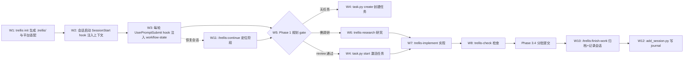

# Trellis 核心工作流调研报告

> 调研对象：`/data00/home/wangyubo.1219/workbench/code-src/github/Trellis`（mindfold-ai/Trellis，v0.6.15）
> 调研方式：只读，基于仓库内官方文档（README、`.trellis/workflow.md`、AGENTS.md）与源码（`.trellis/scripts/`、`packages/cli/src/`）等一手来源，未修改 Trellis 仓库任何文件。
> 结论标注约定：`[文档]` 表示依据为仓库内文档（含 workflow.md / README / 命令文件）；`[代码]` 表示依据为源码实现；两者均给出文件路径，必要时附行号。

---

## 目录

1. [产品定位与总体架构](#1-产品定位与总体架构)
2. [仓库结构](#2-仓库结构)
3. [核心工作流总览](#3-核心工作流总览)
4. [工作流详解](#4-工作流详解)
   - [W1 初始化：`trellis init` / `trellis update`](#w1-初始化trellis-init--trellis-update)
   - [W2 会话启动：SessionStart hook](#w2-会话启动sessionstart-hook)
   - [W3 每轮状态注入：UserPromptSubmit hook（workflow-state breadcrumb）](#w3-每轮状态注入userpromptsubmit-hookworkflow-state-breadcrumb)
   - [W4 任务生命周期：`task.py`](#w4-任务生命周期taskpy)
   - [W5 规划：Phase 1（brainstorm → artifacts → start gate）](#w5-规划phase-1brainstorm--artifacts--start-gate)
   - [W6 研究：`trellis-research`](#w6-研究trellis-research)
   - [W7 实现：`trellis-implement`](#w7-实现trellis-implement)
   - [W8 检查：`trellis-check`](#w8-检查trellis-check)
   - [W9 子代理上下文注入：PreToolUse hook](#w9-子代理上下文注入pretooluse-hook)
   - [W10 收尾：`/trellis:finish-work`](#w10-收尾trellisfinish-work)
   - [W11 继续：`/trellis:continue` 与 `/trellis:start`](#w11-继续trelliscontinue-与-trellisstart)
   - [W12 会话记录：`add_session.py` 与 workspace journal](#w12-会话记录add_sessionpy-与-workspace-journal)
5. [任务数据结构](#5-任务数据结构)
6. [hooks 机制总结](#6-hooks-机制总结)
7. [文档声称 vs 代码实证对照](#7-文档声称-vs-代码实证对照)
8. [结论](#8-结论)

---

## 1. 产品定位与总体架构

Trellis 是一个「开箱即用的 AI 编码工程化框架」（out-of-the-box engineering framework for AI coding）：把规范（specs）、任务（tasks）、记忆（memory）沉淀进仓库，让任意 Coding Agent 按团队的工程标准工作。[文档] `README.md:10-11`、`README_CN.md:10-11`。

定位差异（相对 CLAUDE.md / AGENTS.md / .cursorrules）：那些文件只是入口且易臃肿，Trellis 在其上补充了作用域明确的 spec、按任务划分的 PRD、工作流关卡（workflow gates）、工作区记忆与平台适配文件。[文档] `README.md:100-102`。

核心能力（README 声称）[文档] `README.md:41-47`：

| 能力 | 说明 |
| --- | --- |
| 自动注入规范 | 规范沉淀到 `.trellis/spec/`，会话中按任务按需注入 |
| 任务驱动工作流 | PRD / 实现上下文 / 审查上下文 / 状态统一存放 `.trellis/tasks/` |
| 项目记忆 | `.trellis/workspace/` 的 journal 保留会话脉络 |
| 团队共享标准 | spec 随仓库版本化，可跨团队复用 |
| 多平台复用 | 同一套结构覆盖 22 个 AI coding 平台 |

总体架构由三层组成 [代码]（见 §2 目录证据）：

1. **`.trellis/` 运行时目录**（Python 脚本 + workflow.md + spec + tasks + workspace）——工作流的「大脑」，由 `trellis init` 生成、`trellis update` 刷新；
2. **平台适配目录**（`.claude/`、`.cursor/`、`.codex/`、`.opencode/`、`.pi/` 等）——把同一套运行时桥接到各平台的 commands / hooks / agents / skills 三种机制；
3. **npm CLI 包**（`packages/cli` 与 `packages/core`）——生成与刷新上述目录、提供 `trellis channel` / `trellis mem` 等扩展能力。

---

## 2. 仓库结构

### 2.1 `.trellis/` 运行时目录

仓库顶层 `.trellis/` 的结构（实际存在，`ls` 实证）：

| 路径 | 用途 | 依据 |
| --- | --- | --- |
| `workflow.md` | 工作流单一事实源（Phase Index + 分步指引 + `[workflow-state:STATUS]` breadcrumb 块） | [代码] 文件本体；`AGENTS.md:8` |
| `config.yaml` | 项目级配置（session 自动提交、生命周期 hooks、packages、channel 守卫、context 注入上限、prompt 注入开关） | [代码] `.trellis/config.yaml` |
| `scripts/` | Python 命令脚本：`task.py`、`get_context.py`、`init_developer.py`、`add_session.py` + `common/` 共享模块 | [代码] `ls .trellis/scripts/` |
| `scripts/hooks/` | 生命周期 hook 脚本示例（`linear_sync.py`：任务事件同步 Linear） | [代码] `.trellis/scripts/hooks/linear_sync.py` |
| `spec/` | 按 package/layer 组织的编码规范（`spec/<package>/<layer>/index.md` + 细则） | [代码] `AGENTS.md:9`；`ls .trellis/spec/` |
| `tasks/` | 任务目录：`{MM-DD-name}/`（task.json、prd.md、design.md、implement.md、research/、implement.jsonl、check.jsonl）与 `archive/{YYYY-MM}/` | [代码] `AGENTS.md:12`；`ls .trellis/tasks/` |
| `workspace/` | 每开发者会话日志：`<developer>/journal-N.md`（每文件上限 2000 行）+ `index.md` | [代码] `workflow.md:80-83`；`ls .trellis/workspace/` |
| `agents/` | channel 运行时 agent 定义（`implement.md`、`check.md`、`research.md`、`plan.md`、`architect.md`），供 `trellis channel spawn --agent <name>` 加载 | [代码] `.trellis/agents/implement.md:11`；`templates/trellis/index.ts:80-85` |
| `.runtime/sessions/` | 会话级活跃任务指针（`<platform>_<session-id>.json`），gitignored | [代码] `common/active_task.py:237-238`、`workflow.md:76` |

### 2.2 `packages/` 两个 npm 包

| 包 | 职责 | 依据 |
| --- | --- | --- |
| `packages/cli`（`@mindfoldhq/trellis`） | CLI 主包：`trellis` / `tl` 命令；`src/commands/`（init、update、upgrade、uninstall、workflow、mem、channel）、`src/configurators/`（22 个平台适配器）、`src/templates/`（生成到用户项目的模板）、`src/migrations/` | [代码] `packages/cli/package.json:2-11,44-52`；`ls packages/cli/src/` |
| `packages/core`（`@mindfoldhq/trellis-core`） | 核心 SDK：channel 与 task 领域原语（`src/channel/`、`src/task/`、`src/mem/`），供 CLI 与下游 Node 服务消费 | [代码] `packages/core/package.json:2-7,44-52` |

CLI 注册的命令（`src/cli/index.ts`）：`init`、`update`、`upgrade`、`uninstall`、`mem`、`workflow`、`platforms`、`channel`。[代码] `packages/cli/src/cli/index.ts:70-348`。

### 2.3 平台适配目录（commands / hooks / agents / skills）

同一套运行时通过四类文件桥接到各平台（目录实证）：

- **slash 命令**（commands）：`.claude/commands/trellis/{continue,finish-work,create-manifest,publish-skill,improve-ut}.md`、`.cursor/commands/trellis-{continue,finish-work,...}.md`、`.opencode/commands/trellis/{start,continue,finish-work}.md`、`.pi/prompts/trellis-{start,continue,finish-work}.md`；
- **hooks**：`.claude/hooks/{session-start,inject-workflow-state,inject-subagent-context}.py`、`.codex/hooks/*.py` + `.codex/hooks.json`、`.opencode/plugins/{session-start,inject-workflow-state,inject-subagent-context}.js`；
- **agents**（子代理定义）：`.claude/agents/trellis-{research,implement,check}.md`、`.codex/agents/trellis-*.toml`；
- **skills**：`.claude/skills/trellis-{brainstorm,before-dev,check,break-loop,update-spec,channel,meta,...}/SKILL.md`。

这些文件全部由 `trellis init` 从 `packages/cli/src/templates/` 生成（见 W1）。

---

## 3. 核心工作流总览

Trellis 的核心工作流是一个围绕「任务生命周期 + 三阶段开发循环」的状态机，由 hooks（运行时注入）、slash 命令（用户入口）、`task.py`（状态迁移）与子代理（执行体）四类机制协作驱动。README 将其概括为 4 阶段循环：Plan → Implement → Verify → Finish。[文档] `README.md:80-85`；workflow.md 细化为 Phase 1 Plan / Phase 2 Execute / Phase 3 Finish 的 3 阶段编号（1.0–1.5、2.1–2.3、3.2–3.5）。[文档] `.trellis/workflow.md:144-150,182-249`。

### 工作流清单（一句话）

| 编号 | 工作流 | 入口 | 一句话实现方式 |
| --- | --- | --- | --- |
| W1 | 初始化/更新 | `trellis init` / `trellis update` | CLI 按 configurator 注册表把模板渲染写入 `.trellis/` 与各平台目录 [代码] `packages/cli/src/configurators/index.ts:85-111` |
| W2 | 会话启动 | SessionStart hook | `session-start.py` 输出 `<session-context>` 紧凑上下文（身份/git/任务/spec 索引/工作流概览） [代码] `.claude/hooks/session-start.py:822-946` |
| W3 | 每轮状态注入 | UserPromptSubmit hook | `inject-workflow-state.py` 解析 workflow.md 的 `[workflow-state:STATUS]` 块，按活跃任务状态注入 `<workflow-state>` breadcrumb [代码] `.claude/hooks/inject-workflow-state.py:420-484` |
| W4 | 任务生命周期 | `task.py` | create/start/finish/archive 四命令驱动 `task.json.status` 迁移 + 会话指针 + 生命周期 hooks [代码] `.trellis/scripts/task.py:73-174,514-627` |
| W5 | 规划 | Phase 1 | `trellis-brainstorm` skill 逐题探索需求写入 `prd.md`（复杂任务补 `design.md`/`implement.md`），jsonl 策展后 `task.py start` [文档] `workflow.md:308-465` |
| W6 | 研究 | `trellis-research` 子代理 | 子代理把每条调研结论持久化到 `{TASK_DIR}/research/*.md`，只回报文件路径 [代码] `.claude/agents/trellis-research.md:11-15,48-58` |
| W7 | 实现 | `trellis-implement` 子代理 | 子代理按 jsonl 注入的 spec/research + prd/design/implement 写代码，禁止 git commit [代码] `.claude/agents/trellis-implement.md:11-50` |
| W8 | 检查 | `trellis-check` 子代理 | 子代理对 diff 对照 spec 与 artifacts 自查自修，跑 lint/typecheck [代码] `.claude/agents/trellis-check.md:11-47` |
| W9 | 子代理上下文注入 | PreToolUse hook | `inject-subagent-context.py` 按 agent 类型读 `implement.jsonl`/`check.jsonl` + prd/design/implement，注入子代理首条 prompt [代码] `.claude/hooks/inject-subagent-context.py:459-678` |
| W10 | 收尾 | `/trellis:finish-work` | 命令文件驱动：检查脏文件 → `task.py archive` → `add_session.py` 记录 journal [代码] `.claude/commands/trellis/finish-work.md:5-64` |
| W11 | 继续 | `/trellis:continue`（/start） | 命令文件按 `status` + artifacts 路由到具体 phase step [代码] `.claude/commands/trellis/continue.md:23-50` |
| W12 | 会话记录 | `add_session.py` | 把会话写入 `workspace/<dev>/journal-N.md`（超 2000 行滚动新文件）并自动提交 [代码] `.trellis/scripts/add_session.py:67-91` |

---

## 4. 工作流详解

### W1 初始化：`trellis init` / `trellis update`

**用途**：在用户项目里落地整套 Trellis 结构（`.trellis/` 运行时 + 所选平台的适配文件），并保证后续可增量刷新。[文档] `README.md:56-65`。

**触发**：`trellis init -u <name> [--claude --cursor --codex ...]`；维护升级用 `trellis update`。[文档] `README.md:56-65`。

**实现方式** [代码]：

1. `packages/cli/src/cli/index.ts:70-71` 注册 `init` 命令 → `packages/cli/src/commands/init.ts`（2079 行）执行；
2. `init.ts` 调用 `createWorkflowStructure`（`src/configurators/workflow.ts`）写 `.trellis/`（scripts、workflow.md、config.yaml、agents、tasks 骨架），再按用户选择调用各平台的 `configure` 函数；
3. 平台文件集由注册表 `PLATFORM_FUNCTIONS` 描述：`configurators/index.ts:85-111` 中每个平台一个 `collect<Platform>Templates()`（如 `collectClaudeTemplates`，`configurators/claude.ts:109`），经 `writeTemplateMap` 渲染占位符后写入磁盘（`configurators/shared.ts`）；
4. 共享 hook 脚本按 `SHARED_HOOKS_BY_PLATFORM` 表分发（`templates/shared-hooks/index.ts:95-149`），保证「脚本在盘但无人调用」不会发生；
5. 写入的每个文件哈希记录在 `.trellis/.template-hashes.json`，`trellis update` 据此做块级替换（避免覆盖用户改动，见 `workflow.ts:80-102` 的 classifyExistingWorkflow 与 `.claude/commands/trellis/create-manifest.md:99` 的 hash 机制说明）。

**涉及数据结构**：`.trellis/.template-hashes.json`（模板哈希清单）、`.trellis/config.yaml`、`.trellis/workflow.md`。

### W2 会话启动：SessionStart hook

**用途**：会话开始时向主 AI 注入一份紧凑上下文，让新会话「带着记忆开始」。[文档] `README.md:45`（项目记忆）。

**触发**：Claude Code 的 `SessionStart` 事件（`.claude/settings.json:6-37` 注册了 startup/clear/compact 三个 matcher，均调 `session-start.py`）；其余平台经 `SHARED_HOOKS_BY_PLATFORM` 表分发同一脚本 [代码] `templates/shared-hooks/index.ts:95-149`；无 SessionStart hook 的平台（Pi/OpenCode）用 `/trellis:start` 命令手动等价加载 [代码] `.pi/prompts/trellis-start.md:3,10-31`。

**执行步骤与数据流** [代码] `.claude/hooks/session-start.py:822-946`：

1. 读取 hook JSON（`cwd` 等）→ 定位 `.trellis/` → 解析 `context_key`（会话身份）并持久化给 bash 子进程（`_persist_context_key_for_bash`，行 857）；
2. 按配置解析 spec 作用域（`_resolve_spec_scope`），收集相关 spec index 路径（`_collect_spec_index_paths`，行 868）；
3. 组装 `<session-context>` 输出：`<current-state>`（身份/git 状态/活跃任务/journal 行数，`_build_compact_current_state`，行 884）+ `<trellis-workflow>`（Phase Index 概览，`_build_workflow_overview`，行 888）+ `<guidelines>`（spec index 列表，行 891-908）+ `<task-status>`（行 911-912）+ `<first-reply-notice>`（首条回复确认语，行 875）；
4. 以 `hookSpecificOutput.additionalContext` 返回（行 928-945），平台注入为会话首轮上下文。

**关键实现文件**：`.claude/hooks/session-start.py`（核心 `main()` 与 `_build_compact_current_state` 行 697）；`.trellis/scripts/get_context.py` → `common/session_context.py`（`get_context_text` 行 578，命令式等价物）。

### W3 每轮状态注入：UserPromptSubmit hook（workflow-state breadcrumb）

**用途**：每一轮用户消息都向主 AI 注入当前任务与所处阶段，提醒 AI 该做什么、不该做什么——这是唯一每轮生效的阶段控制通道。[文档] `.trellis/spec/cli/backend/workflow-state-contract.md:11-21`（breadcrumb 是唯一每轮通道，`[required · once]` 步骤必须出现在对应 tag 块里，否则 AI 会静默跳过）。

**触发**：Claude Code `UserPromptSubmit`（`.claude/settings.json:60-70`）；Codex/Gemini/Qoder/Copilot/CodeBuddy/Droid/Kiro/Trae/ZCode 经 `SHARED_HOOKS_BY_PLATFORM` 分发 [代码] `templates/shared-hooks/index.ts:95-149`；OpenCode 用 JS 插件 `.opencode/plugins/inject-workflow-state.js`（同 contract 文档行 44-46 提及）。

**执行步骤与数据流** [代码] `.claude/hooks/inject-workflow-state.py:420-484`：

1. 读取 hook JSON → 沿 cwd 向上找 `.trellis/`（`find_trellis_root`，行 83-94），找不到则静默退出；
2. 解析 `.trellis/config.yaml`：支持 `prompt_injection.skip_keyword`（默认 `no-trellis`）逃生舱（行 434）与 `codex.dispatch_mode`（行 286-306）；
3. 调 `common.active_task.resolve_active_task()`（行 152-158）解析会话级活跃任务；无任务 → `no_task`；指针指向已删目录 → `stale_<source>`；task.json 缺失/损坏 → `task_error`（行 161-195）；
4. 用正则 `_TAG_RE`（行 204-207）解析 workflow.md 的 `[workflow-state:STATUS]...[/workflow-state:STATUS]` 块为 `{status: body}` 映射（`load_breadcrumbs`，行 209-232）——**workflow.md 是唯一事实源，脚本内无回退字典**（行 14-18 注释）；
5. 组装 `<workflow-state>` 块（`build_breadcrumb`，行 359-380）：命中 tag → 用块正文；未命中 → 输出通用提示「Refer to workflow.md for current step.」；
6. 以 `hookSpecificOutput.additionalContext` 返回（行 477-483），平台注入为当轮系统级前导。

**状态机契约**：`no_task` / `planning` / `planning-inline` / `in_progress` / `in_progress-inline` / `completed`（当前 DEAD）等 tag 与阶段的对应关系、writer 表与可达性矩阵见 `.trellis/spec/cli/backend/workflow-state-contract.md:120-134,251-261`；状态迁移由 `task.py` 写 `task.json.status`（workflow.md:100-141 注释）。

**关键实现文件**：`.claude/hooks/inject-workflow-state.py`；`.trellis/scripts/common/active_task.py`（`resolve_active_task` 行 596）；`.trellis/spec/cli/backend/workflow-state-contract.md`（契约）。

### W4 任务生命周期：`task.py`

**用途**：任务目录与状态的 CRUD——创建、激活、完成、归档，是 Phase 1/2/3 状态机的执行器。[文档] `workflow.md:44-76`。

**触发**：命令行 `python3 ./.trellis/scripts/task.py <create|start|current|finish|archive|list|...>`；slash 命令与 hooks 内部调用。

**关键命令与数据流** [代码] `.trellis/scripts/task.py` + `common/task_store.py`：

| 命令 | 函数 | 行为 | 依据 |
| --- | --- | --- | --- |
| `create "<title>" [--slug] [--parent]` | `cmd_create`（task_store.py:227） | 生成 `{MM-DD-slug}/` 目录 + `task.json`（status=`planning`）+ 默认 `prd.md`；子代理平台另 seed `implement.jsonl`/`check.jsonl`（`_write_seed_jsonl`，行 166-174）；有会话身份时自动设活跃指针（行 437-487）；触发 `after_create` hook | `task.py:481-502`；task_store.py:362-507 |
| `start <dir>` | `cmd_start`（task.py:73） | 写会话活跃指针（`set_active_task`）+ 把 `task.json.status` 从 `planning` 翻到 `in_progress`；无会话身份降级只翻状态；触发 `after_start` hook | task.py:108-149 |
| `current [--source] [--json]` | `cmd_current`（task.py:177） | 打印当前活跃任务与来源（session 指针 / 环境变量 / shell ticket） | task.py:177-214 |
| `finish` | `cmd_finish`（task.py:156） | 删除会话活跃指针（状态不变）；触发 `after_finish` hook | task.py:156-174 |
| `archive <name>` | `cmd_archive`（task_store.py:514） | 写 `status=completed` + `completedAt`，目录移到 `tasks/archive/{YYYY-MM}/`，清理引用它的会话文件，`chore(task): archive` 自动提交，触发 `after_archive` hook | task_store.py:551-627；task_utils.py:130-167 |

**会话指针机制**：活跃任务按会话存储于 `.trellis/.runtime/sessions/<platform>_<session-id>.json`，`context_key` 来自 hook 输入 / `TRELLIS_CONTEXT_ID` 环境变量 / 平台原生会话环境变量（DSH_SESSION_ID、CLAUDE_CODE_SESSION_ID、CODEX_THREAD_ID 等，见 `common/active_task.py:67-120` 的实测注释）；shell 子进程无法继承会话 id 时用 30 秒有效期的 shell ticket 桥接（`_lookup_shell_ticket_context_key`，行 468-495）。单会话回退：仅当 runtime 下恰好一个会话文件时使用（`_resolve_single_session_fallback`，行 633-655）。

**生命周期 hooks**：`task.json` 可声明 `hooks.after_create/after_start/after_finish/after_archive`（也可在 `config.yaml` 配置），由 `run_task_hooks`（`common/task_utils.py:253-296`）以 `TASK_JSON_PATH` 环境变量执行 shell 命令；示例 `.trellis/scripts/hooks/linear_sync.py` 把任务事件同步到 Linear（create→建 issue、start→In Progress、archive→Done）。

### W5 规划：Phase 1（brainstorm → artifacts → start gate）

**用途**：把用户请求转化为可评审、可执行的规划产物，并设「start gate」保证实现前先获得评审。[文档] `workflow.md:308-465`。

**触发**：由 W3 breadcrumb（`planning` 状态）驱动；无任务时由 W2/W11 提示走 Request Triage（简单对话只问是否建任务；复杂任务需征得同意才能建任务，同意建任务 ≠ 同意实现，`workflow.md:152-156`）。

**执行步骤** [文档] `workflow.md:182-197,308-465`：

1. **1.0 Create task**：`task.py create` 建目录（status=planning），breadcrumb 自动切到 `planning`；
2. **1.1 Requirement exploration**：加载 `trellis-brainstorm` skill，一次一个问题探索需求，边问边更新 `prd.md`；复杂任务必须产出 `design.md`（技术设计）与 `implement.md`（执行清单）；多交付物拆 parent/child 任务树（parent 拥有需求集与跨子任务验收，child 独立规划/实现/检查/归档；父子不是依赖系统，依赖写进 artifact）；
3. **1.2 Research**（可选，见 W6）；
4. **1.3 Configure context**：子代理派发平台需用真实条目填充 `implement.jsonl` / `check.jsonl`（格式 `{"file": "<path>", "reason": "<why>"}`，只放 spec/research 不放代码路径；seed `_example` 行不算数，start 前两文件必须各至少一条真实条目，`workflow.md:381-428`）；inline 平台（codex-inline/Kilo/Antigravity/Devin/DeepSeek Harness）跳过此步，由 `trellis-before-dev` skill 直接加载；
5. **1.4 Activate task**：评审产物后 `task.py start`（status → in_progress），breadcrumb 切到 `in_progress`；
6. **1.5 Completion criteria**：`prd.md` 存在 + 用户确认 + start 已执行（复杂任务另要求 design/implement.md 与 jsonl 已策展，`workflow.md:450-465`）。

**实现载体**：`prd.md`/`design.md`/`implement.md` 由 AI 在 `trellis-brainstorm` skill 指导下编写；skill 文件：`.claude/skills/trellis-brainstorm/SKILL.md`、`.claude/skills/trellis-before-dev/SKILL.md`。步骤详情按需加载：`get_context.py --mode phase --step <X.X>`（`common/workflow_phase.py:get_step` 行 100-120 从 workflow.md 提取 `#### X.X` 节）。

### W6 研究：`trellis-research`

**用途**：产研分离——把代码/技术调研派给专用子代理，且强制「调研结果落盘」。[文档] `workflow.md:352-379`；`README.md:82`。

**触发**：Phase 1.2 由主会话 spawn 子代理（agent 类型 `trellis-research`）；inline 平台主会话直接做并写入 `{TASK_DIR}/research/`。[文档] `workflow.md:356-370`。

**执行步骤与数据流** [代码] `.claude/agents/trellis-research.md`：

1. 先 `task.py current --source` 解析活跃任务（行 30-38）；
2. 分类请求（internal/external/mixed，行 40-47），Glob+Grep+web 并行搜索（行 44-47）；
3. **每个主题写一个文件**到 `{TASK_DIR}/research/<topic-slug>.md`，格式含 Query/Scope/Date/Findings/Caveats（行 48-58, 83-118）；
4. 只回报「文件路径 + 一行摘要」，禁止把全文贴回聊天（行 52-59）——核心原则「Conversations get compacted; files don't」（行 11-15）；
5. 写入权限严格限定：只允许 `{TASK_DIR}/research/`，禁止改代码/spec/scripts/其他任务目录/任何 git 操作（行 64-79）。

**关键实现文件**：`.claude/agents/trellis-research.md`；`.codex/agents/trellis-research.toml`；channel 运行时版 `.trellis/agents/research.md`（provider: claude，供 `trellis channel spawn --agent research`）。研究产物由 W9 通过 jsonl 注入给实现/检查子代理。

### W7 实现：`trellis-implement`

**用途**：把已评审的规划产物变成代码，且**不做 git commit**（提交权属于主会话）。[文档] `workflow.md:473-526`；`README.md:83`。

**触发**：Phase 2.1 主会话 spawn 子代理（`trellis-implement`）；Codex 原生 `SubagentStart` 注入上下文（agent 配置文件 `.codex/agents/trellis-implement.toml`）；inline 平台由主会话加载 `trellis-before-dev` skill 后直接改码（`workflow.md:518-526`）；channel 运行时经 `trellis channel spawn --agent implement`。[代码] `.trellis/agents/implement.md:11`。

**执行步骤与数据流** [代码] `.claude/agents/trellis-implement.md`：

1. **递归守卫**：提示自身已是 implement 子代理，禁止再 spawn implement/check（行 11-17）；
2. **上下文加载协议**：检测 dispatch prompt 首行 `Active task: <path>`；优先信任 hook 注入（`<!-- trellis-hook-injected -->` 标记），标记缺失（Windows/--continue/fork/hook 禁用）则自己读 `implement.jsonl` + 列表文件 + prd/design/implement（行 19-33）；
3. 读 spec（`.trellis/spec/<package>/<layer>/`）与 artifacts（行 53-68）；
4. 写代码，遵循既有模式、不过度设计（行 70-75）；
5. 跑项目 lint + typecheck 验证（行 76-79），按固定格式回报文件清单/摘要/验证结果（行 82-101）。

**关键实现文件**：`.claude/agents/trellis-implement.md`；`.codex/agents/trellis-implement.toml`；channel 版 `.trellis/agents/implement.md`（读序：implement.jsonl → prd → design → implement → spec，行 15-21）。

### W8 检查：`trellis-check`

**用途**：对照 spec 与任务 artifacts 审查代码改动并**自查自修**，保证 lint/typecheck/tests 通过。[文档] `workflow.md:528-557`；`README.md:84`。

**触发**：Phase 2.2 主会话 spawn 子代理（`trellis-check`）；inline 平台加载 `trellis-check` skill（`workflow.md:546-555`）；channel 运行时 `trellis channel spawn --agent check`。

**执行步骤与数据流** [代码] `.claude/agents/trellis-check.md`：

1. 递归守卫 + 上下文加载协议与 implement 相同（行 11-24）；
2. `git diff` 取未提交改动（行 53-58）；
3. 对照 prd/design/implement 与 `.trellis/spec/` 逐项核查（目录结构/命名/类型/潜在 bug，行 60-70）；
4. **自己修**，不只报告（行 72-79）；
5. 跑 lint + typecheck，失败则修到绿（行 80-84）；按固定格式回报（行 88-115）。

**补充要求**：任务最后一次 2.2 必须全量范围检查（`get_context.py --mode packages` 列出所有受影响包，逐个加载 Quality Check 节），以抓跨层/多包问题（`workflow.md:557`）。

**关键实现文件**：`.claude/agents/trellis-check.md`；`.trellis/agents/check.md`；检查技能 `.claude/skills/trellis-check/SKILL.md`。

### W9 子代理上下文注入：PreToolUse hook

**用途**：在子代理（Task/Agent 工具调用）启动前，把 jsonl 清单里的 spec/research 与 prd/design/implement 全部内联进子代理首条 prompt——「hook 负责注入全部上下文，子代理带完整信息自主工作」。[代码] `.claude/hooks/inject-subagent-context.py:8-11`。

**触发**：Claude Code `PreToolUse` matcher=Task/Agent（`.claude/settings.json:38-59`）；Codex `SubagentStart` matcher=`^(?:trellis-implement|trellis-check|trellis-research)$`（`.codex/hooks.json`）；ZCode/Droid/CodeBuddy 等同表分发 [代码] `templates/shared-hooks/index.ts:95-149`；class-2 平台（Gemini/Qoder/Copilot/Trae 等）无此 hook，靠 agent profile 自带「先读 jsonl」的 pull 式回退（`workflow.md:490-502`）。

**执行步骤与数据流** [代码] `.claude/hooks/inject-subagent-context.py`：

1. 识别子代理类型（`_extract_subagent_type`，行 993）与活跃任务（`get_current_task`，行 139）；
2. 按类型取上下文：`get_implement_context`（行 499，读 implement.jsonl → prd → design → implement）/ `get_check_context`（行 557，check.jsonl + 同上）/ `get_research_context`（行 727）；
3. jsonl 条目经 `_materialize_jsonl_entries`（行 437）物化为文件块，受 `context_injection` 上限约束：单文件 `max_file_bytes`、单 artifact `max_artifact_bytes`、总量 `max_total_bytes`（预算类 `_Budget` 行 235；超限截断/降级为索引行，`_truncate_notice` 行 263 / `_index_notice` 行 285）；
4. `build_implement_prompt`（行 614）/`build_check_prompt`（行 649）/`build_research_prompt`（行 773）把上下文拼进带 `<!-- trellis-hook-injected -->` 标记的完整 prompt，经 `hookSpecificOutput`（行 1148-1160）替换子代理首条输入。

**关键实现文件**：`.claude/hooks/inject-subagent-context.py`；`.codex/hooks/inject-subagent-context.py`；`.opencode/plugins/inject-subagent-context.js`；上限配置 `.trellis/config.yaml:149-154`。

### W10 收尾：`/trellis:finish-work`

**用途**：会话结束时归档任务、记录会话 journal，把「工作提交」与「记账提交」分离。[文档] `.claude/commands/trellis/finish-work.md:1-3`；`README.md:76`。

**触发**：用户在 CLI 输入 `/trellis:finish-work`（各平台命令文件：`.claude/commands/trellis/finish-work.md`、`.cursor/commands/trellis-finish-work.md`、`.opencode/commands/trellis/finish-work.md`、`.pi/prompts/trellis-finish-work.md`；`.agents/skills/trellis-finish-work/SKILL.md`）。

**执行步骤与数据流** [代码] `.claude/commands/trellis/finish-work.md:5-66`：

1. **Survey**：`get_context.py --mode record` 列出活跃任务/git 状态/近期提交（行 5-17）；
2. **Sanity check**：`git status --porcelain` 分类脏路径——仍属当前任务未提交 → 拒绝收尾并退回 Phase 3.4；属他窗口工作 → 报告后继续；不确定 → 问一次（行 19-43）；
3. **Archive**：`task.py archive <name>` 归档（当前活跃任务必归档；其它已完成任务经一次性确认），每个归档产生 `chore(task): archive ...` 自动提交（行 45-53）；
4. **Record journal**：`add_session.py --title --commit --summary`，用 Phase 3.4 的工作提交 hash（不含归档 hash），产生 `chore: record journal` 提交（行 55-64）；最终 git log 顺序：work commits → archive commits → journal commit。

**关键实现文件**：`.claude/commands/trellis/finish-work.md`；`.trellis/scripts/common/git_context.py`（`--mode record` → `get_context_text_record`，`common/session_context.py:803`）。

### W11 继续：`/trellis:continue` 与 `/trellis:start`

**用途**：恢复会话时定位「上次停在哪一步」，替代用户记忆 Trellis 流程。[代码] `.claude/commands/trellis/continue.md:23-25`。

**触发**：`/trellis:continue`（Claude/Cursor/OpenCode/Pi/OMP 有；Pi/OpenCode 的会话初始入口是 `/trellis:start`，`.pi/prompts/trellis-start.md`、`.opencode/commands/trellis/start.md`）。

**执行步骤与数据流** [代码] `.claude/commands/trellis/continue.md:7-50`：

1. `get_context.py` 确认当前任务/git/提交（Step 1）；
2. `get_context.py --mode phase` 展示 Phase Index（Step 2）；
3. 按 `status` + artifacts 路由（Step 3）：`planning`+无 prd → 1.1；`planning`+prd-only → 判断轻量/复杂；`planning`+产物齐但 jsonl 未策展 → 1.3；齐备 → 1.4（等评审）；`in_progress`+未实现 → 2.1；实现完未检查 → 2.2；检查过 → 3.3→3.4；`completed` → 归档流；
4. `get_context.py --mode phase --step <X.X> --platform 
` 加载该步详情（Step 4）。

**关键实现文件**：`.claude/commands/trellis/continue.md`；`common/workflow_phase.py`（`get_step`/`get_phase_index`/`filter_platform`）。

### W12 会话记录：`add_session.py` 与 workspace journal

**用途**：把每次 AI 会话的关键信息持久化到 `.trellis/workspace/<developer>/`，形成跨会话项目记忆。[文档] `workflow.md:78-87`；`README.md:45`。

**触发**：`/trellis:finish-work` 内部调用；也可手动 `python3 ./.trellis/scripts/add_session.py --title "..." --commit "hash" --summary "..."`。[代码] `.trellis/scripts/add_session.py:1-23`。

**实现方式** [代码] `.trellis/scripts/add_session.py`：

1. 定位当前开发者目录与最新 journal 文件（`get_latest_journal_info`，行 67-91，按 `journal-N.md` 的 N 取最大）；
2. 写入 `journal-N.md`（每文件上限 `max_journal_lines`（默认 2000），超限自动滚动 `journal-(N+1).md`，`config.yaml:14-15`）；
3. 更新 `workspace/<dev>/index.md`（会话计数、最近活跃）；
4. 按 `session_auto_commit`（默认 true）自动 stage + commit（`chore: record journal`，`config.yaml:12,20-33`）。

**涉及数据结构**：`workspace/index.md`（全局索引）、`workspace/<dev>/index.md`（个人索引）、`workspace/<dev>/journal-N.md`（会话日志）。

---

## 5. 任务数据结构

每个任务一个目录：`.trellis/tasks/{MM-DD-slug}/`。[文档] `workflow.md:42`；真实样例 `.trellis/tasks/08-06-mem-full-recall/`（含 task.json、prd.md、design.md、implement.md、research/、implement.jsonl、check.jsonl）。

### 5.1 `task.json` —— 任务元数据（状态机载体）

字段由 `cmd_create` 写入（[代码] `common/task_store.py:362-387`），真实样例见 `.trellis/tasks/08-06-mem-full-recall/task.json`：

| 字段 | 说明 | 迁移者 |
| --- | --- | --- |
| `id` / `name` | slug | create |
| `title` / `description` | 标题与描述 | create |
| `status` | `planning` → `in_progress` → `completed` | create=planning；start=in_progress（task.py:127-144）；archive=completed（task_store.py:572） |
| `priority` | P0-P3（默认 P2） | create |
| `creator` / `assignee` | 开发者（来自 `.trellis/.developer`） | create（task_store.py:257-268） |
| `package` | monorepo 包名（校验 `config.yaml` packages） | create |
| `branch` / `base_branch` | 分支与 PR 目标分支 | create（base_branch 自动解析默认分支）；set-branch/set-base-branch |
| `createdAt` / `completedAt` | 时间戳 | create / archive |
| `parent` / `children` / `subtasks` | 父子任务树双向链接 | create --parent / add-subtask / remove-subtask |
| `scope` | PR 标题 scope | set-scope |
| `commit` / `pr_url` / `worktree_path` | git/PR 关联 | 预留 |
| `relatedFiles` / `notes` | 相关文件与备注 | AI 编辑 |
| `meta` | 任意键值（如 `linear_issue`，linear_sync.py 写入） | set-meta |
| `hooks` | 生命周期 hook 命令（after_create/after_start/after_finish/after_archive） | 用户配置，`workflow.md:688-702` |

### 5.2 规划产物：`prd.md` / `design.md` / `implement.md`

- `prd.md`：需求/约束/验收标准，不放技术设计（`workflow.md:160`）；create 时生成骨架（Goal/Requirements/Acceptance Criteria/Notes，[代码] `task_store.py:197-220`）；
- `design.md`：复杂任务的技术设计——边界、契约、数据流、权衡、兼容性、回滚（`workflow.md:161`）；
- `implement.md`：复杂任务的执行计划——有序清单、验证命令、评审关卡、回滚点（`workflow.md:162`）；
- 轻量任务可 PRD-only；复杂任务三件套必须在 `task.py start` 前齐备（`workflow.md:164`）。

### 5.3 上下文清单：`implement.jsonl` / `check.jsonl`

- 格式：每行一个 JSON 对象 `{"file": "<repo-root 相对路径>", "reason": "<why>"}`（目录条目加 `"type": "directory"`）[代码] `common/task_context.py:96-103`；
- 语义：`implement.jsonl` 放实现子代理需要的 spec/research；`check.jsonl` 放检查子代理需要的质量规范/检查约定（`workflow.md:399-403`）；不放代码路径（代码由子代理自己读 diff，`workflow.md:395-397`）；
- 生命周期：`task.py create` 对子代理平台 seed 一条自述 `{"_example": "..."}`（无 `file` 字段，消费者自动跳过）[代码] `task_store.py:142-174`；规划期 AI 用 `task.py add-context` 或直接编辑填入真实条目（`workflow.md:413-422`）；`task.py validate` 校验条目存在性/JSON/代码文件卫生/大小上限（`common/task_context.py:226-314`）；
- 消费方：W9 hook 与 pull 式 agent profile 读取并注入子代理首条 prompt（`inject-subagent-context.py:470-472`）。

### 5.4 `research/` 目录

研究产物目录，一个主题一个 `.md` 文件（如 `research/auth-library-comparison.md`），格式含 Query/Scope/Date/Findings（文件表、代码模式、外部引用、相关 spec）/Caveats。[代码] `.claude/agents/trellis-research.md:83-118`；约定见 `workflow.md:372-375`。

### 5.5 运行时状态：`.trellis/.runtime/sessions/`

会话级活跃任务指针 `<platform>_<session-id>.json`（`{"current_task": "<task 相对路径>", "platform": ..., "last_seen_at": ...}`），gitignored；由 `set_active_task`/`clear_active_task` 维护（[代码] `common/active_task.py:684-730`），是 W3/W4 的状态来源。

---

## 6. hooks 机制总结

Trellis 的「hook/skill 注入」分四层，全部由 `trellis init` 生成、`SHARED_HOOKS_BY_PLATFORM` 表控制分发（[代码] `templates/shared-hooks/index.ts:95-149`）：

| 层 | 平台事件 | 脚本 | 注入内容 | 证据 |
| --- | --- | --- | --- | --- |
| 会话启动 | `SessionStart` | `session-start.py` | `<session-context>`（current-state / workflow 概览 / spec 索引 / task-status） | `.claude/settings.json:6-37`；`session-start.py:870-916` |
| 每轮阶段 | `UserPromptSubmit` | `inject-workflow-state.py` | `<workflow-state>` breadcrumb（任务 + 阶段 + 该阶段指引） | `.claude/settings.json:60-70`；`inject-workflow-state.py:359-380` |
| 子代理上下文 | `PreToolUse`(Task/Agent)、`SubagentStart` | `inject-subagent-context.py` | jsonl 物化文件 + prd/design/implement 内联进子代理 prompt | `.claude/settings.json:38-59`；`.codex/hooks.json`；`inject-subagent-context.py:614-678` |
| 任务生命周期 | `task.py` 事件 | `task.json.hooks.after_*` / `config.yaml hooks` | 执行用户 shell 命令（示例：linear_sync.py 同步 Linear） | `workflow.md:688-702`；`task_utils.py:253-296`；`scripts/hooks/linear_sync.py` |

关键设计点：

1. **workflow.md 是唯一事实源**：`[workflow-state:STATUS]` 块由 `inject-workflow-state.py`（Python）与 `inject-workflow-state.js`（OpenCode 插件）解析，脚本内无回退字典；解析失败时输出显式提示让用户修复而非静默掩盖（`inject-workflow-state.py:12-18,209-232`；契约 `.trellis/spec/cli/backend/workflow-state-contract.md:29-63`）；
2. **hook 注入与 pull 回退双通道**：class-1 平台（Claude/Cursor/Codex/ZCode 等）hook 注入，class-2 平台（Gemini/Qoder/Copilot/Trae/Kiro 等）靠 agent profile「先读 jsonl + artifacts」的 pull 式加载；子代理检测 `<!-- trellis-hook-injected -->` 标记决定信任哪条通道（`trellis-implement.md:19-33`；`workflow.md:223,498-502`）；
3. **注入有预算**：`context_injection.max_file_bytes/max_artifact_bytes/max_total_bytes` 控制内联大小，超限截断或降级为索引行（`inject-subagent-context.py:235-310`；`config.yaml:149-154`）；
4. **会话身份是状态前提**：无 context key 时活跃任务指针无法写入，`task.py start` 降级只翻 status（`task.py:108-132`；`active_task.py:498-539` 的环境变量实测表）；
5. **inline 模式**：Codex `dispatch_mode: inline` 及 Kilo/Antigravity/Devin/DeepSeek Harness 不走子代理，改由 `trellis-before-dev`/`trellis-check` skill 在主会话加载（`workflow.md:205-241,430-434`）。

---

## 7. 文档声称 vs 代码实证对照

| 声称（文档） | 实证（代码） | 结论 |
| --- | --- | --- |
| 「Specs injected, not remembered」（workflow.md:8） | `session-start.py` 注入 spec 索引 + `inject-subagent-context.py` 注入 jsonl 引用文件 | 一致 |
| 任务目录含 task.json/prd.md/design.md/implement.md/research/、implement.jsonl/check.jsonl（workflow.md:42） | `task_store.py:362-407` 创建全部；真实目录 `08-06-mem-full-recall/` 全齐 | 一致 |
| 「current-task 机制：task.py create 自动设活跃指针」（workflow.md:76） | `task_store.py:437-487`：有 context_key 才设置，无则静默降级 | 一致（带条件） |
| 「task.py finish 删除当前 session 文件（状态不变）」（workflow.md:76） | `task.py:156-174` → `clear_active_task` 删除 session 文件，task.json 不动 | 一致 |
| 「archive 写 status=completed 并移动目录」（workflow.md:76） | `task_store.py:551-627`：写 completed + `archive_task_complete` 移动 + 自动提交 | 一致 |
| 「4 阶段循环 Plan/Implement/Verify/Finish」（README.md:80-85） | workflow.md 的 Phase 1/2/3（3.4 commit 融入 2.2+3.4 注记，workflow.md:249） | 基本一致，README 为简化版 |
| 「22 个平台」（README.md:47） | `configurators/index.ts:85-111` 注册 22 个平台函数（含 dsh） | 一致 |
| 「/trellis:research、/trellis:new-task」命令（任务背景描述） | 仓库内无此命令名：research 是 agent 类型而非 slash 命令；new-task 无对应文件；命令实际为 start/continue/finish-work/create-manifest/publish-skill/improve-ut | **不符**（任务背景描述有误，以仓库为准） |
| 会话指针存 `.trellis/.runtime/sessions/`（workflow.md:76） | `active_task.py:237-238` 定义 `.runtime/sessions` 路径 | 一致 |
| 「[workflow-state:completed] 当前 DEAD」（workflow.md:128-133） | `cmd_archive` 在同一调用里翻状态+移目录，resolver 丢指针 | 一致（代码内注释自证） |

---

## 8. 结论

Trellis 的 12 个核心工作流围绕一个中心状态机运转：`task.json.status`（planning → in_progress → completed）驱动每轮 breadcrumb（W3），breadcrumb 指引 AI 走 Phase 1 规划（W5，含研究 W6）→ Phase 2 执行（实现 W7 / 检查 W8，上下文由 W9 hook 注入）→ Phase 3 提交，最后经 `/trellis:finish-work`（W10）归档任务并记录 journal（W12）。`trellis init/update`（W1）生成全部运行时与平台适配，SessionStart（W2）与 continue/start 命令（W11）保证新会话/恢复会话有上下文。实现上以「Python 脚本做状态与数据、平台 hooks 做上下文注入、Markdown agent/skill 定义做执行体」三层分工，workflow.md 作为单一事实源同时被 breadcrumb 解析器与步骤提取器消费——这是其「多平台同一套工作流」的根本机制。

（报告完）
